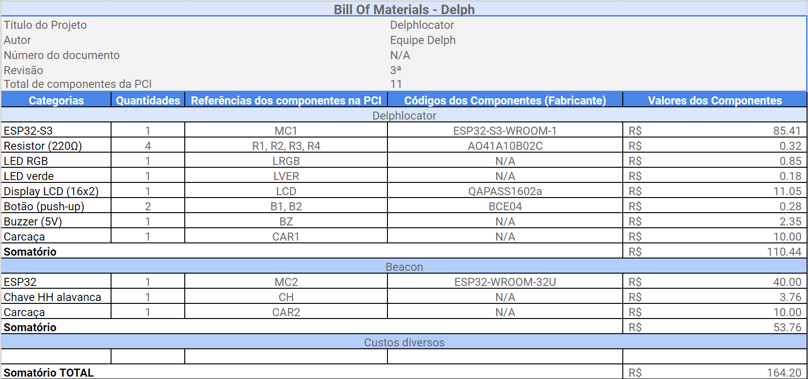
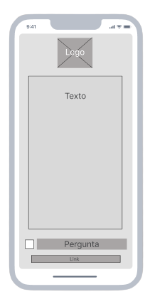
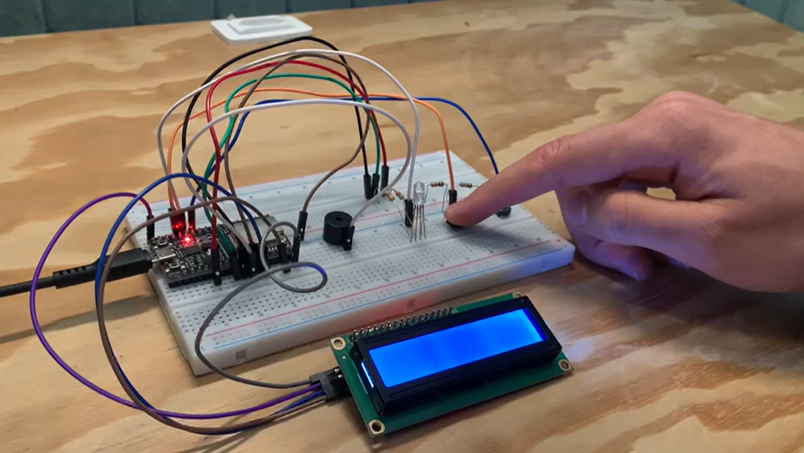

# Documentação IoTDoc - Módulo 4 - Inteli

## Delph

#### Ana Carolina Cremonezi Martire, Cecília Gonçalves, Davi Motta, Felipe Braga, Leonardo Khalid, Raí de Oliveira, Mauro das Chagas Júnior


## Sumário

[1. Introdução](#c1)

[2. Metodologia](#c2)

[3. Desenvolvimento e Resultados](#c3)

[4. Possibilidades de Descarte](#c4)

[5. Conclusões e Recomendações](#c5)

[6. Referências](#c6)

<br>


# <a name="c1"></a>1. Introdução

&emsp;&emsp;O Hospital Sírio-Libanês, considerado um dos melhores do Brasil e um dos melhores do mundo pela *Newsweek*, é, de acordo com seu próprio site, uma "instituição filantrópica que oferece atendimento de alta complexidade". Voltado, principalmente, para o público das classes A e B, ele tem 7 unidades em São Paulo e em Brasília, atendendo mais de 120 mil pacientes por ano. O hospital atua em diversas áreas da saúde, indo desde alergias até quimioterapias, e faz tudo com máxima excelência.

&emsp;&emsp;Inovação é a palavra-chave de todo negócio nos dias de hoje. E o hospital Sírio-Libanês não se exclui. Em uma busca por tornar-se ainda mais tecnológico, o hospital criou a marca Alma Sírio-Libanês, uma vertente focada em "construir a Saúde do futuro". Seu plano é focar na inovação, e, seguindo esse raciocínio, a *Delph* foi contactada.

&emsp;&emsp;Hoje, o fluxo de pessoas no hospital é mais caótico do que o ideal, principalmente em situações críticas. O Sírio-Libanês precisava que as equipes médicas e pacientes fossem facilmente localizadas, assim melhorando a eficiência no PA (Pronto Atendimento). Esse problema foi apresentado para a *Delph*, e uma solução em IoT foi planejada. 


## 1.1 Objetivos

&emsp;&emsp;O objetivo geral do Hospital Sírio-Libanês, e, consequentemente, da sua vertente Alma, é aprimorar a eficiência e a qualidade do atendimento no Pronto Atendimento (PA) por meio da implementação de uma solução inovadora em IoT. Especificamente, a instituição busca facilitar a localização das equipes médicas e dos pacientes em tempo real, reduzir o tempo de resposta e atendimento em situações críticas, além de otimizar o fluxo de pessoas no ambiente hospitalar para proporcionar um atendimento mais ágil e eficaz. Essas metas refletem o compromisso do hospital em oferecer um serviço de saúde de excelência e de alta complexidade, alinhado às demandas e expectativas do seu público.


## 1.2 Proposta da solução

&emsp;&emsp;Em relação aos objetivos apresentados, o principal foco a ser resolvido é o fluxo de pessoas dentro do ambiente do hospital, tanto de pacientes quanto por parte da equipe de PA. A resolução e melhora nessa questão daria condições para a melhora de diversas outras áreas, em especial o atendimento ao cliente, que se tornaria mais ágil e eficaz. Para estruturar uma proposta de solução para esse desafio, é necessário compreender que  o problema a ser resolvido possui duas partes principais que podem vir a atuar em conjunto através da solução desenvolvida. Entretanto, antes de adentrar na proposta em si, é de suma importância fracionar e ampliar a compreensão do que precisa ser feito.

&emsp;&emsp;A primeira parte do problema está relacionada à melhoria no sistema de chamados de emergência do hospital que, atualmente, é feito por meio de estações de comunicação espalhadas em locais pontuais do hospital. Por meio desses pontos, é possível alertar uma central sobre emergências que ocorrerem dentro do hospital. Essa central, que atua como um intermediário de comunicação, aciona um sinal para dispositivos utilizados pelos profissionais da equipe de PA que informam o local da emergência para que o atendimento possa ser realizado.

&emsp;&emsp;A forma como o sistema de emergências é feita atualmente é capaz de estabelecer a comunicação entre a equipe médica e a emergência a ser atendida. Entretanto, existe uma grave questão de limitação espacial nesse contato, uma vez que, para abrir um chamado, é necessário estar próximo a uma estação de comunicação, o que dificulta o contato e atrasa o atendimento de emergências em áreas remotas do hospital. Outro fator negativo do atual sistema é a limitação de feedbacks, que podem ser recebidos pela equipe médica devido ao uso de um display simples para a exibição das informações. Além disso, a estrutura do hardware em si é desfavorável, dificultando o fornecimento de feedbacks sobre o atendimento da emergência (uma vez que o botão utilizado para isso é complexo de ser pressionado, o que muitas vezes impede a resposta ao chamado). Ademais, o sistema atual utiliza de uma regra de negócios simples para enviar as emergências. Ou seja, ele não é capaz de selecionar os profissionais do PA mais próximos para atenderem o chamado, assim causando ineficiência e atrasos que podem chegar a custar vidas.


&emsp;&emsp;A segunda parte do problema está relacionada ao fluxo dos pacientes do hospital, já que esse controle ainda não existe na estrutura organizacional do parceiro. O mapeamento da localização dos pacientes e de qual ponto do atendimento eles estão seria de suma importância para a otimização do fluxo de pessoas do hospital, já que áreas de maior congestionamento poderiam ser identificadas com maior facilidade, momentos de maior ineficiência do uso do tempo poderiam ser mapeados e novos fluxos de trabalho poderiam ser estruturados visando a agilidade no tratamento e a qualidade do atendimento.

&emsp;&emsp;Visando cada um desses pontos a serem solucionados por meio de um MVP utilizando IoT, foi desenvolvida uma arquitetura da solução focada em sanar cada um dos problemas apresentados anteriormente de modo simples, eficiente e com o menor custo possível, contendo um design plenamente pensado em como será utilizado pelas principais personas do projeto através de metodologias focadas na experiência dos usuários. Segue uma imagem simplificada de como a arquitetura da solução foi estruturada.

<br>
<p align="center">
   <b>Figura 01 -</b> Arquitetura simplificada da solução
   <p align="center">
      </a>
   </p>
<p align="center">
   Fonte: Elaboração Delph
</p>
<br>

&emsp;&emsp;Como pode ser observado na imagem da arquitetura simplificada da solução, o produto consiste na existência de microcontroladores *ESP32* que serão utilizados como "sinalizadores". Ou seja, eles farão a emissão de um sinal, que, no caso, será o sinal BLE (Bluetooth low energy). Esses sinalizadores serão estrategicamente posicionados nas áreas de maior interesse do hospital. Por meio desse sinal, os aparelhos celulares dos médicos e pacientes estabelecerão conexão BLE, o que permitirá que os dispositivos troquem informação com o *ESP32* mais próximo conectado. Com isso, o *ESP32* identificará que um novo dispositivo conectou-se a sua rede e coletará os dados necessários para tratamento. Tais dados serão, principalmente, a localização desse dispositivo, e, consequentemente, da pessoa portando-o. Após essa identificação, os dados serão enviados para um servidor web na linguagem Node.JS.


&emsp;&emsp;A partir do servidor web, dependendo de qual persona conectou-se ao sistema, as informações serão redirecionadas para um Endpoint distinto que passará por diferentes processamentos. No Endpoint da equipe do PA, o foco será no envio de dados sobre os pacientes presentes no hospital e no controle das chamadas de emergência. A equipe de PA poderá enviar chamados para outros profissionais quando identificarem alguma emergência dentro do hospital de forma simples, além de também ser o meio por onde receberão os avisos das situações emergenciais registradas e poderão dar feedbacks indicando se estão indo atender o chamado. Ademais, ocorrerá um processamento de dados nessa etapa, o que garantirá que os profissionais mais próximos da ocorrência sejam enviados para resolver o ocorrido, assim garantindo a eficiência no fluxo de trabalho da equipe.

&emsp;&emsp;No Endpoint do paciente, o foco será em requisitar emergências. Mas também será responsável por enviar feedbacks sobre atendimento, tempo de espera e outras informações úteis para a melhoria do atendimento dos pacientes.


&emsp;&emsp;Enquanto isso, no endpoint de monitoramento, todos os dados estarão em conjunto e integrados de modo que o profissional responsável por essa área terá um "overview" sobre todas as informações do hospital e poderá filtrá-las e manipulá-las para obter insights e feedbacks sobre o fluxo do hospital, assim liberando possibilidades de otimização e melhoria nos processos. É válido ressaltar que os Endpoints dedicados aos pacientes e à equipe de PA serão adaptados para o mobile, enquanto o endpoint de monitoramento será construído para ser usado em notebooks e/ou desktops.


&emsp;&emsp;Ademais, pensando na rotina de trabalho da equipe de PA, a *Delph* possui uma proposta complementar para os colaboradores do hospital. Devido à necessidade de higienização e desinfecção constante de todos os dispositivos utilizados pelas equipes, entende-se que nem sempre os smartphones de enfermeiros(as), fisioterapeutas, ou médicos(as) estarão disponíveis para uso, dado que, para isto, a equipe precisa dispor de tempo e cuidados específicos para a desinfecção dos aparelhos móveis. Além disso, a conexão de alguns smartphones pode se mostrar como instável durante processos, como o mencionado, devido aos seus componentes eletrônicos. Por isso, também foi desenvolvida a arquitetura abaixo.

<br>
<p align="center">
   <b>Figura 02 -</b> Arquitetura Simplificada da Solução Complementar
   <p align="center">
      </a>
   </p>
<p align="center">
   Fonte: Elaboração Delph
</p>
<br>


&emsp;&emsp;Esta proposta complementar possui funcionamento semelhante ao visto na proposta com smartphones. Assim, o primeiro dispositivo visto na figura 2, de maneira similiar ao smartphone, possibilitará a visualização do tipo, do local e do grau de gravidade da emergência através de uma pequena tela LCD e de um LED RGB, que é capaz de informar três níveis de gravidade através das cores azul, amarelo e vermelho — que representam, respectivamente, gravidade baixa, média e alta. Além disso, vale ressaltar que o grupo decidiu basear-se nos "pagers para a construção deste dispositivo. Já no que diz respeito ao servidor e aos endpoints da arquitetura da figura 2, estes terão o mesmo funcionamento supracitado abaixo da figura 1, o que anula a necessidade de uma nova explanação.


&emsp;&emsp;Em suma, a solução a ser desenvolvida é baseada no uso de *ESP32* como sinalizadores que indicarão em qual espaço do hospital cada paciente e profissional do PA estão. Com isso, tais dados são compartilhados com um servidor web principal que, após o devido tratamento dessas informações, passará as respectivas informações para cada Endpoint específico de cada persona, assim garantindo que todos os usuários estejam cientes das informações que precisam e abrindo margem para a melhoria no fluxo de trabalho e do uso de espaço do hospital. O design dessa solução resolve o problema da ausência de dados sobre a localização dos pacientes, pois fornece uma forma simples de conexão e identificação do estado e local dos mesmos ao longo de seu atendimento no hospital sem que eles tenham que realizar grandes adaptações em seu atendimento.

&emsp;&emsp;Ademais, tal arquitetura também resolve a questão da limitação espacial para o envio de chamados, uma vez que os mesmos poderão ser enviados pelo celular. Os feedbacks e informações sobre cada emergência também podem ser mais detalhados, já que a aplicação mobile permite maior flexibilidade na exibição de informações, e o uso de botões (e outras formas de resposta) por parte da equipe também é muito facilitada.

&emsp;&emsp;Em adição a essas soluções, o sistema também possibilita um envio mais eficiente dos chamados, já que é capaz de mapear o profissional mais próximo para atender o chamado de emergência enviado. Por meio desse fluxo do MVP, todos os pontos antes apresentados como problemas poderão ser resolvidos e poderão ser inseridos nos processos seguidos — tanto pela equipe de PA, quanto pelos pacientes, uma vez que suas integrações foram construídas através de metodologias ágeis de negócios e design. Isso garante que a solução criada resolva com precisão os problemas apresentados de forma centralizada nas necessidades do usuário final.

## 1.3 Justificativa

&emsp;&emsp;A solução da *Delph* destaca-se pela sua capacidade de abordar os desafios complexos propostos, melhorando a experiência do paciente e a eficiência operacional. Essa capacidade se dá pela IoT, que é uma rede usada para integrar o real e o virtual, sendo uma tecnologia versátil que oferece rastreamento.

&emsp;&emsp;Mais especificamente, os tópicos a seguir explicam, de forma direta e sucinta, o porquê da solução ser uma ótima ideia para o Sírio-Libanês.

**Revolução do atendimento:** A solução em IoT oferece uma resposta inovadora e altamente eficiente para um desafio crítico enfrentado pelo Sírio-Libanês: a localização rápida e precisa de médicos e pacientes.

**Experiência do Usuário:** Ao implementar essa solução, o hospital demonstra seu compromisso com a inovação tecnológica e a busca pela excelência no atendimento ao paciente, ao proporcionar um serviço mais ágil e personalizado. Além disso, a proposta da solução é ser extremamente intuitiva para qualquer um que a use, tanto a equipe médica, quanto os pacientes.

**Agilidade:** A solução em IoT trará uma melhora significativa na eficiência operacional do Pronto Atendimento, reduzindo o tempo de resposta em situações críticas.

**Continuidade na liderança:** Nos dias de hoje, para manter-se em um patamar elevado, ideias inovadoras são essenciais. A expansão e integração com outras soluções tecnológicas é o passo perfeito a se tomar, fortalecendo a posição do hospital como líder em inovação na área da saúde.

&emsp;&emsp;Esta solução em IoT tem o potencial de revolucionar a forma como o Hospital Sírio-Libanês gerencia o fluxo de atendimento no Pronto Atendimento, resultando em benefícios tangíveis para pacientes e equipes médicas, além de reforçar a reputação da instituição como líder em inovação na área da saúde.


# <a name="c2"></a>2. Metodologia

&emsp;&emsp;A principal metodologia utilizada para o desenvolvimento deste projeto foi o RM-ODP. O termo RM-ODP, advindo do inglês 'Reference Model Open Distributed Processing', é uma sigla utilizada para descrever um modelo de referência de processamento distribuído aberto. O qual é uma iniciativa da International Standardization Organization (ISO) - Organização Internacional para Padronização - que busca oferecer uma estrutura pré-definida de coordenação para a uniformização de processamento distribuído. Segundo o primeiro capítulo do livro “Building Enterprise Systems with ODP", este modelo caracteriza-se pela fragmentação do problema enfrentado em diferentes pontos de vista, os quais então cuidam de entender, tratar e solucionar suas respectivas questões. A partir disto, é feita novamente a junção destes pontos e obtêm-se uma compreensão mais aprofundada e ao mesmo tempo ampla do sistema em questão, dado que aborda diferentes perspectivas acerca do mesmo objeto. 

&emsp;&emsp;As visões utilizadas neste método, individualmente, focam em um diferente aspecto do sistema distribuído e, obrigatoriamente, são: Visão de Negócios, Visão de Informação, Visão de Computação, Visão de Engenharia e Visão de Tecnologia. Ademais, é importante ressaltar que estas 5 visões foram definidas, ainda segundo o material técnico supracitado, de modo que uma única destas seja capaz de atender as demandas da enorme comunidade de indivíduos que atuam nestes segmentoa, fator que novamente afirma o intuito de padronização e agilidade do framework. 

<br>
<p align="center">
   <b>Figura 03 -</b> Visões do RM-ODP
   <p align="center">
      </a>
   </p>
<p align="center">
   Fonte: Elaboração Delph
</p>
<br>

**Visão de Negócios:** Também conhecida como “Enterprise Viewpoint”, a Visão de Negócios ou Visão de Empresa tem como foco a situação organizacional na qual se está trabalhando. Assim, esta visão concentra-se nos objetivos, regras de negócio e políticas do sistema que está sendo desenhado, ou seja, busca definir claramente as premissas e finalidades de desenvolvimento do sistema. Além disso, é de suma importância ressaltar que esta visão pode aplicar-se diretamente a uma companhia, a um tipo específico de usuário ou até mesmo a um produto, pois refere-se ao ‘Negócio’ com que se está trabalhando.

**Visão de Informação:** No que tange à visão de informação, é aquela que trata da modelagem e da manipulação de informações que são usualmente compartilhadas dentro de um negócio. Um de seus objetivos é a especificação destas informações a fim de padronizar o modo como serão entendidas pelos receptores. O que, a grosso modo, é similar a criação de um dicionário a fim de garantir que todos os interlocutores de um idioma possuam a mesma compreensão acerca do significado das palavras. Assim, neste caso, o objetivo é que todos possuam a mesma interpretação dos dados compartilhados.


**Visão de Computação:** Esta é a visão responsável por desenhar e desenvolver as aplicações que darão suporte ao negócio. Deste modo, é encarregada dos Requisitos Funcionais, do comportamento, das especificações de serviços, da interface e componentes e da interação entre componentes no sistema distribuído.
Os Requisitos Funcionais dizem respeito às funcionalidades do sistema, todas as tarefas e serviços que este pode executar individualmente ou em conjunto para atingir seus objetivos. O comportamento diz respeito à forma como os diferentes componentes do sistema interagem enquanto uma tarefa é executada. A especificação de serviços trata-se da explicitação dos serviços que se pode realizar nos sistemas bem como o modo como se pode realizá-los. A interface define como os elementos podem interagir entre si, enquanto os componentes são os elementos da interface que permitem a operação e o pleno funcionamento do sistema. Já a interação entre os componentes, aborda a modelagem da maneira como os diferentes componentes de um sistema se comunicam entre si.

**Visão de Engenharia:** A 'Engineering View' ou Visão de Engenharia, aborda questões relacionadas à implementação física dos Sistemas distribuídos e a diversidade na provisão destes. Isto, para que a operação dos sistemas não seja presa a uma plataforma específica mas, com um maior intervalo de compatibilidade, possa funcionar sob diversas circunstâncias, de acordo com as diferentes demandas possíveis. Esta visão também pode envolver a comunicação entre subsistemas e soluções distintos e seu objetivo principal é assegurar que o sistema é confiável para o uso em todos os casos e circunstâncias possíveis. Além do já citado, a Visão de Engenharia também é responsável por prover aos envolvidos na visão computacional um conjunto de garantias chamadas transparências (transparencies).

**Visão de Tecnologia:**  A visão de Tecnologia é responsável por gerenciar os recursos a serem utilizados e realizar a implantação dos sistemas no negócio. Assim, é aquela que verifica o hardware e o software que serão necessários para implementar o sistema, bem como os elementos satélites demandados para que aqueles funcionem adequadamente. Em adição a tal, também cuida dos padrões e protocolos necessários para que haja a interoperabilidade dos componentes do sistema , da mesma forma que toma medidas e cria estratégias para torná-los mais seguros contra ataques e falhas.
É de suma importância ressaltar que nesta visão objetiva-se o agnosticismo à tecnologia, ou seja, o desprendimento a tecnologias e fornecedores específicos em troca da possibilidade de utilizar aquilo que mais se adequa e corresponde ao momento e ao problema no qual se está trabalhando.


&emsp;&emsp;Todas as visões do RM-ODP se conectam, logo a Visão de Negócios é aquela que traz o entendimento da arquitetura que se deseja desenvolver. Nela, será compreendido o usuário, juntamente com as suas dores, sua jornada e a experiência que deseja proporcioná-lo durante a utilização do sistema. A partir do entendimento das questões relacionadas ao usuário, pode-se então trabalhar na Visão Computacional, onde são elencados os Requisitos Funcionais do sistema, ou seja, as funcionalidades que ele trará para o usuário de acordo com as dores e necessidades deste. Por outro lado, o entendimento de negócio também leva ao desenvolvimento da Visão de Informação, a qual possibilitará o entendimento das qualidades e  características do sistema, também conhecidas como Requisitos não Funcionais, o que é essencial para o compreendimento e usufruto do pleno potencial de um sistema. 

&emsp;&emsp;Ademais, tendo estas visões já abordadas, pode-se idear a arquitetura do sistema em questão, também representada pela Visão de Engenharia, pois neste momento já é claro quais tarefas o sistema deverá realizar bem como suas principais características, fator que abre as portas para o desenho de uma arquitetura que suporte todos os requisitos. Por fim, tendo a arquitetura definida, é colocada em voga a visão de tecnologia, onde se dá a definição de quais tecnologias serão utilizadas no sistema. Neste momento, o agnosticismo à tecnologia torna-se essencial, assim como citado anteriormente, dado que aquelas que serão utilizadas devem ser elicitadas devido ao ‘fit’ com o projeto em questão. Na figura 04 pode-se observar um diagrama que busca representar este fluxo e esta conexão das visões  da metodologia RM-ODP referidas.

<br>
<p align="center">
   <b>Figura 04 -</b> RM-ODP (II)
   <p align="center">
      </a>
   </p>
<p align="center">
   Fonte: Elaboração Delph
</p>
<br>

&emsp;&emsp;Logo, pode-se concluir que o RM-ODP é um framework projetado para a aplicação em diferentes tipos de sistema, visando trazer mais agilidade e padronização no processo de concepção e especificação de sistemas distribuídos abertos, onde se possui um desenvolvimento dividido em visões ou etapas para que haja um maior compreendimento e resolução do negócio que se está abordando.


# <a name="c3"></a>3. Desenvolvimento e Resultados 

## 3.1. Domínio de Fundamentos de Negócio

### 3.1.1. Contexto da Indústria	

&emsp;&emsp;Como já apresentado antes, o Hospital Sírio-Libanês é um dos mais fortes do Brasil e do mundo inteiro. Mas isso não significa que não haja competição, muito pelo contrário. Há diversos outros hospitais querendo manter-se na liderança, como o Hospital Albert Einstein, o Hospital Samaritano, e o Hospital Alemão Oswaldo Cruz. Todos estes têm um enorme potencial de serem os líderes no quesito da Saúde.

&emsp;&emsp;Esses 4 hospitais possuem visões e clientes muito parecidos: pacientes das classes A e B. Existe, também, uma reputação de excelência clínica e qualidade de atendimento muito forte neles, o que atrai cada vez mais profissionais extremamente qualificados. Porém, um dos fatores mais importantes, é a inovação tecnológica deles. Todos têm recursos para desenvolver e implementar tecnologias de ponta, e isso é um diferencial significativo. O Hospital Sírio-Libanês, por exemplo, criou a Alma, uma marca própria que é voltada para a tecnologia hospitalar. Já o Albert Einstein desenvolveu o CIT, Centro de Inovação Tecnológica.

&emsp;&emsp;A crescente adoção de tecnologias na área da Saúde é, claramente, um fator essencial para determinar as empresas líderes nesse quesito hospitalar. Além disso, a implementação da Telemedicina e da medicina domiciliar também representam forte mudança no modo tradicional de atendimento médico. Mantendo-se nesse caminho, a tendência dos hospitais é somente crescer, tanto em tamanho, quanto em reputação.

&emsp;&emsp;Com esse enfoque na tecnologia, tanto o hospital, quanto a própria Alma, operam como uma instituição de saúde de alta complexidade, oferecendo uma amplitude imensa de serviços médicos e hospitalares. Dando enfoque ao hospital em si, o modelo de negócio do Sírio-Libanês é sustentado, principalmente, pela prestação de procedimentos médicos, consultas e exames. Esses serviços são remunerados, tanto por pacientes particulares, quanto por meio de convênios e planos de saúde.


&emsp;&emsp;A Alma, por sua vez, se difere levemente, possuindo um foco maior na inovação e na construção da Saúde do futuro. Seu modelo de negócio abrange diversas frentes, como o desenvolvimento e a implementação de soluções inovadoras (na área da saúde), e, de acordo com Rafael Machado, no site *futurodasaude*, “vai oferecer produtos ao mercado da saúde por conta própria, além de cocriar com startups soluções de tecnologia.”

&emsp;&emsp;Após compreender as tendências e o modelo de negócio do hospital e da Alma, é possível partir para as 5 Forças de Porter, uma ferramenta estratégica concebida por Michael Porter, que oferece uma análise abrangente do ambiente competitivo de uma indústria. Como descrito por Bruno Cardoso, “as 5 forças de Porter ajudam você a prestar atenção à sua volta, entendendo o que os concorrentes estão fazendo e identificando oportunidades de inovação. Essa visão agrega muito às suas ideias de negócio e pode aumentar as suas chances de ter uma empresa de sucesso” (RESULTADOS DIGITAIS, 2022).

&emsp;&emsp;Como o próprio nome diz, as 5 Forças incluem 5 aspectos sobre uma empresa: a rivalidade entre concorrentes existentes, a ameaça de novos entrantes,  a ameaça de produtos ou serviços substitutos, o poder de barganha dos fornecedores e o poder de barganha dos compradores. Cada uma dessas forças desempenha um papel fundamental na determinação do grau de competitividade de uma indústria e na lucratividade potencial das empresas que a compõem. Portanto, ao aplicar essa análise, é possível obter uma compreensão mais profunda do ambiente no qual uma organização opera, permitindo a formulação de estratégias mais eficazes para enfrentar os desafios e aproveitar as oportunidades do mercado.

<br>

<p align="center">
   <b>Tabela 01 -</b> 5 Forças de Porter
</p>

| Força | Quem são? | Quais ameaças? | Quais as reações possíveis? |
|-------|-----------|----------------|-----------------------------|
| **CONCORRENTES ATUAIS** | Hospital Albert Einstein, Hospital Samaritano, Hospital Alemão Oswaldo Cruz. | Perda de pacientes, maior reconhecimento, contratação de melhores profissionais. | Manter uma boa rede de profissionais, além de melhorar em outros aspectos, como a tecnologia. |
| **CONCORRENTES POTENCIAIS** | Hospitais regionais em ascensão, que seguem o mesmo propósito e têm clientes parecidos com os do Sírio-Libanês. | Utilização de tecnologias inovadoras e que chamem a atenção, principalmente do público mais jovem, mas também voltadas para um público um tanto quanto mais velho. Também a expansão da rede de atendimento. | Sempre tentar inovar o máximo possível, seja por meio de novas tecnologias, ou quaisquer outros métodos, além de monitorar essas possíveis ascensões. |
| **PRODUTOS SUBSTITUTOS**| Medicina domiciliar, medicinas disruptivas, telemedicina. | Preferência dos pacientes de se tratarem em casa ou próximos, sem a necessidade de ir até um hospital. | Atendimento domiciliar, maior incentivo na parte tecnológica do hospital, e, consequentemente, melhorias/mais engajamento no PA online. |
| **FORNECEDORES** | Empresas de equipamentos médicos, medicamentos, materiais médicos descartáveis, equipamentos de tecnologia e órteses, materiais especiais. Mais de 4000 fornecedores. | Aumento nos preços, corte de verba, intervenção governamental. | Otimização do uso da verba, para caso haja um desconto na mesma. |
| **CLIENTES** | Pacientes particulares (classes A e B) por terem maior poder aquisitivo, pacientes com planos de saúde privados, convênios empresariais e pacientes internacionais.| Preferência dos clientes por outros hospitais do mesmo padrão, buscando alternativas que possam atender às suas expectativas e necessidades específicas.| Atender um leque de planos de saúde mais abrangente, médicos que saibam outras línguas para atender os estrangeiros, atendimento humanizado e diferenciais competitivos. |

<p align="center">
   Fonte: Elaboração Delph
</p>
<br>

### 3.1.2. Análise SWOT	


&emsp;&emsp;A Matriz SWOT, de acordo com o SEBRAE, é uma ferramenta que “Serve para analisar os pontos fortes e fracos, e as oportunidades e ameaças de um negócio(...)”. Sendo assim, a matriz possui quatro quadrantes, dois destes relacionados ao ambiente interno da empresa e outros dois relacionados ao ambiente externo à empresa. Aqueles, são nomeados forças e fraquezas, enquanto estes, oportunidades e ameaças. As forças podem ser definidas como os fatores internos de uma empresa ou negócio que diferem-na dos concorrentes, as fraquezas, os fatores internos, os quais podem causar algum tipo de prejuízo ao desenvolvimento do negócio. As oportunidades, são elementos presentes no ambiente externo e podem influenciar positivamente o negócio, enquanto as ameaças, fatores externos que podem influenciar negativamente. Assim, a partir de tais conceitos  foi construída a Matriz SWOT da Alma Sírio Libanês.

&emsp;&emsp;Desta forma, como Forças pode-se citar que esta é uma empresa nascida em um ambiente completamente digital, sofrendo influência do processo de transformação digital do Hospital Sírio Libanês para a sua construção, o que lhe proporciona uma maior capacidade de adaptação às atuais necessidades do mercado envolvendo saúde e tecnologia. Outro fator que também advém deste ponto é a cultura de inovação e tecnologia que é um dos pilares da fundação da empresa, e se caracteriza como essencial no nicho em que esta se encontra. Além disso, a Alma é uma marca vertical do Hospital Sírio Libanês, o qual já possui um nome reconhecido e é tido como referência em inovação em saúde no Brasil, sendo o primeiro Hospital do país a implantar uma Unidade de Terapia Intensiva (UTI), o que gera uma associação positiva e confiabilidade por parte do público em sua nova marca. Adicionalmente, a empresa possui um alto nível de satisfação por parte dos clientes, devido ao excelente atendimento, consolidando ainda mais a confiança e a reputação positiva da marca.

&emsp;&emsp;Como fraquezas, podemos citar que por a Alma ser uma empresa muito nova - da data de seu anúncio ao público até o momento atual não se passou um ano completo - pode ainda estar passando por um momento de estruturação interna e estabelecimento no mercado, o que pode ser uma desvantagem competitiva se comparada a outras empresas mais antigas. A cultura altamente inovativa da empresa pode trazer altos custos e problemas de sustentabilidade financeira para a empresa, isto pode ser visto, por exemplo, no investimento inicial do Hospital para a criação da Alma, o qual gira em torno de 200 milhões. Além disso, a rápida evolução tecnológica no setor de saúde e tecnologia apresenta um desafio adicional para a Alma. Existe o risco significativo de tornar-se obsoleta, uma vez que a constante inovação e a introdução de novas tecnologias podem superar os recursos e as capacidades da empresa em um curto período.

&emsp;&emsp;No cenário das oportunidades, pode-se citar que o mercado atual tem se mostrado altamente receptivo à integração entre saúde e tecnologia, bem como a comunidade de saúde, ao perceber as possibilidades trazidas pela tecnologia, também demanda uma maior utilização desta para auxiliar e aumentar a eficiência de procedimentos. Isto torna este um momento oportuno para a atuação da empresa.  Além disso, a estratégia de estabelecer parcerias estratégicas com instituições de saúde se apresenta como uma abordagem promissora para a Alma. Colaborando com outras organizações do setor, a vertical de inovação não apenas fortalece sua posição no mercado mas também amplia suas capacidades. 

&emsp;&emsp;Já no que tange às ameaças, no Brasil, existem outras healthtechs que possuem maior tempo de atuação e soluções que já foram consolidadas no país - como é o caso do Dr. Consulta -, bem como o surgimento de outras empresas neste ramo tem tornado-se cada vez mais frequente. Estes fatores contribuem para a existência de uma alta competitividade no ambiente externo desta empresa, o que pode configurar-se como um grande empecilho para o seu estabelecimento. Além disso, o Brasil ainda é um país que apresenta muitos problemas de conectividade, o que pode atrapalhar ou até mesmo inviabilizar a implementação de soluções tecnológicas construídas pela Alma.

<br>
<p align="center">
   <b>Figura 05 -</b> Análise SWOT
   <p align="center">
      </a>
   </p>
<p align="center">
   Fonte: Elaboração Delph
</p>
<br>

&emsp;&emsp;Assim, o principal objetivo desta análise é possibilitar o entendimento de fatores internos e  externos que podem ajudar ou atrapalhar no desenvolvimento do negócio. A partir disto, a empresa é capaz de situar-se, entendendo quais características podem ser usadas para a promoção da marca e quais ainda precisam ser trabalhadas. Após a realização desta anlise, tornou-se ainda mais claro para o grupo *Delph* que a Alma encontra-se em um ótimo momento para inovação e continuidade a seus programas de transformação digital. Isto, pois tanto o ambiente externo quanto o interno da empresa encontram-se repletos de incentivos e oportunidades para o negócio, podendo destacar-se dentre estes o alto investimento inicial recebido pela empresa e a receptividade do mercado a inovações tecnológicas na área da saúde.

### 3.1.3. Descrição da Solução a ser Desenvolvida	

#### 3.1.3.1 Qual é o problema a ser resolvido

&emsp;&emsp;O problema a ser resolvido diz respeito ao complexo fluxo hospitalar, em conjunto com a necessidade de uma gestão eficiente das equipes assistenciais. Por ser um sistema complexo, frequentemente resulta em longos tempos de espera para os pacientes, e reações ineficazes a situações críticas, como urgências médicas. Ineficiências desse gênero podem chegar a ser catastróficas, comprometendo a qualidade dos cuidados prestados e a experiência dos pacientes.

#### 3.1.3.2 Qual a solução proposta (visão de negócios)

&emsp;&emsp;O próposito da *Delph* foi desenvolver uma solução em IoT para rastrear pacientes e equipes médicas em tempo real dentro da área hospitalar, tendo como objetivo de otimizar seu fluxo. Ou seja, cada pessoa é identificada, localizada e associada a cada ponto do hospital. A abordagem selecionada permite direcionar, de maneira eficaz, o fluxo de atendimento, o que, por sua vez, melhora a eficiência operacional.

&emsp;&emsp;Levando em consideração o ponto de vista da empresa parceira, tanto o próprio Hospital Sírio-Libanês, quanto sua vertente, Alma Sírio-Libanês, a solução traz, além das melhorias no hospital em si, um importante passo para a empresa. Ao otimizar o fluxo de atendimento, a empresa reforça sua posição de referência em inovação no setor de saúde. Além disso, tem o potencial para impactar positivamente tal setor, alinhando-se com a missão da Alma de cuidar da jornada de saúde das pessoas ao longo da vida. 

#### 3.1.3.3 Como a solução proposta deverá ser utilizada

&emsp;&emsp;Haverá diversos *ESP32* espalhados em locais específicos e estratégicos do hospital, servindo como sinalizadores. Eles, como o próprio nome diz, sinalizarão a equipe médica mais próxima caso haja uma emergência na área.

&emsp;&emsp;Os profissionais de cada equipe terão, em seus celulares, um site ou aplicativo, onde poderão receber tais chamados de emergência. Então, a equipe mais próxima do local onde foi solicitada ajuda, receberá um alerta, dizendo onde está ocorrendo e qual a gravidade da emergência. Nos seus próprios celulares, os profissionais podem aceitar ir até o local onde estão sendo necessitados, ou, caso não seja viável naquele momento, recusar, e a mensagem será enviada para outra equipe próxima.

&emsp;&emsp;Porém, como citado anteriormente, nem sempre o uso de smarthphones será possível. Portanto, a *Delph* desenvolveu outra vertente da solução: um dispositivo que possibilita a visualização do local e da gravidade da emergência, assim como o celular. Isso será feito através de uma pequena tela LCD e de um LED RGB, que pode informar até 3 níveis de gravidade através das cores azul (gravidade baixa), amarelo (gravidade média) e vermelho (gravidade alta).

#### 3.1.3.4 Quais os benefícios trazidos pela solução proposta

&emsp;&emsp;Os benefícios proporcionados pela solução proposta são de grande relevância e impacto. Primeiramente, destaca-se a significativa redução nos tempos de espera, o que não apenas otimiza a eficiência operacional, mas também aprimora a experiência dos pacientes. Além disso, a implementação desta solução contribui para uma melhoria substancial na operação como um todo, permitindo uma gestão mais eficaz dos recursos e uma resposta mais ágil às demandas. Ela também é útil para ajudar na consolidação da Alma Sírio-Libanês como um centro de inovação em saúde, demonstrando o compromisso contínuo com a excelência e a liderança no setor. Esses benefícios combinados representam um avanço significativo para a organização e para aqueles que se beneficiam dos serviços oferecidos.

#### 3.1.3.5 Qual será o critério de sucesso e qual medida será utilizada para o avaliar

&emsp;&emsp;O critério de sucesso envolve diversos indicadores-chave, como: redução no tempo de resposta da equipe assistencial em emergências, tempo de espera  consideravelmente menor para os pacientes serem atendidos, valor da solução dentro do esperado pelos parceiros e, por fim, a integração bem-sucedida da solução no cotidiano hospitalar.

&emsp;&emsp;Medir o sucesso envolverá o monitoramento constante dessas métricas e indicadores, assim como pela adesão dos profissionais de saúde e aceitação da comunidade médica. Também será avaliado o impacto na saúde geral, alinhando tudo com a missão da Alma de cuidar da jornada de saúde das pessoas ao longo da vida

	
### 3.1.4. Value Proposition Canvas

&emsp;&emsp;A Proposta de Valor é uma das 9 partes do Business Model Canvas, que, de acordo com o *TeraBlog*, "ajuda a entender dores, necessidades e desejos" do público consumidor. Ela também é extremamente útil para avaliar as questões mais importantes, analisadas em duas partes: A primeira (à direita) é a responsável pelo enfoque no cliente, no usuário deste produto. É aqui que se descobre o que a solução deve entregar. Já a segunda etapa consiste em ver como o produto se propõe a abordar determinados aspectos do contexto no qual se encontra, mais voltada para os desenvolvedores da solução.

&emsp;&emsp;Na primeira etapa da análise, são considerados três elementos fundamentais: as "tarefas do cliente" (o que precisa ser feito para solucionar o problema), "dores" (os elementos que impulsionam a necessidade de uma solução) e "ganhos" (o que se espera alcançar após a solução). No contexto do produto, os termos correspondentes são "produtos & serviços" (a oferta que possibilita a execução das atividades), "alívios" (os componentes do produto que conseguem, como o nome diz, aliviar as dores do usuário) e "criadores de ganho" (os recursos desenvolvidos para potencializar os benefícios obtidos).

&emsp;&emsp;Como pode ser visto na figura a seguir, as "tarefas" da Alma são, tanto agilizar o atendimento de pacientes no Hospital Sírio-Libanês, quanto melhorar a sua eficiência no pronto socorro. Para isso, foi pedido que uma solução em IoT fosse criada para localizar as pessoas do estabelecimento em tempo real. Assim, o fluxo de atendimento e resposta se torna mais eficaz e direcionado, resolvendo os problemas impostos pela empresa.

&emsp;&emsp;Com essa solução, o Hospital resolverá diversos problemas. O vasto tempo de espera para atendimento de pacientes será diminuido, e o tempo gasto para tentar localizar e acionar médicos no enorme Hospital também. Por conta dessas melhorias, a  coordenação das pessoas ficará ainda melhor, sendo de grande ajuda durante situações críticas.

&emsp;&emsp;A ferramenta será simples e de baixo custo, podendo ser implementada e utilizada pelo hospital inteiro. E, ainda mais importante, será extremamente intuitiva, não causando dúvida alguma quanto ao seu uso.

<br>
<p align="center">
   <b>Figura 06 -</b> Proposta de Valor
</p>
   <p align="center">
      </a>
   </p>
<p align="center">
   Fonte: Elaboração Delph
</p>
<br>

&emsp;&emsp;Uma Proposta de Valor é criada para ajudar a entender o que uma empresa espera receber, e o que a solução terá que pode saciar suas vontades. Com a proposta criada pela sede tecnológica do Hospital Sírio-Libanês, fica claro etender o que a empresa demandou e o que a *Delph* deve fazer para atender aos seus pedidos. Dessa forma, as dores do hospital serão remediadas, pois haverá uma ótima gestão, tanto da equipe médica, quanto dos pacientes, via o monitoramento de sua localização.

### 3.1.5. Matriz de Riscos

&emsp;&emsp;A matriz de riscos, segundo o *esferablog*, é "uma ferramenta utilizada para avaliar a probabilidade de um evento acontecer e quais seriam os impactos (consequências), ou seja, de que forma ele afetaria o ambiente de trabalho." Ela é uma tabela dividida em probabilidade (eixo vertifcal) e o impacto que isso terá na empresa (eixo horizontal).

&emsp;&emsp;Essa ferramenta foi utilizada pela *Delph* como uma forma de refletir e compreender quais os riscos e oportunidades presentes durante todo o processo de desenvolvimento da solução. Ela engloba tanto questões diretamente ligadas ao MVP entregue ao final do projeto, quanto em outros fatores de grande impacto no progresso da construção do produto, como problemas internos de organização, questões de comunicação, imprevistos externos ao projeto e outras situações que podem gerar impacto negativo (no caso das ameaças) ou positivo (no caso das oportunidades). É válido ressaltar que, para cada ameaça identificada, um plano de ação foi traçado para garantir que essa dificuldade possa ser superada com facilidade, bem como planos de ação para fazer bom uso das oportunidades.

<br>
<p align="center">
   <b>Quadro 01 -</b> Matriz de Riscos
</p>
   <p align="center">
      </a>
   </p>
<p align="center">
   Fonte: Elaboração Delph
</p>
<br>

&emsp;&emsp;Como apresentado no quadro, uma série de riscos e oportunidades foram traçados de acordo com seu nível de impacto e probabilidade de acontecerem. Cada posicionamento foi feito de acordo com o quão complexo seria de reverter a situação das ameaças, e o quão benéfica cada oportunidade poderia ser para o projeto e para os membros do grupo. De mesmo modo, foi realizada uma avaliação da probabilidade de cada uma dessas situações ocorrerem com base em fatores de experiência, compreensão do problema, conversas com o parceiro e com os principais stakeholders do projeto. Em seguida, foram desenvolvidas justificativas e estratégias para cada ameaça e oportunidade. Para auxiliar na compreensão, as ameaças foram numeradas de *01* até *10*, e as oportunidades de *01* até *06*. Essas numerações podem ser identificadas antes do enunciado de cada ameaça/oportunidade.

#### Estratégias para cada ameaça:

**01 -** Esse módulo se destaca por ser o primeiro com conteúdo relacionado à hardware, programação de baixo nível e conteúdos de física. Precisamente por isso, muitos alunos podem apresentar mais dificuldade por esses não serem conteúdos tão corriqueiros / acessíveis como o desenvolvimento web, por exemplo. Uma medida para evitar tais dificuldades é manter uma rotina organizada de conclusão dos autoestudos, além de sempre entrar em contato com os professores para tirar dúvidas.  

**02 -** Problemas de comunicação são comuns em qualquer projeto desenvolvido em grupo. Uma medida para evitá-los é o uso eficiente das metodologias ágeis como as dailies, fechamento, planning e a comunicação com o Scrum Master. Utilizar esses processos da melhor maneira possível é de suma importância para garantir que a comunicação seja feita de uma forma melhor entre os membros do grupo. 

**03 -** Problemas físicos são comuns em soluções IoT e muitos fatores estão fora de nosso controle, como a temperatura ou umidade do ar que fará no dia de alguma apresentação. O que pode ser feito para evitar situações como essas é o processo de testes da solução sob diferentes circunstâncias para compreender os melhores ambientes e cenários para o uso da mesma, conferir as especificações das peças para respeitar questões de temperatura e umidade, além de deixar um responsável pela solução que possa guardá-la em um local seguro e que garanta sua integridade para apresentações. Revisões periódicas do produto também devem ser realizadas para verificar seu estado e garantir seu funcionamento.

**04 -** Em conjunto com problemas de comunicação, problemas de planejamento são comuns em qualquer projeto. Uma forma de mitigar essa questão é, novamente, seguir os processos da metodologia ágil, além de seguir a realização efetiva da planning e manter ajustes constantes no que foi definido anteriormente em todas as dailies. Ademais, cabe ao scrum master de cada semana verificar se o planejamento está funcionando e fazer ajustes mediante imprevistos.  

**05 -** Embora a tecnologia esteja presente em nosso dia a dia, o uso de "wearables" ainda não é algo tão difundido e comum para a maioria das pessoas. Muitas ainda se sentem inseguras quanto ao uso de soluções devido a inseguranças com rastreamento, invasão de privacidade, falta de conhecimento sobre quais dados estão sendo adquiridos por esses aparelhos e outras desconfianças causadas pela falta de comunicação entre usuário e desenvolvedor. Isso é um grande risco para o projeto, uma vez que, mesmo com uma solução boa, se os usuários não a aceitarem, o problema não será solucionado. Para remover essa ameaça, o primeiro passo é seguir com muito rigor as leis de segurança e privacidade de dados, garantindo que o produto criado realmente não caia em alguma ilegalidade. O segundo passo é realizar um processo de abstração da solução, fazendo com que esse "wearable" seja o mais integrado possível ao trabalho e vida dos usuários enquanto eles o estiverem utilizando, de modo que ele possa funcionar sem causar transtornos e/ou a necessidade de adaptação à rotina e processo de trabalho. Por último, a comunicação é de vital importância para garantir que a solução seja aceita. Portanto, além de instruções de uso, o manual para utilização do produto conterá esclarecimentos detalhados de quais dados estão sendo utilizados e qual a finalidade dos mesmos. Ademais, esses esclarecimentos também serão feitos diretamente para quem utilizará a solução, assim garantindo que, caso todos estejam de acordo, o protótipo possa ser usado sem problemas de aceitação e possa solucionar os desafios propostos.

**06 -** Muitos problemas com o uso de diversas soluções estão presentes no fato dos usuários não compreenderem ao certo como utilizar as mesmas. Tendo isso em mente, o protótipo desenvolvido contará com uma documentação bem estruturada com orientações detalhadas para seu uso. Além disso todo o processo de desenvolvimento será feito pensando em como fazer com que o produto seja o mais simples possível de ser utilizado, independente do cenário e do perfil do usuário. Isso será feito por meio de estratégias de design UX coerentes com as personas desenvolvidas e mediante conversas com o cliente para a definição da melhor forma de utilização da solução IoT.

**07 -** Quanto aos requisitos presentes na TAPI, o principal para que seja possível entregar todos eles é garantir exatamente o que precisa ser feito com o cliente por meio de conversas e do workshop da primeira semana, além de realizar ajustes conforme os membros do grupo *Delph* compreendem melhor o problema e o que pode ser feito dentro do tempo e com os recursos possuídos.

**08 -** Um dos requisitos principais dessa solução é que ela seja de baixo custo, ou seja, precisa-se utilizar o mínimo de recursos para entregar o máximo do que foi pedido. Por questões acadêmicas, naturalmente já não há muitos recursos, portanto a construção da solução já será feita com um valor baixo. Mas preços podem aumentar. Para evitar que isso ocorra, o principal é que, durante as conversas com o parceiro, definir qual o limite de "budget" que pode ser considerado, além de validar várias estratégias para resolução, alcançando no caminho mais otimizado e eficiente.

**09 -** Como apresentado anteriormente, um projeto de localização e rastreamento como esse deve ter muito cuidado com o uso de dados. Precisamente por isso, a melhor estratégia para evitar problemas como essa é que, desde o começo, deve-se atentar às leis de privacidade e segurança dos dados, garantindo que a solução em sua base respeite todas as leis e não entre em alguma ilegalidade.

**10 -** Para evitar problemas de comunicação com os principais stakeholders do projeto, o ideal é seguir a metodologia SCRUM e todos os seus processos, além de prezar pela atualização e iteração constante. Isso garante que todos estão atualizados, em conformidade com o que foi definido e aprimorando o desenvolvimento de acordo com as conversas e feedbacks passados.

#### Estratégias para cada oportunidade:

**01 -** Manter contato com o parceiro para compreender o quão positiva a solução está sendo, além de, futuramente, propor novas ideias para a solução em novos trabalhos em conjunto.

**02 -** Compreender como o potencial de cada um está sendo aprimorado devido o trabalho em equipe e buscar aprimorar isso com todos os membros, de modo que todos evoluam a partir de experiências e trocas com todos do grupo.

**03 -** Com a conclusão dos requisitos do TAPI com antecedência, novas "features" podem ser adicionadas à solução, visando praticar outras áreas relacionadas com IoT que os membros do grupo têm interesse, assim adquirindo conhecimentos além do MVP desenvolvido no módulo, como também interesses pessoais de cada um possam ser aperfeiçoados na prática. Um exemplo pode ser a aplicação de uma inteligência artifical ou proposta de visão computacional que torne o protótipo melhor.

**04 -** Concluir os estudos e artefatos de forma mais tranquila e com maior qualidade, uma vez que os requisitos foram concluídos com maior velocidade.

**05 -** Desenvolver bases sólidas de IoT nesse módulo, além de compreender bem a metodologia e processos que foram utilizados para a conclusão desse projeto, garantindo que seja possível repetir esse processo em projetos parecidos em objetivo.

**06 -** Continuar o desenvolvimento na área de IoT, uma vez que os membros do grupo tiveram destaque nessa área, além da construção de networking e de novas oportunidades de trabalho e desenvolvimento técnico, profissional e pessoal.

&emsp;&emsp;O uso da matriz de riscos, em conjunto com a elaboração de estratégias e planos de ação para cada ameaça e oportunidade, é uma abordagem poderosa para o desenvolvimento de qualquer solução. Identificar os principais riscos em torno de um projeto com antecedência oferece mais tempo para encontrar soluções, ao mesmo tempo em que permite a implementação de medidas preventivas antes que um problema mais grave surja. Além disso, essa prática otimiza o desenvolvimento da solução, assegurando que esteja alinhada com as expectativas e necessidades do cliente.


### 3.1.6. Política de Privacidade de acordo com a LGPD

#### 3.1.6.1 Informações gerais sobre a empresa / organização

&emsp;&emsp;O Hospital Sírio-Libanês (HSL) de São Paulo é um complexo hospitalar privado fundado em 1965. Atualmente, possui sede também em Brasília e é referência nacional em saúde e integração entre saúde e tecnologia, o que é notável pela sua organização subsidiária da Alma Sírio-Libanês, focada em trazer tecnologia e inovação para todos os setores do HSL.

#### 3.1.6.2 Informações sobre o tratamento de dados

&emsp;&emsp;O Hospital Sírio-Libanês (HSL) atua predominantemente como controlador no tratamento de dados pessoais, com o objetivo de fornecer serviços solicitados e compartilhar informações relevantes com os usuários.

#### 3.1.6.3 Quais são os dados coletados

&emsp;&emsp;Dados de localização e identificação pessoal fornecidos voluntariamente pelos usuários, bem como dados coletados automaticamente (como IP e características do dispositivo de acesso) são tratados pelo HSL.

#### 3.1.6.4 Onde os dados são coletados 

&emsp;&emsp;Os dados são coletados principalmente através do website do HSL e durante o cadastro dos usuários, seja online ou nas dependências do HSL​.

#### 3.1.6.5 Para quais finalidades os dados serão utilizadas

&emsp;&emsp;Os dados são utilizados exclusivamente para otimizar o fluxo de pessoas no setor de Pronto Atendimento do HSL, uma vez que, a partir do acesso aos dados de localização dos pacientes e da equipe de atendimento do produto, é possível identificar "gargalos" no fluxo de atendimento e direcionar o profissional mais próximo para atender determinadas ocorrências.

#### 3.1.6.6 Onde os dados ficam armazenados 

&emsp;&emsp;Os dados ficam armazenados exclusivamente no sistema interno do HSL.

#### 3.1.6.7 Qual o período de armazenamento dos dados (retenção)

&emsp;&emsp;O armazenamento de dados de identificação é duradouro para os usuários que mantêm cadastro no hospital. Contudo, os dados de localização dos usuários ficam armazenados apenas durante o período em que o usuário se mantem conectado à rede do HSL.

#### 3.1.6.8 Uso de cookies e/ou tecnologias semelhantes

&emsp;&emsp;O Hospital Sírio-Libanês utiliza cookies, pixeltags, "beacons" e "local shared objects" para otimizar a experiência de navegação do usuário conforme seus hábitos e preferências. É possível desabilitar a coleta automática de informações por meio dessas tecnologias através das configurações do navegador de internet

#### 3.1.6.9 Com quem esses dados são compartilhados (parceiros, fornecedores, subcontratados)

&emsp;&emsp;Nenhum dos dados coletados pelo HSL para o funcionamento da solução IoT é compartilhado com agentes externos ao hospital. A circulação dos dados se restringe aos sistemas internos do hospital.

#### 3.1.6.10 Informações sobre medidas de segurança adotadas pela empresa

&emsp;&emsp;As medidas de segurança adotadas pelo HSL em relação aos dados coletados consistem em medidas de segurança convencionais (criptografia de dados, não compartilhamento com agentes externos etc) e na perenidade do armazenamento dos dados, uma vez que estes passam a não ser mais armazenados pelo hospital após a desconexão dos usuários da rede do HSL.

#### 3.1.6.11 Orientações sobre como a empresa/organização atende aos direitos dos usuários

&emsp;&emsp;O HSL atende aos direitos dos usuários de forma totalmente adequada à LGPD. Isso significa que os usuários podem optar por fornecer ou não quaisquer de seus dados, bem como interromper tal fornecimento ou requisitar informações adicionais sobre este via contato o Data Protection Officer.

#### 3.1.6.12 Informações sobre como o titular de dados pode solicitar e exercer os seus direitos

&emsp;&emsp;Os usuários têm direito à confirmação da existência de tratamento e compartilhamento, acesso, correção, portabilidade, eliminação dos dados, entre outros, conforme o artigo 18 da LGPD. As solicitações relativas aos dados pessoais podem ser feitas por e-mail, e o hospital busca responder dentro de 30 dias corridos, embora um prazo maior possa ser necessário para solicitações complexas ou numerosas.

#### 3.1.6.13 Informações de contato do Data Protection Officer (DPO) ou encarregado de proteção de dados da organização

&emsp;&emsp;Os usuários podem encaminhar solicitações relativas aos seus dados pessoais para o e-mail ouvidoria@hsl.org.br com o assunto "Meus Dados Pessoais".


### 3.1.7. Bill of Materials (BOM)

&emsp;&emsp;O Bill of Materials se trata de um documento no qual consta a listagem de todos os materiais utilizados para a confecção de um determinado produto. De maneira geral, essa lista acompanha o nome do material, a quantidade necessária deste, um código de identificação atribuído a ele no contexto do projeto, um código de identificação do fabricante e/ou fornecedor do material e o custo proveniente de sua compra unitária e total.

&emsp;&emsp;Com base na organização e visualização direta de custos que o bill of materials proporciona para os projetos em que é aplicado, a equipe Delph optou por desenvolver e disponibilizar o documento sob o contexto do projeto na figura 07, a seguir:

<br>
<p align="center">
   <b>Figura 07 -</b> Bill of Materials da solução
</p>
   <p align="center">
      </a>
   </p>
<p align="center">
   Fonte: Elaboração Delph
</p>
<br>

&emsp;&emsp;À vista deste arquivo, o custo associado à confecção da solução, inicialmente, limita-se aos componentes que formam o Delphlocator (que é o dispositivo móvel da solução) e o beacon (que é o dispositivo fixo da solução). No entanto, é indispensável lembrar que o custo total varia de acordo com a quantidade total de dispositivos que será implantada no Hospital Sírio Libanês, o que é diretamente proporcional à quantidade de ambientes nas quais pretende-se instalar beacons de localização e, no momento, incalculável — haja em vista o não-acesso temporário à planta baixa do local de Pronto Atendimento do hospital.

## 3.2. Domínio de Fundamentos de Experiência de Usuário 

### 3.2.1. Personas

&emsp;&emsp;A persona é uma representação de arquétipos fictícios do cliente ideal de um negócio, desempenhando um papel fundamental no contexto de projetos. Tratam-se de ferramentas de marketing construídas a partir de informações demográficas, dores, necessidades e esperanças, a fim de personificar e entender as diferentes partes interessadas envolvidas no projeto.

&emsp;&emsp;Nesse caso, as personas são muito importantes para a otimização do fluxo hospitalar, pois representam os pacientes que buscam um atendimento mais eficaz, bem como a equipe assistencial que lida com situações de emergência. As personas ajudam a identificar as lacunas e desafios que a tecnologia IoT pode resolver, garantindo que a solução seja direcionada para as reais necessidades das pessoas e resulte em benefícios tangíveis para todos os envolvidos no processo de cuidados de saúde.

<br>
<p align="center">
   <b>Figura 08 -</b> Persona Paciente
</p>
   <p align="center">
      </a>
   </p>
<p align="center">
   Fonte: Elaboração Delph
</p>
<br>

&emsp;&emsp;A persona do paciente Thiago Souza enfatiza a importância de uma abordagem centrada no usuário no desenvolvimento da nossa solução de IoT para otimização do fluxo hospitalar. Suas expectativas de redução do tempo de espera e aceleração da recuperação são fundamentais.

&emsp;&emsp;Em seguida, tem-se a persona da Dra. Carla Santos, uma ortopedista experiente, para compreender como a solução pode atender às necessidades dos profissionais de saúde envolvidos.

<br>
<p align="center">
   <b>Figura 09 -</b> Persona Profissional da Saúde
</p>
   <p align="center">
      </a>
   </p>
<p align="center">
   Fonte: Elaboração Delph
</p>
<br>

&emsp;&emsp;A Dra. Carla Murici, ortopedista experiente, evidencia a necessidade de eficiência e rapidez no atendimento ortopédico de emergência. Ela está disposta a adotar novas tecnologias, desde que estas aprimorem a eficiência no Pronto Atendimento.

&emsp;&emsp;Agora, segue a persona de uma Vigilante de Monitoramento do hospital, para entender como a solução de IoT pode auxiliar profissionais como ela na gestão de situações críticas e no aprimoramento do fluxo hospitalar.
<br>
<p align="center">
   <b>Figura 10 -</b> Persona Vigiliante de Monitoramento
</p>
   <p align="center">
      </a>
   </p>
<p align="center">
   Fonte: Elaboração Delph
</p>
<br>

&emsp;&emsp;Vanessa Barros, a profissional de monitoramento hospitalar, ilustra a importância da solução de IoT na gestão de situações críticas e no aprimoramento do fluxo hospitalar. Sua disposição para aprender e adotar novas tecnologias ressalta a necessidade de assegurar a eficiência no monitoramento hospitalar.

&emsp;&emsp;Em resumo, as personas desempenham um papel fundamental ao representar pacientes, equipes de saúde e profissionais envolvidos, permitindo uma abordagem centrada no usuário e garantindo que a implementação da tecnologia IoT no ambiente hospitalar atenda às necessidades reais das partes interessadas.

### 3.2.2. Jornadas do Usuário e Storyboard

#### Jornadas do Usuário

&emsp;&emsp;Os mapas de jornadas de usuário são ferramentas do design UX eficientes para analisar o processo que os usuários enfrentam quando lidam com o problema que a solução a ser desenvolvida está tentando resolver, além de mapear todo o processo que o usuário passa até utilizar a solução proposta. Outro ponto importante sobre essa metodologia é que ela garante o processo de empatia de quem está desenvolvendo a solução com quem utilizará a o produto, uma vez que as ações e pensamentos são mapeados sob a perspectiva do usuário, assim garantindo um desenvolvimento centrado nas necessidades de quem utilizará a solução.

&emsp;&emsp;No contexto deste projeto, foi elaborado um mapa da jornada do usuário com o foco na persona Carla Murici, uma médica que se encontra em um ambiente de atendimento de emergência no hospital. Seu objetivo é atender a um chamado de forma eficiente para garantir a segurança e o bem-estar do paciente. A criação dessa jornada levou em consideração as necessidades, ações e pensamentos de Carla, assim fazendo com que todo o processo de construção da solução seja feito de forma personalizada e aderente à resolução mais eficiente possível dos desafios enfrentados pelos usuários. O mapa da jornada do usuário a seguir ilustra essa trajetória.

<br>
<p align="center">
   <b>Figura 11 -</b> Mapa de jornada de usuário - Médica
   <p align="center">
      </a>
   </p>
<p align="center">
   Fonte: Elaboração Delph
</p>
<br>

&emsp;&emsp;Como pode-se ver, o cenário considera cinco fases que representam uma situação comum vivida pelos usuários da solução relacionados à persona. Na fase 1 é oferecido um contexto prévio ao cenário real e, a partir daí, cada etapa é estruturada para apresentar as ações realizadas por Carla e seus pensamentos mediante cada resposta e funcionalidades da solução proposta pela equipe. É importante ressaltar que, embora a solução resolva a maioria dos desafios apresentados, ainda existem margens de melhoria e oportunidades para desenvolver um sistema mais robusto, considerando diversos objetivos e requisitos dos usuários.

&emsp;&emsp;Em seguida, também foi desenvolvido um mapa da jornada de usuário dedicado para a persona de monitoramento, que segue um fluxo e objetivos distintos. O principal foco da jornada de usuário do usuário focado em monitoramento é a compreensão e análise de dados de modo que seja possível identificar pontos de melhoria no procedimento seguido pela equipe e pacientes.

<br>
<p align="center">
   <b>Figura 12 -</b> Mapa de jornada de usuário - Monitoramento
   <p align="center">
      </a>
   </p>
<p align="center">
   Fonte: Elaboração Delph
</p>
<br>

&emsp;&emsp;Como pode-se notar através da imagem, existem 5 fases principais que demonstram um possível fluxo de ações, comportamentos e pensamentos seguidos pela persona de monitoramento. A primeira fase traz o contexto da Vanessa buscar formas de como otimizar o fluxo do hospital, mediante certos problemas que surgem durante o processo de atendimento dos pacientes, como por exemplo fluxo ineficiente de pacientes, gestão de leitos e coordenação da equipe. Com isso, todas as ações seriam realizadas na própria plataforma web e a análise de dados seria proporcionada por meio de visualizações de dados e formas de filtragem pelas informações. Com isso, essa rota seria de vital importância para garantir a otimização dos processo de trabalho no hospital.

#### Storyboards

&emsp;&emsp;Os storyboards são ferramentas visuais que auxiliam na pré-visualização da utilização de um produto. De forma análoga a uma história em quadrinhos, eles exibem uma série de acontecimentos em ordem cronológica através de quadros contendo ilustrações sobre a utilização do produto. No contexto do projeto, os storyboards a seguir mostram como se espera que os principais usuários do produto — paciente, vigilante de monitoramento e profissionais de saúde do PA — o utilizem. O primeiro storyboard refere-se ao uso da solução com foco no smartphone, enquanto o segundo refere-se ao uso da solução com foco no dispositivo IoT utilizado pelas equipes de PA.

<br>
<p align="center">
   <b>Figura 13 -</b> Storyboard de utilização da solução com foco em smartphone
   <p align="center">
      </a>
   </p>
<p align="center">
   Fonte: Elaboração Delph
</p>
<br>

&emsp;&emsp;A partir dessa pré-visualização do modo de utilização do produto com foco no uso do smartphone, pode-se consolidar uma série de inferências.
Em relação ao paciente, idealmente, é proveitoso que exista um acompanhante para o mesmo, que procura o Pronto Atendimento, haja em vista a possibilidade deste não ser capaz de manusear seu smartphone adequadamente em função da gravidade de seu caso médico ou de outras variáveis — como acontece com Thiago, que é menor idade, no storyboard. Também é notável que, em prol de atender às demandas da LGPD (Lei Geral de Proteção de Dados), já na primeira etapa de utilização da solução via smartphone, é importante que o paciente tenha certeza de quais de seus dados (como sua localização) serão coletados.

&emsp;&emsp;Em relação ao usuário intermediário, definido como vigilante de monitoramento, percebe-se que a visualização da localização da equipe de atendimento do PA e dos pacientes é essencial para execução de seu trabalho. Por isso, é interessante que a interface utilizada por este usuário exiba tal informação através de um mapa com a planta do Hospital Sírio-Libanês, como é verificado no quadro 4 do storyboard.

&emsp;&emsp;Por fim, em relação ao profissional de saúde do PA (que compreende enfermeiros, fisioterapeutas e médicos), percebe-se dois pontos principais: o primeiro é referente à necessidade de um sinal de alerta ser emitido pelo celular do profissional no momento em que este recebe um chamado para realizar um atendimento, o que pode se manifestar em forma de vibração ou som de notificação, como se observa no quadro 5 do storyboard. O segundo refere-se à necessidade do profissional poder executar uma ação (como pressionar um botão) em resposta ao chamado para sinalizar que irá atendê-lo, bem como ter sua localização coletada — inclusive — para confirmar que ele chegou ao mesmo local referido no chamado.

&emsp;&emsp;Haja em vista que a solução desenvolvida pela equipe *Delph* contemplará um dispositivo IoT utilizado pela equipe de PA de forma complementar ao smartphone, há, ainda, o seguinte storyboard. Nele, uma situação de emergência é abordada e solucionada com ajuda do dispositivo IoT.

<br>
<p align="center">
   <b>Figura 14 -</b> Storyboard de utilização da solução com foco em dispositivo IoT
   <p align="center">
      </a>
   </p>
<p align="center">
   Fonte: Elaboração Delph
</p>
<br>

&emsp;&emsp;Com essa sequência de acontecimentos que guiam outro modo de uso da solução, também é possível definir algumas conclusões. A primeira delas é em relação ao paciente: este, como se encontra totalmente incapaz de manusear qualquer dispositivo no cenário ilustrado, precisa, indispensavelmente, de outra pessoa, para que a solução seja utilizada de fato. Ademais, também é interessante, mas não essencial, que essa outra pessoa possa receber um feedback sobre o progresso do atendimento de sua emergência, o que pode auxiliar na redução de ansiedade do paciente e/ou desta pessoa.

&emsp;&emsp;A segunda conclusão se relaciona com a pessoa encarregada da vigilância de monitoramento do hospital. Sob a urgência da situação, é imprenscindível que tal pessoa tenha acesso às informações de local e nível de gravidade da emergência, uma vez que ela será responsável por repassar esses dados rapidamente para a equipe de PA mais próxima. Para isso, é importante que a pessoa que informou a emergência possa fornecer essas informações de maneira prática — como por meio da coleta automática da localização (via conexão *BLE* entre "beacon" e smartphone) e de menu simples de múltipla escolha para definir a gravidade da emergência.

&emsp;&emsp;Por fim, há também uma inferência relacionada aos profissionais de saúde do PA. Como mencionado no storyboard anterior, é fundamental que, por meios visuais e/ou auditivos, tais profissionais percebam que estão sendo chamados, e também que o(a) vigilante saiba que a equipe está se deslocando para atender ao chamado. Portanto, o dispositivo contará com sinais sonoros e visuais para alertar à equipe de PA sobre o recebimento de qualquer chamado, além de um botão para que os membros da equipe possam interromper tal sinalização audiovisual e confirmar, para o(a) vigilante, que irão atender à emergência.


### 3.2.3. User Stories

&emsp;&emsp;As User Stories são umas das principais ferramentas de design UX para definir e estruturar os requisitos através de uma abordagem ágil. De forma concisa e direta, elas apresentam as principais necessidades dos usuários sob o ponto de vista dos mesmos. O uso dessa metodologia é interessante porque proporciona maior clareza para os membros da equipe de desenvolvimento do projeto sobre qual caminho devem seguir para resolver os problemas vividos pelos usuários, além de garantir que a solução seja construída focada nas personas elaboradas devido as histórias de usuário serem criadas com o ponto de vista de quem sofre com o problema proposto.

&emsp;&emsp;No contexto do projeto, o uso dessa metodologia foi de suma importância para a estruturação dos principais requisitos que deveriam ser atendidos para cada uma das personas do projeto, uma vez que existem três com diferentes focos e ações no problema. Para cada persona foram criadas entre três e quatro User Stories, todas focando em quais partes específicas da solução cada uma usará e como afetará os outros usuários do produto final. O uso dessa ferramenta foi de suma importância para o projeto devido o caráter modular da solução, ou seja, uma solução de várias partes que resolvem pequenos pontos do problema maior de fluxo de pessoas. Seguem as User Stories para cada uma das personas, contendo seus critérios de aceitação, níveis de prioridade e uma estimativa para o esforço de realização do requisito.

<br>
<p align="center">
   <b>Tabela 02 -</b> User Story - Paciente
</p>

| User Story | Critério de Aceitação | Nível de Prioridade | Estimativa de Esforço |
|------------|-----------------------|---------------------|-----------------------|
| Como paciente, quero receber feedbacks sobre o tempo de espera para meu atendimento, para que eu me sinta melhor atendido no hospital. | O sistema notifica o paciente com uma estimativa de quando será atendido. | baixo | médio |
| Como paciente, quero ter clareza de quais dos meus dados estão sendo utilizados na solução IoT, para que eu me sinta seguro quanto à essa solução. | No momento de cadastro, o sistema alerta o usuário sobre quais dados serão utilizados e solicita sua autorização. | alta | baixo |
| Como paciente, quero que a conexão com a solução IoT seja o mais simplificada possível, para que eu não perca tempo do meu atendimento e aceite melhor a solução. | O dispositivo do paciente conecta-se automaticamente após o fazer o cadastro na plataforma. | alta | médio |

<p align="center">
   Fonte: Elaboração Delph
</p>

<br>

<p align="center">
   <b>Tabela 03 -</b> User Story - Equipe de PA
</p>

| User Story | Critério de Aceitação | Nível de Prioridade | Estimativa de Esforço |
|------------|-----------------------|---------------------|-----------------------|
| Como membro da equipe de PA, quero identificar com facilidade aonde ocorreu uma emergência, para que eu possa atendê-la rapidamente. | O sistema notifica o membro da equipe de PA quando uma emergência acontece, e o local da mesma é apresentado através do dispositivo junto de informações gerais. | alta | alto |
| Como membro da equipe de PA, quero formas fáceis de avisar que vou atender o chamado, para que eu não perca tempo valioso para meu paciente. | O sistema apresenta uma interface simples, intuitiva e facilitada para o uso da equipe de PA, com um botão de fácil acesso para atender o chamado. | alta | baixo |
| Como membro da equipe de PA, quero ter flexibilidade de locais que posso enviar e receber chamados de emergência, para que qualquer caso possa ser atendido o mais rápido possível. | O sistema permite que os chamados possam ser abertos de qualquer local através do celular dos próprios profissionai de PA. | alta | alto |
| Como membro da equipe de PA, quero ter informações sobre os pacientes com os quais estou trabalhando, para que eu otimize minhas ações e atendimento para os mesmos. | O sistema apresenta os pacientes que estão em atendimento em em qual etapa estão no momento aos profissionais de PA. | média | alta |

<p align="center">
   Fonte: Elaboração Delph
</p>

<br>

<p align="center">
   <b>Tabela 04 -</b> User Story - Monitoramento
</p>

| User Story | Critério de Aceitação | Nível de Prioridade | Estimativa de Esforço |
|------------|-----------------------|---------------------|-----------------------|
| Como profissional de monitoramento, quero ter acesso às informações dos pacientes, assim otimizando o fluxo de pessoas no hospital. | O sistema, por meio da interface web, apresenta dados de forma visual sobre o fluxo de pacientes, processo feito por meio do mapeamento do hospital e recursos visuais gráficos. | alta | alto |
| Como profissional de monitoramento, quero ter acesso às informações de cada equipe de médicos, para otimizar o fluxo do hospital e atendimento de emergências. | O sistema, por meio da interace web, permite que o profissional de monitoramento filtre pelas informações da equipe de PA por meio de recursos visuais gráficos, além de fornecer insights sobre o fluxo dos mesmos. | média | alto |
| Como profissional de monitoramento, quero ter uma visualização geral e intuitiva de todo o fluxo do hospital, para que eu possa analisar e otimizar o trabalho no hospital. | O sistema, por meio da interface web, apresenta dados gerais sobre todo o fluxo do hospital de forma visual, além de insights sobre tempo, momentos e locais de maior fluxo e pontos de melhoria na estrutura de atendimento. | média | alto |

<p align="center">
   Fonte: Elaboração Delph
</p>

<br>

&emsp;&emsp;Como apresentado em cada uma das tabelas, de forma concisa, as User Stories apresentam os principais requisitos para a construção da solução, os principais focos que a equipe de desenvolvimento precisará ter para solucionar as várias partes do desafio apresentado pelo cliente. É de suma importância ressaltar que essa ferramenta auxilia no processo de construção de uma solução totalmente focada no usuário, garantindo que o processo de empatia do design thinking seja feito da melhor forma possível já que as histórias são construídas sob a perspectiva de quem utilizará da solução, com isso o MVP final torna-se mais robusto e eficiente para resolver problema apresentado. 

### 3.2.4. Protótipo de interface com o usuário

&emsp;&emsp;Nesta seção serão abordados o Desenho Esquemático da Solução IoT e o Wireframe da Interface da Dashboard.  O Desenho Esquemático, conceitualmente, trata-se de uma representação gráfica da arquitetura da solução desenvolvida pelo grupo para que o seu entendimento seja facilitado. Já o Wireframe da Interface Dashboard é um esboço de baixa fidelidade que busca proporcionar a visualização esperada na Dashboard final do IoT, isto com o intuito de validar a proposta de Dashboard atual e entender o que mais se enquadra ou não com o objetivo do projeto. Além disso, é válido ressaltar que o conceito de wireframe trata-se de uma interface gráfica capaz de trazer uma maior visualização e posterior entendimento de determinado conjunto de dados em tempo real. Assim, também cabe destacar que os dados referidos neste projeto dizem respeito à localização em tempo real dos usuários e a contagem do tempo de permanência destes em ambientes do hospital.

#### 3.2.4.1 Desenho esquemático

&emsp;&emsp;“Desenho esquemático” é um termo que se refere à representação visual do funcionamento de um produto ou processo. No contexto do *Delphlocator*, que se trata de um dispositivo IoT, o desenho esquemático foi feito por meio da plataforma Figma, que pode ser visualizado, tanto através [deste link](https://www.figma.com/file/vBaCjRHcwIPzHkcui6zws6/Delphlocator?type=design&node-id=1%3A2&mode=design&t=ZP86Rks7T3qWApLD-1) quanto pela figura 15. Ele contém a representação de todos os principais componentes do aparelho, seus possíveis estados, e a forma como estes se conectam por meio de software e hardware.

<br>
<p align="center">
   <b>Figura 15 -</b> Desenho esquemático do Delphlocator
   <p align="center">
      </a>
   </p>
<p align="center">
   Fonte: Elaboração Delph
</p>
<br>

&emsp;&emsp;Como é observado na primeira parte da figura 15, "Interface IoT", o conjunto de componentes ilustrados no desenho esquemático, que são representados por meio de figuras contidos no ambiente de simulação virtual do Tinkercad, compreende todos os elementos principais de hardware do *Delphlocator*, juntos a uma breve descrição sobre a variação de seus estados de acordo com o contexto do projeto. Isso inclui o LED RGB, cujo estado varia de acordo com o grau de severidade do chamado de emergência recebido, o monitor LCD, o push button, e o buzzer, cujos estados variam de acordo com o recebimento, emissão e/ou o atendimento de um chamado de emergência. 

&emsp;&emsp;De maneira complementar, na segunda parte, "Diagrama de conexão", compreende-se a conexão e relação entre os componentes supracitados, bem como os diferentes dispositivos que permeiam a solução proposta pela equipe *Delph*. Percebe-se, na primeira linha desse diagrama, uma ilustração da conexão entre *ESP32* e smartphone, que compreende a parte da solução focada nos pacientes do hospital. Quando um paciente passa com seu celular próximo a um *ESP32* com o papel de beacon no hospital, sua localização é captada e enviada para o servidor, que a exibe no computador de monitoramento. Além disso, o smartphone também pode servir para que pacientes abram chamados de emergência e recebam um feedback do andamento do atendimento por meio de uma comunicação com o servidor, que é intermediada pelo vigilante de monitoramento em seu computador.

&emsp;&emsp;Já a segunda linha do diagrama de conexão conta com uma ilustração deste próprio computador de monitoramento, que se relaciona com a terceira linha, referente à conexão entre dois *ESP32*, por intermediar a comunicação destes microcontroladores com o servidor. Essa comunicação se dá de forma que os profissionais de PA, ao andarem com seu dispositivo *Delphlocator* próximos de um *ESP32* com papel de "beacon", terão sua localização captada e enviada para o servidor,que a fornecerá para que o vigilante de monitoramento possa enviar chamados de emergência para os dispositivos dos profissionais do PA mais próximos do local de emergência. O processo, desde o recebimento, até a confirmação de atendimento a um chamado de emergência, também consta na terceira linha do diagrama e é especificado pelo trecho “Fluxo de chamado no dispositivo”. Nele, nota-se que todos os componentes do *Delphlocator* permanecem inativos, até que, ao receber um chamado de emergência, o monitor LCD exibe as informações relacionadas a ela, o LED RGB acende e o buzzer emite um sinal sonoro. Depois, quando o "push button" azul é pressionado, o LED e o buzzer cessam e o monitor LCD confirma o atendimento à emergência.

&emsp;&emsp;Por fim, o desenho esquemático conta com uma terceira parte referente ao próprio circuito do *Delphlocator*. Essa ilustração, oriunda do simulador virtual *Wokwi*, engloba todos os componentes de hardware utilizados para compor o dispositivo e todas as conexões físicas entre estes, de modo a complementar a representação das conexões inter-dispositivos via software no diagrama de conexão.

&emsp;&emsp;Para atender às demandas da equipe de PA, a user story destaca a importância de identificar rapidamente a localização das emergências e fornecer uma maneira eficiente de aceitar chamados de emergência. O desenho esquemático do *Delphlocator* representa, visualmente, como o dispositivo atende a essas necessidades. A conexão entre os *ESP32*, como mostrado no desenho, é indispensável para transmitir informações de localização em tempo real, conforme especificado na user story da equipe de PA. Quando ocorre uma chamada de emergência, o monitor LCD exibe informações relevantes para a equipe de PA. Já o LED RGB fornece um indicador visual do status da emergência, enquanto o buzzer emite alertas sonoros intermitentes. No momento em que a equipe atende a emergência pressionando o push button, o LED RGB e o buzzer cessam, assim, atendendo aos requisitos da user story da equipe de PA.

&emsp;&emsp;Além disso, a user story de monitoramento enfatiza a necessidade de acesso a informações de pacientes e da equipe médica, a fim de otimizar o fluxo hospitalar. Como mostra o desenho esquemático, a solução atende tais necessidades. A conexão entre os *ESP32* permite a transmissão de dados de localização e tempo, os quais são utilizados no monitoramento em tempo real, conforme especificado na user story da equipe de monitoramento. Isso é vital, pois, sem acesso rápido e preciso a essas informações, a equipe de monitoramento poderia enfrentar atrasos na resposta a emergências médicas, o que pode resultar em riscos à segurança dos pacientes e dificuldades na alocação de recursos hospitalares. A solução proposta busca resolver os problemas do usuário de maneira responsável, posto que, visa evitar críticas. 

&emsp;&emsp;Em complemento ao desenho esquemático, um modelo distinto foi desenvolvido, com intuito de representar, com maior precisão, a relação entre os dispositivos da solução IoT e o fluxo dos dados relacionados com o servidor web, banco de dados e as duas categorias distintas do *ESP32*. A imagem desse novo modelo do desenho esquemático está documentada a seguir.

<br>
<p align="center">
   <b>Figura 16 -</b> Desenho esquemático novo modelo do Delphlocator
   <p align="center">
      </a>
   </p>
<p align="center">
   Fonte: Elaboração Delph
</p>
<br>

&emsp;&emsp;A visualização do novo modelo do desenho esquemático não segue uma ordem específica, já que todo o fluxo de dados está conectado. Entretanto, para fins de interpretação, recomenda-se iniciar a leitura através da versão simplifica e simulada da planta de um corredor e duas salas do hospital.

&emsp;&emsp;Nessa representação, existe um *ESP-server*, que estabelece comunicação com um *ESP-client*, através da rede *BLE* e com o servidor web por meio da rede Wi-Fi. É válido ressaltar que a conexão via *BLE* espera um curto alcance de conexão, tendo em vista que deseja-se minimizar conexões indesejadas. Ademais, é esperado que a conexão via Wi-Fi tenha um alto alcance de comunicação, para que a solução possa ser utilizada em todo o hospital.

&emsp;&emsp;Em continuidade, a partir da conexão do *ESP-server* com o *ESP-client*, essa informação de localização é enviada para o servidor web, para que possa ser adicionada ao banco de dados, e, assim, possível para que o sistema utilize-a para mapear os membros da equipe de PA mais próximos de cada emergência, também analisando o fluxo de pessoas no hospital (para fins de otimização). Ademais, o servidor web também interage com o *ESP-client* por meio da criação de novos chamados e atendimento deles em andamento. Esses dados são enviados para o servidor web, que, ao mesmo tempo, manda dados de novos chamados abertos ao *ESP-client*. Para fins de consulta, a demonstração desse processo está presente na seção "3.4.2. Protótipo Físico do Projeto (offline)".

&emsp;&emsp;Partindo do servidor web, toda a comunicação dos dados é enviada para os respectivos endpoints de cada respectivo usuário da solução e, em seguida, todos os dados são enviados para a database do sistema, aonde informações de localização, status dos chamados, e meta-dados são armazenados. Por fim, todas essas informações podem ser acessadas através do endpoint de monitoramento, que analisa e busca insights sobre o atendimento de emergências e do fluxo de pessoas no ambente hospitalar.

&emsp;&emsp;Como visto anteriormente, os desenhos esquemáticos são ferramentas poderosas para o desenvolvimento de projetos, em especial em conjunto com metodologias ágeis, já que fornecem uma ampla visão sobre a estrutura da solução, fluxo de funcionamento, e o caminho percorrido pelos dados utilizados para que a aplicação seja eficiente. Ademais, os esquemas criados também favorecem a comunicação entre os membros da equipe e dos stakeholders, uma vez que, de forma visual, todos podem verificar exatamente como a solução funciona, quais regras definem o funcionamento do produto, e o que é esperado de ser entregue no final. O uso dessa ferramenta garante que um projeto aderente ao problema a ser resolvido seja feito de forma plena, e que os requisitos solicitados pelo cliente sejam concluídos com sucesso.

#### 3.2.4.2 Wireframe
##### 3.2.4.2.1 Wireframe do Paciente


&emsp;&emsp;Para a primeira persona, Thiago, foi desenvolvida uma interface inteiramente voltada para smartphones. Afinal, são poucos os pacientes que entram em um hospital carregando seu notebook. Como mostrado no primeiro Storyboard, o primeiro cadastro nesse site será feito com a ajuda de um recepcionista. Após isso, o paciente já pode começar a mexer na aplicação web.

&emsp;&emsp;A primeira tela é muito simples de preencher. Basta inserir seu CPF e a senha que o paciente acabou de definir depois da instrução com o recepcionista. Essa tela pode ser vista na figura 17.

<br>
<p align="center">
   <b>Figura 17 -</b> Wireframe do Paciente - Tela de Login
   <p align="center">
      </a>
   </p>
<p align="center">
   Fonte: Elaboração Delph
</p>
<br>

&emsp;&emsp;Ao realizar o Login com sucesso, a interface levará o usuário a uma nova tela, contendo um texto, um botão de "check" e um link. Isso é necessário, pois é aqui que o paciente aceita ou não que sua localização seja rastreada no hospital, além de concordar em utilizar a interface de maneira correta. Caso ele não aceite os termos, ele não pode continuar utilizando a solução desenvolvida pela *Delph*, pois ela se baseia fortemente na localização das pessoas. Porém, ao aceitar os termos (que, caso desejado, podem ser lidos inteiramente pelo link abaixo do botão), a página será trocada. Na figura 18, pode-se visualizar a tela contendo os termos e condições do hospital.

<br>
<p align="center">
   <b>Figura 18 -</b> Wireframe do Paciente - Tela de Termos
   <p align="center">
      </a>
   </p>
<p align="center">
   Fonte: Elaboração Delph
</p>
<br>

&emsp;&emsp;Na próxima tela, o paciente pode ver um texto, que explicará como ela funciona. Há três botões distintos ao final da página: "Botão emergência grave", "Botão emergência mediana", e "Botão emergência leve". Apertando cada um desses botões, a equipe de monitoramento receberá esse aviso, e saberá com qual situação estão lidando. Enquanto isso, o texto dará alguns exemplos de situações que podem ser atribuídas a cada um dos botões. Isso ajudará a equipe médica a saber a urgência da emergência. Segue a figura remetente à essa parte da interface.

<br>
<p align="center">
   <b>Figura 19 -</b> Wireframe do Paciente - Tela Inicial
   <p align="center">
      </a>
   </p>
<p align="center">
   Fonte: Elaboração Delph
</p>
<br>

&emsp;&emsp;É importante destacar, que apertar o botão que não condiz com a gravidade da emergência do paciente não pode ser permitido. Pode haver situações onde o paciente tem uma lesão leve, e peça por ajuda urgente, e isso não significa que a equipe médica o atenderá mais rápido por isso. Essa ação somente prejudicará outras pessoas necessitadas de ajuda imediata, e o descumprimento das regras de uso da interface pode custar vidas.

&emsp;&emsp;Assim que um pedido for solicitado, a tela entrará em modo de carregamento. Isso significa que a equipe de monitoramento está procurando por uma equipe médica para atender o pedido. Assim que uma equipe aceitar o chamado, via um LCD, a seguinte imagem irá aparecer:

<br>
<p align="center">
   <b>Figura 20 -</b> Wireframe do Paciente - Tela de Status
   <p align="center">
      </a>
   </p>
<p align="center">
   Fonte: Elaboração Delph
</p>
<br>

&emsp;&emsp;Nessa última página, o paciente pode ler um texto informando que uma equipe já está indo em sua direção. Além disso, haverá um mapa logo abaixo do texto, mostrando, tanto a localização da equipe, quanto a sua própria. Assim, o usuário terá uma noção melhor de quanto tempo demorará para ele ser atendido.

<br>

##### 3.2.4.2.1 Wireframe da Equipe de Monitoramento

&emsp;&emsp;A *Delph* também desenvolveu uma interface para notebook e desktop, voltada para a equipe de monitoramento, que tem, como persona, a Vanessa.

&emsp;&emsp;A primeira tela será uma página de login, onde a equipe da Vanessa realizará seu acesso à plataforma, através de suas credenciais, que serão oferecidas pelo próprio hospital. Após este primeiro acesso, o sistema realizará login automático neste dispositivo por um período de pelo menos 1 mês, a fim de garantir a praticidade no uso da solução, e melhorar a experiência do usuário. Segue o wireframe desta primeira página.

<br>
<p align="center">
   <b>Figura 21 -</b> Wireframe do Intermediário - Tela 1 
   <p align="center">
      </a>
   </p>
<p align="center">
   Fonte: Elaboração Delph
</p>
<br>

&emsp;&emsp;Após isto, o intermediário é direcionado para a página representada pela figura 22, a qual possui duas áreas principais: o espaço de visualização de mapas, e uma aba para a seleção de filtros (visível na lateral esquerda da tela). Na primeira área, é possível visualizar miniaturas de mapas de todos os andares. Dessa forma, assim que houver uma ocorrência em um determinado andar, surgirá uma notificação no mapa do mesmo, alertando o intermediário da emergência.

<br>
<p align="center">
   <b>Figura 22 -</b> Wireframe do Intermediário - Tela 2
   <p align="center">
      </a>
   </p>
<p align="center">
   Fonte: Elaboração Delph
</p>
<br>

&emsp;&emsp;Após isso, o usuário poderá seguir dois caminhos propostos: utilizar os filtros de Seleção de andar, ou clicar no mapa onde há o alerta de emergência. As duas funções trarão uma melhor visualização do mapa, dado que este é imediatamente ampliado e passa a ocupar grande parte da tela.

&emsp;&emsp;Logo abaixo do mapa ampliado surgem dois botões diferentes. O que está localizado mais à esquerda do usuário deve ser clicado para que este selecione o paciente a ser atendido, enquanto o mais à direita deve ser clicado para selecionar qual equipe notificar, acerca da emergência com o paciente já selecionado. Esta "feature" foi idealizada tendo em vista que, devido ao elevado número de andares que o prédio do hospital possui, é provável que haja diversos pacientes que precisem de apoio simultaneamente. A imagem que representa essa etapa possui o título de "Figura 23".

<br>
<p align="center">
   <b>Figura 23 -</b> Wireframe do Intermediário - Tela 3 
   <p align="center">
      </a>
   </p>
<p align="center">
   Fonte: Elaboração Delph
</p>
<br>

&emsp;&emsp;Ademais, assim que o paciente e o colaborador ou equipe de atendimento forem selecionados, é aberto um "pop-up", onde é possível visualizar os usuários que foram selecionados, evitando, assim, erros ou acidentes nos envios de chamados. Por isto, nesta aba, é possível confirmar ou cancelar envio. Caso seja confirmado, o "pop-up" se fecha, e, em seu lugar, surge uma mensagem confirmando o envio da localização do paciente para o(s) colaborador(es) que realizarão o atendimento. Caso, ainda na tela de confirmação, perceba-se que a seleção paciente-colaborador não tenha sido realizada da melhor forma, pode-se clicar no botão de cancelar, e então escolher novamente o que se deseja. A figura abaixo é o wireframe que demonstra esse último processo.

<br>
<p align="center">
   <b>Figura 24 -</b> Wireframe do Intermediário - Tela 4 
   <p align="center">
      </a>
   </p>
<p align="center">
   Fonte: Elaboração Delph
</p>
<br>

&emsp;&emsp;É de suma importância desenvolver wireframes logo no início de um projeto. Eles ajudam, não somente a entender o que se espera, mas também a validar com o cliente se é isso que este realmente deseja. Dessa forma, manter uma boa comunicação entre os desenvolvedores e os clientes aumenta a probabilidade de o produto final possuir uma ótima fidelidade às expectativas do cliente.

<br>


## 3.3. Solução Técnica	

_Nesta seção, detalhe a especificação da solução, de acordo com o disposto nas subseções._

### 3.3.1. Requisitos Funcionais	

&emsp;&emsp;Os requisitos funcionais, no contexto do desenvolvimento de software e de hardware, correspondem à documentação que descreve todas as funcionalidades e ações que devem ser realizadas pelo sistema desenvolvido, além da descrição de entradas e saídas esperadas para cada um desses comandos. No contexto da prototipação e criação de uma solução em IoT, os requisitos funcionais ganham um papel fundamental para orientar o design e validação da solução, garantindo que, desde o começo do projeto, o foco seja totalmente voltado ao que é necessário para a resolução do desafio proposto.

&emsp;&emsp;No contexto do projeto, os requisitos funcionais servem como um guia para orientar o design e arquitetura da solução desenvolvida. Com isso, foram levantadas as funcionalidades essenciais do produto para garantir que o problema seja resolvido, e os comportamentos esperados da solução em cada etapa foram definidos para guiar tanto o desenvolvimento quanto o processo de teste e validação do protótipo. Ademais, o processo de definição de tais requisitos pode ser potencializado pela relação disso com as necessidades do usuário, dessa forma garantindo que as personas e seu mapa de ação sejam os principais pontos levados em consideração para a construção da solução com IoT. Segue os requisitos funcionais levantados para o projeto contendo cada um dos pontos abordados.

#### RF1: Coleta de dados via conexão de rede

&emsp;&emsp;O sistema deve ser capaz de coletar os principais dados de qual o dispositivo conectado ao *ESP32* de sinalização mais próximo por meio de conexões de rede como a *BLE*. Tais dados seriam: A chave de identificação do usuário, a localização do *ESP32* de sinalização e o horário da conexão, no caso da equipe PA, também seriam coletados informações da especialização do profissional e se já está atendendo algum chamado de emergência ou não. Essas informações são de vital importância para garantir o funcionamento do sistema uma vez que serão usados no processo de otimização do fluxo de pessoas no hospital e no direcionamento dos profissionais de PA para as emergências do modo mais coerente e otimizado possível.

&emsp;&emsp;Esse requisito funcional está relacionado à todas as User Stories em geral, uma vez que toda a troca de informações sobre a localização da equipe médica e dos pacientes precisa passar pela coleta de dados via conexão *BLE* entre os dispositivos móveis dos usuários e os *ESP32* sinalizadores. Um exemplo dessa aplicação é uma das histórias da equipe médica: "Como membro da equipe de PA, quero ter flexibilidade de locais que posso enviar e receber chamados de emergência para que qualquer caso possa ser atendido o mais rápido possível". Esse processo só é possível a partir da conexão de rede estabelecida que proporcionará a troca de informações de localização com o servidor web que permitirá o acionamento e recebimento de chamados de emergência para os(as) médicos(as).

#### RF2: Formatação de dados para protocolo mqtt

&emsp;&emsp;O sistema deve ser capaz de trocar informações com outros dispositivos, seguindo o protocolo *MQTT* (Message Queuing Telemetry Transport). Tal protocolo de comunicação é de suma importância, pois, além de muito utilizado em sistemas IoT para a troca de mensagens entre dispositivos e servidores, o mesmo garante uma estrutura padrão de tópicos, mensagens e dados para poderem ser comunicados. O uso dessa formatação deve ser feito no processo de desenvolvimento da solução e é essencial para a conclusão do projeto, uma vez que essa estrutura garante a interoperabilidade e eficácia da comunicação de um sistema IoT e possíveis integrações com outros sistemas e arquiteturas.

&emsp;&emsp;Esse requisito está diretamente relacionado com o RF1, já que os dados que serão trocados entre os dispositivos conectados via *BLE* precisam seguir a estrutura proporcionada pelo protocolo *MQTT*, para garantir a interoperabilidade e eficácia da comunicação e troca de dados. Sendo assim, tal requisito funcional está ligado à todas as User Stories, pois cumpre com uma função essencial para a solução como um todo. O mesmo exemplo do acionamento e recebimento de chamados de emergência pode ser aplicado para esse caso.

#### RF3: Conexão WiFi

&emsp;&emsp;O sistema deve ser capaz de conectar-se à internet do local aonde será utilizado, assim sendo capaz de estabelecer conexão com o servidor web da solução. Essa comunicação garante que informações sobre a localização dos aparelhos conectados ao *ESP32* sejam compartilhadas com um sistema de processamento dos dados, permitindo que a otimização do fluxo de pessoas no hospital possa ser feita mediante a constante troca de informações entre os aparelhos de conexão, *ESP32* sinalizadores e o servidor web integrado.

&emsp;&emsp;A conexão com Wifi é de suma importância para User Stories relacionadas com o acesso ao servidor web do projeto, tendo como exemplo uma história de monitoramento: "Como profissional de monitoramento, quero ter uma visualização geral e intuitiva de todo o fluxo do hospital, para que eu possa analisar e otimizar o trabalho no hospital". Para a obtenção dessa visualização geral, faz-se necessária a conexão via Wi-Fi com a aplicação web da solução, para que os dados proveninentes da comunicação entre os celulares e o *ESP32* possam ser recebidos, processados e enviados para cada um dos Endpoints, em especial o de monitoramento que terá o maior fluxo de dados da solução.

#### RF4: Conexão Bluetooth

&emsp;&emsp;O sistema deve ser capaz de conectar-se a um segundo dispositivo, seja ele outro *ESP32* programado para ser capaz de conectar-se via bluetooth, ou um aparelho celular. Essa conexão garantirá que os dados possam ser trocados entre diferentes dispositivos, em especial o smartphone, onde os dados do sistema serão enviados para que ele acesse o servidor web da solução e possa apresentar informações e feedbacks para os usuários.

&emsp;&emsp;Como citado anteriormente, a conexão via Blueetooth é de suma importância para esse projeto, em especial utilizaremos da tecnologia do *BLE* para realizar a conexão e comunicação de informações entre os dispositivos. Esse requisito é de importância geral para todas as histórias, uma vez que é a base para toda a lógica e design da solução criada. Sendo assim, o mesmo exemplo de acionamento e recebimento de chamados de emergência pode ser aplicado para esse caso.

#### RF5: Definição de chave de identificação de usuário

&emsp;&emsp;O sistema deve ser capaz de indentificar o dispositivo conectado nos *ESP32* usados como sinalizadores espalhados em pontos de interesse do hospital. Esse processo pode ser feito por meio de um cadastro prévio feito na parte web da solução. Para isso, após o cadastro de cada usuário, uma chave de identificação única será gerada para o dispositivo cadastrado. Assim, quando esse aparelho conectar-se ao *ESP32* mais próximo, essa chave seria verificada, tornano a identificação dos pacientes e equipe de PA viável e segura.

&emsp;&emsp;A definicação de chaves de identificação para os usuário é um procedimento de suma importância para o cumprimento das User Stories da equipe de PA e de monitoramento. Uma das histórias que se destaca nesse contexto é a seguinte: "Como profissional de monitoramento, quero ter acesso às informações dos pacientes, para otimizar o fluxo de pessoas no hospital". Ela se destaca, pois saber exatamente qual usuário passou por qual local auxiliará no controle do fluxo de pessoas dentro do hospital, assim fornencendo um conjunto de dados mais seguro e robusto para a busca por otimizações e melhora do atendimento da equipe.

#### RF6: Acesso ao servidor web da solução

&emsp;&emsp;O sistema deve ser capaz de interagir com o servidor web da solução, tanto em sua forma desktop, quanto mobile. Essa conexão é de suma importância para a solução, uma vez que 3 Endpoints principais são estabelecidos para cada persona criada, sendo eles: Endpoint da equipe PA, Endpoint dos pacientes, Endpoint de monitoramento.

&emsp;&emsp;Cada uma dessas rotas estebelece uma comunicação distinta com seus usuários. O Endpoint da equipe PA é focado na troca de informações com os(as) médicos(as) sobre localização de emergências dentro do hospital, além de feedbacks sobre seus pacientes responsáveis. O Endpoint dos pacientes é focado na exibição de feedbacks para o paciente sobre seu atendimento. O Endpoint de monitoramento é focado na exibição de informações gerais sobre os dispositivos conectados e, como consequência, do fluxo de pessoas dentro do hospital, assim proporcionando possibilidades de ações de otimização e desenvolvimento.

&emsp;&emsp;Assim como outros requisitos funcionais, o acesso ao servidor web é uma das bases da solução, já que todo o processamento de dados sobre a localização (tanto da equipe, quanto dos pacientes) são feitos através desse sistema. Por isso, todas as histórias de usuário estão diretamente ligadas com esse requisito. Um exemplo de aplicação do mesmo é uma história da equipe de PA: "Como membro da equipe de PA, quero ter flexibilidade de locais que posso enviar e receber chamados de emergência, para que qualquer caso possa ser atendido o mais rápido possível". Essa flexibilidade de envio e recebimento será, justamente, proporcionada pela aplicação web, que poderá ser acessada pelo celular dos profissionais. 

#### RF7: Definição de devices dentro da plataforma

&emsp;&emsp;É esperado que o sistema esteja plenamente montado e configurado em sua respectiva plataforma de desenvolvimento, além de suas integrações modeladas e configuradas para possibilitar a comunicação da solução. Esse processo é de vital importância para uma solução IoT para garantir que o sistema saiba quais os dispositivos internos e externos conectados ao mesmo, assim possibilitando a comunicação entre dispositivos, controle, visualização e manutenção da solução.

&emsp;&emsp;A definição dos devices dentro da plataforma é um requisito muito relacionado com o RF5. Embora possam existir algumas limitações devido especificações de certos dispositivos, a identificação dos dispositivos conectados é uma forma eficiente de mapear exatamente quem está em cada local, quantidade de pessoas e outras informações que permitem mapear o fluxo geral do hospital. Assim, esse requisito encaixa-se com a mesma user story de monitoramento do requisito 5.

#### RF8: Representação gráfica dos dados coletados

&emsp;&emsp;Devido à natureza de localização e otimização do fluxo de pessoas no hospital, a melhor representação gráfica para isso é o mapeamento da planta do hospital no Endpoint de monitoramento. Sendo assim, o sistema deve ser capaz de apresentar a localização de cada *ESP32* usado como um sinalizador, assim mapeando quais os principais pontos de interesse de localização para o hospital. Além disso, é esperado que o sistema também seja capaz de apresentar informações gerais de forma visual sobre a situação do hospital, fornecendo insights e formas de otimização dos problemas no fluxo de pessoas dentro das instalações hospitalares.

&emsp;&emsp;A representação gráfica dos dados coletados é um requisito importante para facilitar a avaliação das informações presentes no hospital, em especial para as histórias de usuário de monitoramento, uma vez que essa parte da solução é a que conterá a maior parte do fluxo de dados da solução, e organizar a visualização disso é o que garantirá o bom uso dessa ferramenta para a melhoria geral do fluxo hospitalar. Uma User Story específica, que utiliza dessa representação gráfica, é uma do monitoramento: "Como profissional de monitoramento, quero ter acesso às informações de cada equipe de médicos, otimizando o fluxo do hospital e atendimento de emergências". Por existir muito o que ser apresentado sobre o PA, ou seja, a necessidade de uma boa representação gráfica, formas de filtragem pelos dados e melhores exibições são vitais para a retirada de insights e formas de aprimorar o atendimento e trabalho geral do hospital.

<br>

&emsp;&emsp;Em suma, os requisitos funcionais fornecem uma visão geral das funcionalidades essenciais do projeto IoT desenvolvido, além de fornecer uma visão geral para como será o funcionamento de cada um dos pontos do produto, apresentando o comportamento do sistema mediante distintos dados de entrada, formas de processamento e dados e componentes de saída. Por meio dessa ferramenta, o processo de prototipação torna-se mais eficiente e consolidado, uma vez que os principais objetivos quanto a desenvolvimento são mapeados e suas respectivas formas de validação são previamente estabelecidas. Em adição a isso, o levantamento dos requisitos integrado com metodologias de design UX garantem que a solução técnica será feita centrada no usuário, assim garantindo o cumprimento de todos os pontos solicitados pelo cliente, aprimoramento iterativo do projeto e a construção de uma resolução do problema proposto personalizada para os usuários que de fato a utilizarão.

### 3.3.2. Requisitos Não Funcionais

&emsp;&emsp;Diferente dos requisitos funcionais que descrevem as funcionalidades de uma solução, os requisitos não funcionais correspondem aos atributos e qualidades de um sistema de software e hardware. Alguns dos que podem ser destacados são: Desempenho, segurança, escalabilidade, portabilidade, confiabilidade, dentre outros. Tais requisitos são de suma importância para um projeto uma vez que garantem que caracterísiticas essenciais de uma solução sejam atendidas para garantir seu bom funcionamento em diferentes cenários, é de vital importância mapeá-los porque apesar de não serem ações realizadas pelo sistema, o mesmo ainda é afetado por eles, fazendo com que sua identificação permita a construção de estratégias e planos de ação para possíveis falhas e problemas na solução.

&emsp;&emsp;No contexto da solução desenvolvida para o hospital, tais requisitos não funcionais apresentam um papel fundamental para assegurar a segurança dos pacientes, uma vez que questões como disponiblidade de rede, tempo de resposta e dados confiáveis podem fazer a diferença entre uma emergência rapidamente atendida e danos irreparáveis à vida. Sendo assim, a identificação e atendimento desses requisitos é o que garante o bom funcionamento do sistema sob diversas e adversas situações de uso.

#### RNF1: Disponibilidade de Rede

&emsp;&emsp;É esperado que o sistema seja capaz de garantir uma disponiblidade de rede aderente às demandas da solução para que a realização de coleta e envio de dados via conexões de rede, como *BLE* e Wi-Fi, possam ser estabelecidas. É necessário que a conexão por meio do Bluetooth Low Energy aconteça em um curto alcance para que não ocorra conflito de localização, e que a conexão Wi-Fi tenha longo alcance para que todos os "beacons" possam se conectar com o servidor. A verificação desses pontos pode ser feita por meio do monitoramento do estado de conexão dos dispositivos, assim mantendo um registro de falhas e tempos de inatividade.

&emsp;&emsp;É de suma importância que essa disponibilidade de rede exista de forma eficiente dado que para todo o processo de otimização do fluxo de pessoas no hospital e direcionamento dos profissionais de PA para emergências depende dessas conexões, sendo assim este é um requisito não funcional vital para o bom funcionamento da solução.

#### RNF2: Eficiência de Transmissão de Dados

&emsp;&emsp;É esperado que o sistema seja eficiente no processo de transmissão de dados seguindo o protocolo MQTT para que a troca de informações entre os "beacons" com os receptores seja feita rapidamente e de forma eficiente. Uma forma eficiente de testar esse requisito não funcional é realizar verificações do tempo entre o envio de uma informação e o recebimento da mesma entre dois dispositivos diferentes, dessa forma será possível compreender a eficiência da transferência de dados.

&emsp;&emsp;No contexto do ambiente hospitalar, é de suma importância que os dados sejam passados de forma rápida e eficiente tendo em vista que o tempo é precioso para situações de emergência. Com isso, em especial para os casos de abertura de chamados, é necessário que esse RNF seja cumprido, para garantir o bom funcionamento do hospital e integridade física dos pacientes.

#### RNF3: Velocidade de Identificação de Usuário

&emsp;&emsp;É esperado que o sistema seja capaz de identificar rapidamente os dispositivos conectados aos "beacons", tanto os *ESP32* que funcionarão como clientes, quanto o dispositivo celular de cada membro da equipe de PA. Para garantir essa identificação, é necessário que o sistema consiga identificar as chaves de identificação de cada usuário para confirmar sua localização com precisão. Uma forma de testar esse requisito é a medição do tempo do sistema para associar um dispositivo à chave de identificação do usuário, assim garantindo um monitoramento da performance do sistema.

&emsp;&emsp;Tal requisito não funcional é de vital importância para o funcionamento e otimização do fluxo de pessoas no hospital, tendo em vista que, através do dispositivo conectado ao "beacon", é necessário que ocorra a identificação do usuário responsável por esse aparelho para que as regras de negócio do sistema possam ser aplicadas de forma coerente para cada usuário.

#### RNF4: Escalabilidade da Plataforma

&emsp;&emsp;É esperado que o sistema seja escalável para ser capaz de acomodar uma grande quantidade de dispositivos conectados e em pleno funcionamento e comunicação entre si e com o servidor processando um grande volume de informações. Uma forma de testar esse requisito é constantemente monitorar os tempos de resposta do sistema, além de outras informações sobre seu desempenho, assim viabilizando a metrificação para seu funcionamento.

&emsp;&emsp;Pensando no ponto de vista de negócios, é de suma importância que o sistema seja escalável para garantir seu pleno funcionamento no hospital, local com um grande fluxo de pacientes e profissionais, logo com muitos dspositivos que precisariam ser mapeados no espaço para garantir a otimização do fluxo hospitalar.

#### RNF5: Interface de Usuário Responsiva

&emsp;&emsp;É esperado que a solução tenha uma interface responsiva e coerente ao contexto dos usuários, uma vez que os médicos precisarão de algo simples e funcional para que facilmente possam indicar suas ações para os chamados de emergência, sendo assim, é de suma importância o cuidado com a experiência dos usuários. Uma forma eficiente para testar a UI é verificar seu funcionamento em diferentes dispositivos, além de realizar testes e pesquisas com os próprios usuários para verificar suas impressões e experiências com a interface.

&emsp;&emsp;Do ponto de vista do negócio e do problema a ser resolvido, um dos principais problemas da solução atualmente empregada pelo cliente é a dificuldade para o uso do botão de confirmação de atendimento da emergência, a solução é funcional, mas a experiência do usuário a prejudica, sendo assim cabe ao sistema desenvolvido resolver essa dor do cliente.

<br>

&emsp;&emsp;Os requisitos não funcionais são de suma importância para um projeto assim como os requisitos funcionais. O atendimento desses pontos garante a segurança, escalabilidade, confiabilidade do projeto e diversos outros atributos que tornam a solução mais robusta e aderente aos problemas que precisam ser resolvidos. Em especial, no projeto em questão, tais requisitos mostram-se ainda mais importantes uma vez que vidas de diversos pacientes serão impactadas pela solução, fazendo com que seu funcionamento e desempenho precisem desempenhar outro nível de qualidade e segurança.

### 3.3.4. Arquitetura da Solução

[Link para o vídeo com a explicação da arquitetura da solução](https://youtu.be/UTUYNdtiTxc)

&emsp;&emsp;Arquitetura de solução é a estrutura organizacional, técnica e funcional de um sistema ou aplicação. De acordo com o site *gaea*, ela é "a criação de uma estrutura que resolverá problemas e traçará um caminho para o sucesso após levar os problemas em consideração". Ela descreve os principais componentes do sistema, suas interações, e como eles atendem aos requisitos específicos do projeto. Essa arquitetura fornece uma visão abrangente e estruturada do sistema, auxiliando no design, implementação e compreensão do funcionamento do sistema.

&emsp;&emsp;Uma arquitetura de solução é, normalmente, feita por meio de um diagrama. Nele são mostrados componentes vitais para o funcionamento da solução, como, no caso do *Delphlocator*, o dashboard criado, as ligações entre cada elemento, entre diversos outros aspectos. Esse diagrama pode ser visto a seguir, na figura 25.

<br>
<p align="center">
   <b>Figura 25 -</b> Arquitetura da Solução
</p>
   <p align="center">
      </a>
   </p>
<p align="center">
   Fonte: Elaboração Delph
</p>
<br>

&emsp;&emsp;Com intuito de facilitar a compreensão e análise da solução apresentada, ela foi separada em algumas partes para maior aprofundamento sobre cada etapa de seu desenvolvimento. É válido ressaltar que a arquitetura foi desenvolvida com base nos princípios do RM-ODP, ou seja, a mesma foi estruturada de uma forma que ela seja autossuficiente e possa adaptar-se bem a qualquer tecnologia em suas diversas etapas. Na figura abaixo, segue a visualização da etapa inicial do diagrama da arquitetura.

<br>
<p align="center">
   <b>Figura 26 -</b> Arquitetura da Solução - Mapa do hospital
</p>
   <p align="center">
      </a>
   </p>
<p align="center">
   Fonte: Elaboração Delph
</p>
<br>

&emsp;&emsp;Acima temos uma representação hipotética de uma parte da planta do hospital contendo um corredor principal e duas salas. Na primeira sala existe um ponto vermelho próximo a sua entrada, tal ponto representa o "ESP-SERVER" da solução, ou seja, são os dispositivos que ficarão conectados em cada sala do hospital emitindo sinal BLE. Logo em seguida há um ponto em ciano que representa o "ESP-CLIENT-PAGER" que se conecta ao server através do Bluetooth Low Energy, assim enviando um registro dessa conexão para um *Broker MQTT* (fornecido pela plataforma ubidots), assim fazendo uso do protocolo específico de comunicação entre dispositivos IoT de forma sólida e confiável. Na figura a seguir, a arquitetura específica do dispositivo "ESP-SERVER" será desenvolvida.

<br>
<p align="center">
   <b>Figura 27 -</b> Arquitetura da Solução - ESP-SERVER
</p>
   <p align="center">
      </a>
   </p>
<p align="center">
   Fonte: Elaboração Delph
</p>
<br>

&emsp;&emsp;O dispositivo "ESP-SERVER" é uma parte essencial da solução desenvolvida, uma vez que atua como o emissor do sinal BLE que viabiliza a identificação do local dos pacientes e da equipe de PA, além disso, estabelece a comunicação com o *Broker MQTT* e com o servidor web a partir da conexão via WiFi, assim permitindo a troca de informações coletadas pelo hardware e o envio e manipulação disso através de um servidor. Um ponto importante a ser ressaltado é a simplicidade do dispositivo, já que o módulo BLE e WiFi já estão integrados ao sistema do ESP32, assim barateando a solução por não ser necessário comprar módulos novos. Em seguida, está a imagem e explicação do "ESP-CLIENT-PAGER", dispositivo utilizado pela equipe de PA que se conectará ao server.

<br>
<p align="center">
   <b>Figura 28 -</b> Arquitetura da Solução - ESP-CLIENT-PAGER
</p>
   <p align="center">
      </a>
   </p>
<p align="center">
   Fonte: Elaboração Delph
</p>
<br>

&emsp;&emsp;O dispositivo "ESP-CLIENT-PAGER" é o aparelho que será utilizado pela equipe de PA do hospital, o mesmo consiste em um tipo de pager que contém como principal parte o microcontrolador ESP32 que capta o sinal BLE emitido pelo server, além de controlar os outros componentes. Ademais, o dispositivo IoT também apresenta um display LCD I2C que apresentas principais informações de emergências abertas e o local aonde elas aconteceram, facilitando para que a equipe chegue com velocidade aonde o chamado ocorreu. O client também conta com dois botões, um para indicar o atendimento de um chamado e o outro para criar um de acordo com o último local de passagem da equipe, também há um LED RGB e um Buzzer que servem como feedbacks visual e sonoro para o usuário. A imagem seguinte apresenta um maior detalhamento sobre o fluxo dos dados entre os dipositivos IoT.

<br>
<p align="center">
   <b>Figura 29 -</b> Arquitetura da Solução - Fluxo de dados
</p>
   <p align="center">
      </a>
   </p>
<p align="center">
   Fonte: Elaboração Delph
</p>
<br>

&emsp;&emsp;A partir desses dois dispositivos, uma série de dados e informações podem ser obtidas, as mais importantes para a resolução do problema proposto são: O registro da conexão entre ESP-SERVER e ESP-CLIENT uma vez que a partir disso é possível mapear aonde o usuário está no espaço do hospital, dados sobre a abertura de um chamado que puxará a informação da última localização registrada, além das informações sobre o atendimento de um chamado para que todos os ESP-CLIENT sejam atualizados da situação de um chamado aberto e possam se organizar mediante isso. Todos esses dados são enviados para um *Broker*  através do protocolo MQTT, o qual fornece uma estrutura robusta e consolidada para a comunicação entre dispositivos IoT. O *Broker*  que está sendo utilizado foi disponiblizado pela plataforma Ubidots, assim permitindo uma integração facilitada ao seu servidor web e dashboard, etapa que será demonstrada na próxima imagem.

<br>
<p align="center">
   <b>Figura 30 -</b> Arquitetura da Solução - Servidor web e dashboard
</p>
   <p align="center">
      </a>
   </p>
<p align="center">
   Fonte: Elaboração Delph
</p>
<br>

&emsp;&emsp;Após toda a coleta de dados via *Broker MQTT*, tais informações podem ser repassadas para um servidor web, nesse caso o da própria plataforma Ubidots, para seu tratamento e manipulação de dados, com isso as informações são repassadas para seus endpoints específicos e armazenadas no banco de dados. A visualização crucial das informações está contida no endpoint de monitoramento, uma vez que é nele que as informações de localização serão exibidas em formato de dashboard através dos elementos fornecidos pela plataforma, com isso será possível criar gráficos com códigos numéricos para o registro de conexão entre dispositivos, abertura e atendimento de chamados, além da organização dessas informações através de gráficos e tabelas que facilitarão a aquisição de insights e, assim a otimização do fluxo por meio da solução proposta.

<br>

&emsp;&emsp;Essa arquitetura desempenha um papel crucial na análise e avaliação da viabilidade do sistema em relação aos requisitos estabelecidos. Ao definir a estrutura organizacional, técnica e funcional do sistema, a arquitetura proporciona uma visão que facilita a identificação de como os requisitos funcionais e não funcionais serão atendidos. Essa análise abrange a capacidade do sistema em suportar funcionalidades específicas, como também examina outros aspectos cruciais, incluindo desempenho, responsividade e eficiência. Assim, a escolha e a definição adequada da arquitetura garantem não apenas a conformidade com os requisitos, mas também contribuem para a eficácia geral da solução. Nos tópicos 3.3.1 e 3.3.2, foram inseridos os requisitos funcionais e os não funcionais. É de suma importância que cada um deles seja, novamente, analisado, e que se justifique como eles são suportados na arquitetura da solução.

<br>

**RF1: Coleta de dados via conexão de rede**
O requisito funcional 1, relacionado à coleta de dados via conexão de rede, é suportado na arquitetura da solução pelo *BLE*. Essa conexão é eficiente para conexões de curto alcance e, ao passar pelo *ESP32* mais próximo, os dados serão facilmente coletados. Essa coleta também poderia ser feita via Wi-Fi, porém em casos onde o alcance precisasse ser mais longo.

**RF2: Formatação de dados para protocolo mqtt**
O requisito funcional 2, relacionado à formatação de dados via protocolo *MQTT* é suportado na arquitetura da solução pelo envio das informações coletadas pelos dispositivos diretamente para o *Broker MQTT*, disponibilizado pela plataforma Ubidots. Tais dados são posteriormente repassados para o servidor Web, que redireciona essas informações para diferentes visualizações referentes a cada persona do projeto, além do banco de dados que recebe e armazena essas informações. O protocolo *MQTT* é específico para a comunicação entre dispositivos IoT e fornece uma estrutura sólida para o envio e uso eficiente dos dados.

**RF3: Conexão WiFi**
O requisito funcional 3, relacionado à conexão Wi-Fi, é suportado na arquitetura da solução pela estrutura de conexões de rede representadas no dispositivo “*ESP-server*”. A conexão via Wi-Fi é de suma importância para a solução, uma vez que permite que o sistema se conecte ao *Broker MQTT* e ao servidor Web da solução de forma eficiente, assim permitindo a troca de dados das conexões entre os dispositivos IoT e os servidores responsáveis pelo gerenciamento das informações do sistema. É válido ressaltar que a conexão via WiFi pode ser usada em paralelo com a conexão via *BLE*, uma vez que utilizam meios diferentes de emissão de sinal, e, também, o *ESP32* já apresenta um módulo de Wi-Fi interno, assim não sendo necessário aumentar custos com esse componente.

**RF4: Conexão Bluetooth**
O requisito funcional 4, relacionado à conexão Bluetooth, mais especificamente a conexão *BLE* (*Bluetooth Low Energy*), é suportado na arquitetura da solução pela estrutura de conexões de rede representadas no dispositivo “*ESP-server*”. A conexão *BLE* é eficiente para transmissão de dados de curta distância, sendo uma alternativa eficiente para estabelecer uma localização mais precisa das personas, assim evitando interferências de múltiplos sinais em um mesmo ponto. O microcontrolador *ESP32* possui, integrado ao seu sistema, um módulo de Bluetooth/*BLE*, assim permitindo que a emissão desse sinal possa ser feita e controlada diretamente pelo dispositivo, e que pode, também, ser utilizada paralelamente à conexão Wi-Fi, assim permitindo uma forma de conexão simples e eficiente para o mapeamento e fluxo do hospital.

**RF5: Definição de chave de identificação de usuário**
O requisito funcional 5, relacionado à definição de chaves de identificação de usuário, é suportado na arquitetura da solução pela parte do servidor Web, já que, para acessá-lo, é necessário utilizar chaves de acesso específicas para cada persona do sistema. Além disso, tal requisito é suportado pela parte do *Broker MQTT*, uma vez que a própria estrutura do Ubidots, que fornece o *Broker* para utilização, necessita da autenticação dos devices e usuários que irão acessar os dados do sistema.

**RF6: Acesso ao servidor web da solução**
O requisito funcional 6, relacionado ao acesso ao servidor Web da solução, é suportado na arquitetura do sistema, pois constitui o meio pelo qual os dados provenientes dos dispositivos IoT transitam pelo *Broker MQTT*. Esses dados podem ser acessados pelos Endpoints e direcionados tanto para um Frontend, para exibição das informações, quanto para o banco de dados, onde são registrados. O acesso ao servidor é facilitado pelo protocolo *MQTT*, que oferece uma estrutura robusta e confiável para o compartilhamento de informações entre os dispositivos. O servidor desempenha um papel eficiente no tratamento dessas informações, tornando-as disponíveis para outros meios previamente mencionados.

**RF7: Definição de devices dentro da plataforma**
O requisito funcional 7, relacionado à definição dos devices dentro da plataforma, é suportado pela estrutura definida pelo *Broker MQTT*, já que, para que as conexões e dados sejam estabelecidos e relacionados no *Broker*, os respectivos devices que farão tal conexão precisam estar conectados e identificados na plataforma Ubidots. Dessa forma, é possível definir quais são os dispositivos conectados ao sistema, além de ser possível obter as informações necessárias de cada dispositivo para o tratamento e distribuição dos dados pelo sistema.

**RF8: Representação gráfica dos dados coletados**
O requisito funcional 8, que diz respeito à representação gráfica dos dados coletados, é suportado na arquitetura da solução pelo dashboard representado ao final do fluxo. É esperado que o sistema contenha um dashboard que coletará todas as informações fornecidas pelo banco de dados, sendo elas: Informações sobre chamados abertos, dados sobre o atendimento de chamados e informações sobre a localização de pacientes e equipe de PA. Tal dashboard contará com uma representação do espaço do hospital que está sendo mapeado, além de informações gráficas e tabulares sobre a localização de cada persona da solução. Através dessa representação gráfica, é possível ter acesso aos dados coletados e, para a persona de monitoramento, a compreensão dos fluxos e processos internos do espaço, visando obter insights e formas de aprimorar o pipeline de trabalho hospitalar.

<br>

**RNF1: Disponibilidade de Rede**
O requisito funcional 1, que diz respeito à disponibilidade da rede, é suportado na arquitetura da solução pelo monitoramento do estado de conexão dos dispositivos. Essa conexão deve ser feita sem erros, tanto via *BLE*, para curto alcance, quanto via Wi-Fi, para distâncias mais longas.

**RNF2: Eficiência de Transmissão de Dados**
O requisito funcional 2, que diz respeito à eficiência da transmissão de dados,  é suportado na arquitetura da solução pela verificação do tempo entre o envio e recebimento de uma informação entre dois dispositivos diferentes. É esperado que o sistema transmita os dados de acordo com o protocolo *MQTT*, e que essa transmissão entre “beacons” seja feita de forma rápida e sem erros.

**RNF3: Velocidade de Identificação de Usuário**
O requisito funcional 3, que diz respeito à velocidade de identificação do usuário, é suportado na arquitetura da solução pela medição do tempo do sistema para associar um dispositivo à chave de identificação do usuário. Esses usuários estarão conectados aos “beacons” espalhados pelo hospital, sendo eles tanto a equipe de PA, que precisará da identificação para acessar seu *Delphlocator*, quanto os *ESP32*, que funcionarão como clientes. Quanto mais rápida essa associação for, melhor é para o sistema e para os próprios usuários, uma vez que seu acesso ao sistema será quase instantâneo, ajudando, indiretamente, a melhorar o gerenciamento de fluxo do hospital.

**RNF4: Escalabilidade da Plataforma**
O requisito funcional 4, que diz respeito à escalabilidade da plataforma, é suportado na arquitetura da solução pelo monitoramento de uso e tempo de resposta do sistema. Caso diversas pessoas estejam conectadas, e ele venha a falhar, isso deverá ser ajustado. Todas as pessoas no hospital devem ser capazes de utilizar a solução sem problemas, uma vez que ela é necessária para chegar rapidamente em pacientes em estado crítico, e melhorar o gerenciamento do fluxo de pessoas no hospital, atendendo o restante das pessoas de maneira rápida e eficaz. Mas, para que isso funcione perfeitamente, os dispositivos de todas as pessoas presentes devem ser capazes de se conectar ao sistema.

**RNF5: Interface de Usuário Responsiva**
O requisito funcional 5, que diz respeito à responsividade da interface do usuário, é suportado na arquitetura da solução pela verificação de seu funcionamento em diferentes dispositivos, além de testes com os usuários para analisar suas interações com a interface. Dessa forma, é possível entender se a interface é facilmente entendida e, principalmente, se ela faz exatamente o que é esperado. Esses testes deverão ser feitos antes da implementação da solução, já que não pode haver erros nesse requisito.

<br>

&emsp;&emsp;É importante lembrar que, tanto os requisitos funcionais, quanto os não funcionais, são cruciais para o bom desempenho da solução. Para que a experiência dos usuários seja boa, todos os requisitos devem ser suportados, e, caso não sejam, deve ser feita uma mudança no sistema.

<br>


### 3.3.5. Arquitetura do Protótipo

[Link para o vídeo com a explicação da arquitetura do protótipo](https://youtu.be/TuOgSz5Oxgw)

&emsp;&emsp;A arquitetura de um protótipo, assim como a arquitetura da solução, é uma ferramente de estrutura organizacional, técnica e funcional de um sistema e / ou aplicação. Entretanto, diferente da arquitetura da solução, a do protótipo é muito mais focada e direcionada para literalmente quais tecnologias são utilizadas na construção da solução. Então, além da descrição dos principais componentes do sistema, suas interações e como atendem aos requisitos específicos do projeto, também há uma representação mais detalhada sobre como os dados estão fluindo através da arquitetura, passando pelos endpoints, componentes e tópicos do *Broker*  específico que está sendo utilizado para estabelecer a comunicação MQTT.

&emsp;&emsp;Assim como a arquitetura da solução, a arquitetura do protótipo foi feita por meio de um diagrama. Nele são mostrados os componentes vitais para o funcionamento da solução, além de detalhes mais profundos sobre suas formas de conexão e o caminho que os dados seguem através do protótipo, além de tudo isso, todas as tecnologias e sistemas específicos de cada parte da solução estão específicados e detalhados. Esse diagrama pode ser visto na figura a seguir.

<br>
<p align="center">
   <b>Figura 31 -</b> Arquitetura do protótipo
</p>
   <p align="center">
      </a>
   </p>
<p align="center">
   Fonte: Elaboração Delph
</p>
<br>

&emsp;&emsp;Para facilitar a compreensão da arquitetura apresentada, ela foi fracionada em algumas etapas para facilitar sua compreensão através de maior detalhamento. É válido ressaltar que o vídeo apresentado no link acima apresenta detalhadamente cada etapa desse diagrama do protótipo.

<br>
<p align="center">
   <b>Figura 32 -</b> Arquitetura do protótipo - parte 1
</p>
   <p align="center">
      </a>
   </p>
<p align="center">
   Fonte: Elaboração Delph
</p>
<br>

&emsp;&emsp;Na fração acima, há uma representação hipotética de uma parte da planta do hospital com um corredor principal e duas salas apenas para representação. Na sala de cima existe um ponto vermelho próximo a entrada,  ponto representa o dispositivo "ESP-SERVER" da solução, esses dispositivos são espalhados estratégicamente pelo hospital e eles emitem sinal BLE para captação. O ponto em ciano representa o dispositivo "ESP-CLIENT-PAGER" que conecta-se ao server através da conexão BLE emitida. O registro dessa conexão envia um mensagem através de um tópico para o *Broker HiveMQ*, assim fazendo uso de um protocolo confiável e seguro para a integração entre os aparelhos IoT.

<br>
<p align="center">
   <b>Figura 33 -</b> Arquitetura do protótipo - parte 2
</p>
   <p align="center">
      </a>
   </p>
<p align="center">
   Fonte: Elaboração Delph
</p>
<br>

&emsp;&emsp;O dispositivo "ESP-CLIENT-PAGER" é o aparelho que vai ser utilizado pela equipe de PA do HSL, tal dispositivo apresenta um microcontrolador ESP32-S3 que capta o sinal BLE emitido pelo server, além de controlar os componentes necessários para a comunicação da equipe de PA. O dispositivo apresenta um display LCD I2C que apresenta as informações sobre emergências abertas, além do local aonde elas aconteceram. O client também conta com dois botões, um para indicar o atendimento de um chamado e o outro para criar um de acordo com o último local de passagem da equipe, também há um LED RGB e um Buzzer que servem como feedbacks visual e sonoro para o usuário.

<br>
<p align="center">
   <b>Figura 34 -</b> Arquitetura do protótipo - parte 3
</p>
   <p align="center">
      </a>
   </p>
<p align="center">
   Fonte: Elaboração Delph
</p>
<br>

&emsp;&emsp;A imagem acima demonstra todo o processo de conexões entre os dispositivos ESP-SERVER e o ESP-CLIENT-PAGER. Todo esse processo de envio de dados e para onde eles vão são representados através das setas da arquitetura. É válido ressaltar, que devido à dificuldades de acesso à plataforma Ubidots, uma alternativa que garante maior flexibilidade foi escolhida, sendo essa a plataforma HiveMQ que fornece conexão com um *Broker MQTT* versátil, consistente e confiável, assim garantindo com que cada informação seja enviada para um tópico específico que redireciona com eficiência para cada endpoint da aplicação web.

<br>
<p align="center">
   <b>Figura 35 -</b> Arquitetura do protótipo - parte 4
</p>
   <p align="center">
      </a>
   </p>
<p align="center">
   Fonte: Elaboração Delph
</p>
<br>

&emsp;&emsp;A figura acima apresenta toda a conexão estabelecida na parte da aplicação web da solução. Todos os dados são enviados diretamente ao backend e, logo após, são redirecionados para o banco de dados, assim fazendo com todas as informações sejam registradas e que seu acesso e manipulação sejam facilitados. Além disso, com todos os dados salvos, o backend garante sua comunicação com o frontend da aplicação feito com React e Tailwindcss, assim garantindo a dinamicidade da aplicação e o bom uso das informações coletadas entre os dispositivos IoT.

&emsp;&emsp;A arquitetura do protótipo é uma etapa essencial para um projeto envolvendo IoT e de qualquer sistema já que fornece uma visão ampla e clara de todos os processos, tecnologias e fluxo dos dados através da solução. Tal ferramenta auxilia na compreensão de quais requisitos precisam ser atendidos, como deve ser seu funcionamento sob situações distintas, além de facilitar sua compreensão e desenvolvimento futuros, sendo essa uma ferramenta de vital importância para o desenvolvimento do projeto.

&emsp;&emsp;Com intuito de facilitar a compreensão sobre quais os componentes utilizados para a construção da solução IoT e de toda a sua arquitetura, foi criada uma tabela que agrupa tais componentes, além de auxiliar na descrição de suas principais funções dentro do sistema e seu tipo, assim facilitando sua identificação e entendimento.

<br>

<p align="center">
   <b>Tabela 05 -</b> Situações de uso da solução com MQTT e I2C
</p>

| **Componente** | **Descrição** | **Tipo** | 
|----------|----------|----------|
|ESP32-S3 (Server)|Componente responsável pela emissão do sinal BLE|Microcontrolador|
|ESP32-S3 (Client)|Componente responsável pela captação do sinal BLE, enviod das informações ao *Broker*  e uso da equipe de PA do hospital|Microcontrolador|
|Display LCD I2C|Componente responsável por apresentar informações sobre emergências ativas e seu local de ocorrência para informar a equipe de PA|Emissor|
|Botão 1|Componente responsável por ser a forma de criação de chamados da equipe de PA|Atuador|
|Botão 2|Componente responsável por ser a forma de atendimento de chamados da equipe de PA|Atuador|
|Buzzer|Componente responsável por ser a forma de feedback sonoro para a equipe de PA|Emissor|
|LED RGB|Componente responsável por ser a forma de feedback visual para a equipe de PA|Emissor|

<p align="center">
   Fonte: Elaboração Delph
</p>
<br>

&emsp;&emsp;A compreensão sobre os principais componentes presentes em um sistema é de suma importância para garantir que cada parte efetue sua função de modo eficiente e coerente ao que precisa ser resolvido, precisamente por isso o mapeamento desses dispositivos através da arquitetura do protótipo faz-se uma ferramenta crucial para a elaboração de um protótipo coerente com o problema a ser resolvido.

### 3.3.6. Arquitetura Refinada da Solução

[Link para o vídeo com a explicação da arquitetura refinada da solução](https://youtu.be/9Ql3SWQqxSs)

&emsp;&emsp;Após um contínuo processo iterativo de desenvolvimento de uma arquitetura que represente em plenitude o funcionamento e fluxo de informações na solução proposta pelo grupo *Delph*, uma arquitetura refinada da solução foi desenvolvida, sendo essa um aprimoramento da última arquitetura do protótipo feita e documentada no ponto 3.3.5. Em suma, esse refino não trouxe grandes mudanças em relação ao que já havia sido apresentado, exceto pela adição de uma nova "feature" para a aplicação, que se trata de um chatbot feito usando o framework **RASA**, uma tecnologia que utiliza de *NLU* (Natural Language Understanding) para compreender a linguagem humana e ser capaz de se comunicar naturalmente. Tal adição foi feita pensando na escalabilidade da solução e em como, futuramente, o fluxo de dados ficará intenso e complexo de gerir. Logo, um assintente virtual seria uma boa forma de auxiliar com esse problema. A imagem a seguir apresenta a arquitetura refinada da solução.

<br>
<p align="center">
   <b>Figura 36 -</b> Arquitetura refinada da solução
</p>
   <p align="center">
      </a>
   </p>
<p align="center">
   Fonte: Elaboração Delph
</p>
<br>

&emsp;&emsp;Para facilitar a compreensão da arquitetura apresentada, ela foi fracionada em algumas etapas para facilitar sua compreensão através de maior detalhamento. O vídeo apresentado no link acima, logo abaixo do título da seção "3.3.6. Arquitetura Refinada da Solução", apresenta detalhadamente cada etapa desse diagrama.

<br>
<p align="center">
   <b>Figura 37 -</b> Arquitetura refinada da solução - parte 1
</p>
   <p align="center">
      </a>
   </p>
<p align="center">
   Fonte: Elaboração Delph
</p>
<br>

&emsp;&emsp;Na fração acima, há uma representação hipotética de uma parte da planta do hospital com um corredor principal e duas salas apenas para representação. Na sala de cima existe um ponto vermelho próximo a entrada, que representa o dispositivo *ESP-SERVER* da solução. Esses dispositivos são espalhados estratégicamente pelo hospital e emitem sinal *BLE* para captação. O ponto em ciano representa o dispositivo *ESP-CLIENT-PAGER* que se conecta ao *ESP-SERVER* através da conexão *BLE* emitida. O registro dessa conexão envia um mensagem através de um tópico para o *Broker HiveMQ*, assim fazendo uso de um protocolo confiável e seguro para a integração entre os aparelhos IoT.

<br>
<p align="center">
   <b>Figura 38 -</b> Arquitetura refinada da solução - parte 2
</p>
   <p align="center">
      </a>
   </p>
<p align="center">
   Fonte: Elaboração Delph
</p>
<br>

&emsp;&emsp;O dispositivo *ESP-CLIENT-PAGER* é o aparelho que vai ser utilizado pela equipe de PA do HSL. Tal dispositivo apresenta um microcontrolador *ESP32-S3* que capta o sinal *BLE* emitido pelo server, além de controlar os componentes necessários para a comunicação da equipe de PA. O dispositivo apresenta um display *LCD I2C*, que apresenta as informações sobre emergências abertas, além do local aonde elas aconteceram.

&emsp;&emsp;O dispositivo *ESP-CLIENT* também conta com dois botões: um para indicar o atendimento de um chamado e o outro para criar um de acordo com o último local de passagem da equipe. Além disso, há um LED RGB e um Buzzer que servem como feedbacks visual e sonoro para o usuário.

&emsp;&emsp;Essa etapa da arquitetura, em conjunto com a etapa focada no *ESP-SERVER*, demonstrada anteriormente, suporta alguns dos principais requisitos funcionas e não funcionais do projeto, uma vez que representam o "core" principal da solução (sendo esta a conexão entre *ESPs* para fornecer informações sobre a localização da equipe de PA). Tais etapas da arquitetura suportam os requisitos funcionais 1, 3 e 4, sendo eles, respectivamente: "Coleta de dados via conexão de rede", "Conexão WiFi", "Conexão Bluetooth", principalmente porque estão relacionados à conectividade entre dispositivos, funcionamento de vital importância para o sistema de localização. Além disso, pelos mesmos motivos de conectividade, tais etapas também suportam os requsitos não funcionais 1, 2 e 3, sendo eles, respectivamente: "Disponibilidade de Rede", "Eficiência de Transmissão de Dados", "Velocidade de Identificação de Usuário".

<br>
<p align="center">
   <b>Figura 39 -</b> Arquitetura refinada da solução - parte 3
</p>
   <p align="center">
      </a>
   </p>
<p align="center">
   Fonte: Elaboração Delph
</p>
<br>

&emsp;&emsp;A imagem acima demonstra todo o processo de conexões entre os dispositivos *ESP-SERVER* e o *ESP-CLIENT-PAGER*. Todo esse processo de envio de dados e para onde eles vão é representado através das setas da arquitetura. É válido ressaltar que, devido à dificuldades de acesso à plataforma Ubidots, uma alternativa que garante maior flexibilidade foi escolhida, sendo essa a plataforma **HiveMQ** que fornece conexão com um *Broker MQTT* versátil, consistente e confiável. Isso garante que cada informação seja enviada para um tópico específico, que redireciona com eficiência para cada Endpoint da aplicação web.

&emsp;&emsp;Essa etapa da conexão com um *Broker MQTT* é de suma importância para o projeto, uma vez que é o meio pelo qual é possível estabelecer comunicação com a aplicação web e outros dispositivos IoT. Precisamente por essa importância, essa etapa suporta os requisitos funcionais 2, 5 e 7, sendo eles, respectivamente: "Formatação de dados para protocolo mqtt", "Definição de chave de identificação de usuário", "Definição de devices dentro da plataforma". Tal suporte ocorre porque todos esses Requisitos Funcionais estão relacionados com o *Broker MQTT* de alguma forma.

<br>
<p align="center">
   <b>Figura 40 -</b> Arquitetura refinada da solução - parte 4
</p>
   <p align="center">
      </a>
   </p>
<p align="center">
   Fonte: Elaboração Delph
</p>
<br>

&emsp;&emsp;A figura acima apresenta toda a conexão estabelecida na parte da aplicação web da solução. Todos os dados são enviados diretamente ao backend e, logo após, são redirecionados para o banco de dados, assim fazendo com todas as informações sejam registradas e que seu acesso e manipulação sejam facilitados. Além disso, com todos os dados salvos, o backend garante sua comunicação com o frontend da aplicação feito com as linguagens *React* e *Tailwindcss*, assim garantindo a dinamicidade da aplicação e o bom uso das informações coletadas entre os dispositivos IoT. Ademais, logo abaixo do backend, está o chatbot feito com o framework *RASA* para a criação de um assistente virtual com IA para auxiliar na compreensão dos dados presentes no sistema, principalmente para caso a solução escale para outras equipes e outros propósitos dentro do hospital.

&emsp;&emsp;Tal etapa da arquitetura refinada da solução está totalmente relacionada com a aplicação web da solução. Por isso o backend suporta o requisito funcional 6, que é relacionado ao "Acesso ao servidor web da solução", uma vez que o backend em si é o servidor, então todo o controle de acesso é feito através dele. Em conjunto com o acesso ao servidor, está o requisito não funcional 4, ligado à "Escalabilidade da Plataforma", uma vez que é a partir do backend que a gestão do fluxo de dados é feita, tanto com o front quanto com o banco de dados. Ademais, o frontend suporta o requisito funcional 8, "Representação gráfica dos dados coletados", uma vez que é o front que exibe tais informações, principalmente através da biblioteca *ApexCharts*, que permite a criação de gráficos com os dados disponíveis. Em adição à exibição dos dados, o front também suporta o requisito não funcional 5 "Interface de Usuário Responsiva", já que isso permite o uso da aplicação em qualquer dispositivo sem a perda de uma boa experiência do usuário.

&emsp;&emsp;Uma arquitetura refinada da solução é de suma importância para um projeto de desenvolvimento, em especial para os que envolvem IoT, já que é uma ferramenta que fornece uma visão geral e clara sobre todos os processos, tecnologias, fluxo de dados e as partes envolvidas para que tudo funcione corretamente. Além de auxiliar na compreensão de quais requisitos precisam ser atendidos e sobre como deve ser seu funcionamento, ela também facilita o desenvolvimento de novas "features" e aprimoramentos geral da solução, sendo essa uma ferramenta de vital importância para o desenvolvimento do projeto.

## 3.4. Resultados

### 3.4.1.Protótipo Inicial do Projeto usando o Simulador Wokwi

&emsp;&emsp;Projetos de tecnologia, em especial os que utilizam de metodologias ágeis para sua realização, apresentam, como uma de suas principais características, a rápida prototipação, testagem e refatoração da solução, de modo que o produto final passa por constantes processos de validação e ajustes com o cliente e usuários mediante tal processo. Entretanto, projetos desenvolvidos para sistemas embarcados apresentam um obstáculo para esse fluxo de trabalho. Mesmo com a criação de avanços técnicos (como a protoboard), devido à natureza física dos projetos IoT, sua prototipação não é tão simples quanto a do desenvolvimento de um software, o que pode tornar seu processo de desenvolvimento mais lento e menos flexível em relação a outras soluções.

&emsp;&emsp;Uma forma eficiente de lidar com esse problema é a prototipação inicial dos projetos de IoT por meio de simuladores online. Essas ferramentas tanto se destacam pela sua didática e facilidade de aprendizado, quanto por fornecerem uma ambiente seguro para testes rápidos de hardware, permitindo que diversos componentes possam ser utilizados sem o risco de danos aos mesmos, além da facilidade para montar os circuitos e explorar um número muito maior de possibilidades do que se todo o processo tivesse que ser feito manualmente.

&emsp;&emsp;No contexto do projeto, utilizou-se do *Simulador Wokwi* para a realização da prototipação inicial da solução. O uso dessa plataforma foi de suma importância para a conclusão da solução, já que forneceu valiosos insights sobre o funcionamento do produto que foi pensado a priori. Outro ponto fundamental para o uso dessa metodologia para o projeto foi a possibilidade de documentação dos erros e ideias pouco eficientes para a resolução dos desafios propostos pelo parceiro, assim agilizando o processo de prototipação físico e a construção da solução final. Logo em seguida está o link de acesso para o protótipo inicial do projeto.

[Link para o protótipo inicial no Wokwi](https://wokwi.com/projects/380847855200984065)

&emsp;&emsp;A imagem a seguir demonstra o circuito no simulador contendo os principais componentes que foram pensados para a estruturação de um protótipo inicial. Os componentes utilizados foram:

- 1 ESP32;
- 1 LED RGB;
- 3 resistores de 100 Ω;
- 1 display LCD 16x2 (I2C);
- 2 pushButton;
- 1 buzzer;

<br>
<p align="center">
   <b>Figura 41 -</b> Imagem do protótipo inicial no Simulador Wokwi
</p>
   <p align="center">
      </a>
   </p>
<p align="center">
   Fonte: Elaboração Delph
</p>
<br>

&emsp;&emsp;Como pode-se observar no circuito montado, todos os componentes citados estão presentes e agem em conjunto com a programação desenvolvida em linguagem C++ para a realização das funções e testes do protótipo sob cenários distintos, visando simular situações reais de um hospital. O ponto principal simulado por esse protótipo é um dispositivo que apresenta, ao médico que o estiver portando, uma emergência e o local aonde a mesma ocorreu por meio do display LCD. Além disso, também há o buzzer que emite sonoros no recebimento dos chamados de emergência e o LED RGB que sinaliza o nível de severidade da emergência, sendo vermelho para alta severidade, amarelo para média severidade e azul para branda severidade. Vale ressaltar ainda que foi utilizada da cor azul para representar o nível mais baixo devido ao problema de que verde representa algo positivo, o que não é válido mesmo para uma emergência de nível mais leve. Em seguida estão 3 imagens que representam diferentes emergências possível no hospital com diferentes níveis de severidade.

<br>
<p align="center">
   <b>Figura 42 -</b> Teste 1 do protótipo no Simulador Wokwi
</p>
   <p align="center">
      </a>
   </p>
<p align="center">
   Fonte: Elaboração Delph
</p>
<br>

<br>
<p align="center">
   <b>Figura 43 -</b> Teste 2 do protótipo no Simulador Wokwi
</p>
   <p align="center">
      </a>
   </p>
<p align="center">
   Fonte: Elaboração Delph
</p>
<br>

<br>
<p align="center">
   <b>Figura 44 -</b> Teste 3 do protótipo no Simulador Wokwi
</p>
   <p align="center">
      </a>
   </p>
<p align="center">
   Fonte: Elaboração Delph
</p>
<br>

&emsp;&emsp;A representação de cada um desses testes foi de suma importância para a construção de toda essa prototipagem inicial para aumentar a capacidade de compreensão de como é o dia a dia dos usuários da solução proposta, principalmente devido à rotina intensa e em constante mudança dos profissionais da saúde. Para melhorar esse processo, foi feito um código em C++ no projeto que cria emergências aleatórias para serem mostradas no display e simularem situações reais das personas por meio da chamada "programação orientada à objetos", fazendo com que mais possibilidades de testes fossem realizadas e mais próximas da solução final ficassem. Em seguida, segue o código utilizado para esses testes.

```cpp
// classe para simular as emergências que ocorrem no hospital;
class Emergency {
  public:
    String type;
    String local;
    int level;
    bool handled;

    // construtor da classe Emergency;
    Emergency(String _type, String _local, int _level) {
      type = _type;
      local = _local;
      level = _level;
      handled = false;
    }

    // exibe informações da emergência no LCD simulando o que os médicos verão no dia a dia;
    void printEmergency() {
      lcd.backlight();
      lcd.clear();
      lcd.setCursor(0, 0);
      lcd.print("Emerg: " + type); // Emerg = Emergência
      lcd.setCursor(0, 1);
      lcd.print("Local: " + local);
    }

    // controla os LEDs com base no nível da emergência e se foi tratada por algum médico;
    void emergencyLevelLED() {
      if (handled) {
        digitalWrite(R_LED, LOW);
        digitalWrite(G_LED, LOW);
        digitalWrite(B_LED, LOW);
      } else {

         tone(BUZZER_PIN, 400, 500); // Buzzer emite som na frequência de 400Hz por 500ms
         delay(600); // Intervalo de 100ms entre cada emissão de som

        if (level == 3) { // vermelho para alta severidade;
          digitalWrite(R_LED, HIGH);
          digitalWrite(G_LED, LOW);
          digitalWrite(B_LED, LOW);
        } else if (level == 2) { // amarelo para média severidade;
          digitalWrite(R_LED, HIGH);
          digitalWrite(G_LED, HIGH);
          digitalWrite(B_LED, LOW);
        } else if (level == 1) { // azul para branda severidade;
          digitalWrite(R_LED, LOW);
          digitalWrite(G_LED, LOW);
          digitalWrite(B_LED, HIGH);
        }
      }
    }

    // verifica se o botão de atendimento foi pressionado
    void checkButtonHandled(int buttonPin) {
      if (digitalRead(buttonPin) == LOW) {
        handled = true;
        lcd.clear();
        noTone(BUZZER_PIN); // Buzzer é silenciado
        lcd.setCursor(0, 0);
        lcd.print("Emergencia");
        lcd.setCursor(0, 1);
        lcd.print("atendida");
        delay(3000);
        lcd.clear();
      }
    }
}

// criando listas de situações hipotéticas para serem combinadas como emergências (apenas para teste);
String types[] = {"Queda", "Dor", "Desmaio"};
String locals[] = {"Sala 1", "Sala 2", "Parking", "Recepcao"};
int levels[] = {1, 2, 3};

// função para gerar uma emergência aleatória;
Emergency generateRandomEmergency() {
  String randomType = types[random(3)];
  String randomLocal = locals[random(4)];
  int randomLevel = levels[random(3)];
  return Emergency(randomType, randomLocal, randomLevel);
   }


void generateEmergencyIfPressed() {
       if (digitalRead(GEN_EMER_BUTTON_PIN) == LOW) {
         delay(50); // Debounce delay
         if (digitalRead(GEN_EMER_BUTTON_PIN) == LOW) {
            while (digitalRead(GEN_EMER_BUTTON_PIN) == LOW); // Espera pela soltagem do botão
            currentEmergency = generateRandomEmergency();
            currentEmergency.printEmergency();
            currentEmergency.handled = false; // Certifica que a nova emergência está marcada como não atendida
            }
         }
      }


                              [...]


void loop() {
  currentEmergency.emergencyLevelLED();
  currentEmergency.checkButtonHandled(BUTTON_PIN);
  generateEmergencyIfPressed();
}
```

<br>

&emsp;&emsp;Ademais, também foi adicionado um botão ao protótipo que é representado pela cor azul e permite que que o médico sinalize que está indo atender o chamado de emergência. Com isso um feedback é passado por meio do display que, logo em seguida, é apagado junto do LED. É válido ressaltar que essa forma de reposta, por parte da equipe médica, precisa ser o mais otimizada possível, devido ao quão críticas são as situações emergênciais de um hospital.

&emsp;&emsp;Há, ainda, um botão de cor vermelha contido no protótipo inicial cuja função é criar chamados de emergência a partir do próprio dispositivo. Essa função facilita o trabalho da equipe de PA no caso de um membro desta identificar uma situação de emergência e precisar comunicá-la, sem uso de aparelho celular, o ocorrido da maneira mais rápida possível. Portanto, assim como o botão azul supracitado, sua função também deve ser foco de intensa otimização ao longo do desenvolvimento do *Delphlocator*.

&emsp;&emsp;Segue a imagem do protótipo quando um chamado é atendido.

<br>
<p align="center">
   <b>Figura 45 -</b> Protótipo em caso de emergência atendida
</p>
   <p align="center">
      </a>
   </p>
<p align="center">
   Fonte: Elaboração Delph
</p>
<br>

&emsp;&emsp;Como apresentado na imagem anterior, uma resposta sobre o atendimento do chamado de emergência é fornecido à equipe médica para respeitar boas práticas de design UX, assim garantindo sempre um feedback para o usuário da solução, aprimorando o uso do produto e a experiência com o mesmo.

&emsp;&emsp;Com o objetivo de complementar o protótipo feito, uma série de testes foi realizada sob diferentes cenários gerados pelas distintas situações de emergência. Segue uma tabela com todos os testes realizados e suas respectivas informações.

<br>

<p align="center">
   <b>Tabela 06 -</b> Testes (simulador) realizados
</p>

**#** | **Bloco** | **Componente de entrada** | **Leitura da entrada** | **Componente de saída** | **Leitura da saída** | **Descrição**
|----------|----------|----------|----------|----------|----------|----------|
|01|Verificação da existência de chamados de emergência. | Software: Instância de um objeto "Emergency" com informações da emergência e seu local. | ``` handled = false```  (Chamado ainda não atendido) | display LCD I2C | Display ligado com informação de qual a emergência e o local aonde a mesma ocorreu. | Quando um novo chamado de emergência é aberto, as informações são apresentadas pelo display para que o(a) médico(a) possa se dirigir ao local.
|02|Medidor da severidade da emergência. | Software: Instância de uma classe "Emergency" fornece informações sobre a severidade da emergência em uma escala de 1 a 3. |  ``` level = 1```  | Led RGB | Azul para severidade nível 1. | Dependendo do nível de severidade da emergência, o Led RGB fica com uma cor diferente para indicar visualmente ao profissional do PA.
|03|Medidor da severidade da emergência. | Software: Instância de uma classe "Emergency" fornece informações sobre a severidade da emergência em uma escala de 1 a 3. | ``` level = 2```  | Led RGB | Amarelo para severidade nível 2. | Dependendo do nível de severidade da emergência o Led RGB fica com uma cor diferente para indicar visualmente ao profissional do PA.
|04|Medidor da severidade da emergência. | Software: Instância de uma classe "Emergency" fornece informações sobre a severidade da emergência em uma escala de 1 a 3. | ```level = 3```  | Led RGB | Vermelho para severidade nível 1. | Dependendo do nível de severidade da emergência o Led RGB fica com uma cor diferente para indicar visualmente ao profissional do PA.
|05|Emissão de sinal sonoro para indicar recebimento de chamado de emergência. | Software: Função nativa "tone()", que recebe a porta à qual o buzzer está conectado e os valores de frequência e tempo do som emitido por este. | ```tone(BUZZER_PIN, 400, 500)``` | Buzzer ativo | O buzzer emite ondas sonoras que possuem frequência de 400Hz, duração de 0,5s e intervalo de 0,1s entre cada emissão. | Ao receber um chamado de emergência, o dispositivo do profissional do PA irá emitir um som intermitente para alertá-lo de tal recebimento até que a emergência seja dada como atendida.
|06|Uso de um botão para indicar o atendimento do chamado de emergência. | Botão| ``` digitalRead(buttonPin) == LOW```  | Display LCD I2C e Led RGB | O display exibe a mensagem "Emergencia atendida" e em seguida o display e o led desligam. | Os profissionais do PA podem pressionar um botão ao verem um chamado de emergência ativo para indicarem que estão indo atender o chamado.

<p align="center">
   Fonte: Elaboração Delph
</p>

<br>

&emsp;&emsp;A realização de vários testes ainda na fase de prototipação é fundamental para que a compreensão do problema a ser resolvido seja feita da melhor forma possível, além de que a rápida testagem garante que falhas e problemas sejam identificados com maior facilidade e agilidade, assim garantindo maior quantidade de tempo para a resolução dos mesmos e uma entrega final mais sólida ao cliente. Além disso, a documentação tabular desses testes é uma forma interessante de estruturar as informações e dados obtidos, forncendo um *overview* muito eficiente para a realização de futuros ajustes no projeto.

&emsp;&emsp;Como citado anteriormente, a prototipação é uma etapa essencial para o processo de desenvolvimento de soluções, em especial quando metodologias ágeis são utilizadas para sua realização -- devido à valorização dos processos iterativos que englobam tais métodos e garantem com que a solução torne-se mais robusta e aderente ao que precisa ser solucionado com maior velocidade. Por meio do protótipo inicial feito ao início da primeira Sprint do projeto, a equipe é capaz de chegar para a apresentação e review com muito mais repertório e compreensão geral do que precisa ser entregue para o cliente ao final do projeto.

### 3.4.2. Protótipo Físico do Projeto (offline)	

&emsp;&emsp;Conforme mencionado anteriormente, a etapa de prototipagem desempenha um papel crucial em projetos de desenvolvimento de software e hardware. Isso se deve, em grande parte, à importância de elementos como a iteratividade, que possibilita melhorias constantes e contínuo desenvolvimento da solução em questão. Em comparação com outros tipos de projetos, como os voltados para o desenvolvimento de aplicações web, os projetos destinados a sistemas embarcados apresentam uma complexidade adicional na fase de prototipagem. Isso ocorre devido à natureza física do processo, o que torna mais desafiador tanto o desenvolvimento quanto os testes.

&emsp;&emsp;Na seção "3.4.1. Protótipo Inicial do Projeto usando o Simulador Wokwi", realizada na Sprint 1, a prototipação foi realizada por meio do *Simulador Wokwi*. A utilização dessa plataforma foi de vital importância, pois proporcionou um ambiente simples para a prototipação e realização de testes sob diferentes cenários, permitindo assim que a etapa atual fosse realizada com sucesso. Nesse momento, foi construído um protótipo físico do projeto, contendo funcionalidades próximas ao que se espera construir como produto final. Logo em seguida, está o link de acesso a um vídeo do funcionamento desse protótipo físico inicial.

[Link para o vídeo do funcionamento do protótipo físico](https://youtu.be/zwekmRo84fw)

&emsp;&emsp;O vídeo demonstra o funcionamento integral do primeiro protótipo físico da solução. A imagem a seguir demonstra o circuito físico, contendo seus principais componentes pensados para sua estruturação. Os componentes utilizados foram:

- 1 ESP32;
- 1 LED RGB;
- 3 resistores de 100 Ω;
- 1 display LCD 16x2 (I2C);
- 2 pushButton;
- 1 buzzer;

<br>
<p align="center">
   <b>Figura 46 -</b> Protótipo físico da solução - circuito
</p>
   <p align="center">
      </a>
   </p>
<p align="center">
   Fonte: Elaboração Delph
</p>
<br>

&emsp;&emsp;Como pode-se observar, o circuito montado de forma física é muito parecido com o que foi estruturado no Simulador Wokwi, contendo apenas mudanças que o tornaram mais estruturado e com funcionalidades para situações mais próximas à realidade. Todos os componentes citados estão presentes e agem em conjunto com programação desenvolvida na linguagem C++. Além disso, uma série de testes foram realizados com esse protótipo, visando se aproximar cada vez mais da forma com que o mesmo será utilizado. O objetivo desse protótipo é ser a base dos aparelhos *ESP32-client*, que serão utilizados pela equipe de PA do hospital. A ideia dessa categoria de aparelhos é que eles se conectem à *ESP32-servers*, que ficarão distribuídos em locais estratégicos do hospital, funcionando como beacons que emitirão um sinal para conexão desses aparelhos clientes.

Assim como o protótipo do simulador wokwi, o *ESP32-client* apresenta um display LCD para a exibição dos dados dos chamados, um LED RGB que sinaliza o nível de severidade da emergência com seu próprio código de cores previamente descritos, e um botão para indicar o feedback de "chamado indo ser atendido", para que a equipe possa atualizar a situação das emergências abertas. As imagens a seguir demonstram exemplos de funcionamento dos componentes citados.

<br>
<p align="center">
   <b>Figura 47 -</b> Protótipo físico da solução - exemplo 1
</p>
   <p align="center">
      </a>
   </p>
<p align="center">
   Fonte: Elaboração Delph
</p>
<br>

<br>
<p align="center">
   <b>Figura 48 -</b> Protótipo físico da solução - exemplo 2
</p>
   <p align="center">
      </a>
   </p>
<p align="center">
   Fonte: Elaboração Delph
</p>
<br>

&emsp;&emsp;Os diferenciais desse protótipo em relação aos do simulador são, tanto a presença de um buzzer, quanto a de um segundo botão. O buzzer funciona como um complemento ao LED, uma vez que serve para notificar a equipe de PA de forma não somente visual, mas também sonora. Já o segundo botão tem como objetivo simular a criação de chamados de emergência que seriam enviados para todos os *ESP32-client*, fazendo com que algum deles atenda o chamado. No vídeo anexado anteriormente, é possível comprovar o funcionamento do buzzer, e nas imagens a seguir é possível verificar o funcionamento do atendimento de um chamado e da criação de um novo por meio do novo botão implementado.

<br>
<p align="center">
   <b>Figura 49 -</b> Protótipo físico da solução - botão de atender chamado
</p>
   <p align="center">
      </a>
   </p>
<p align="center">
   Fonte: Elaboração Delph
</p>
<br>

&emsp;&emsp;Na figura acima, pode-se ver uma pessoa apertando esse "segundo botão" que foi implementado na solução. É importante notar que a mensagem no LCD diz "Emerg: Queda" e, logo abaixo, "Local: Recepcao", além de um LED acesso para notificar a gravidade da situação.

<br>
<p align="center">
   <b>Figura 50 -</b> Protótipo físico da solução - chamado atendido
</p>
   <p align="center">
      </a>
   </p>
<p align="center">
   Fonte: Elaboração Delph
</p>
<br>

&emsp;&emsp;Agora, tendo apertado o "segundo botão", ou seja, de emergência atendida, é exatamente isso que aparece no LCD. Dessa forma, a equipe de PA notificou a equipe de monitoramento, que agora sabe que pode contactá-los caso surja outra necessidade.

<br>
<p align="center">
   <b>Figura 51 -</b> Protótipo físico da solução - botão de criar chamado
</p>
   <p align="center">
      </a>
   </p>
<p align="center">
   Fonte: Elaboração Delph
</p>
<br>

&emsp;&emsp;Na imagem acima, foi pressionado um botão para criar um chamado. Como esse é o protótipo inicial, não existe uma outra solução para enviar chamados para o LCD. Então, somente com os fins de demonstrar o que seria feito nesse caso, a *Deplh* colocou esse botão. E, como pode ser visto na figura abaixo, ele funciona perfeitamente, pois criou a emergência "Queda" no local "Sala 1".

<br>
<p align="center">
   <b>Figura 52 -</b> Protótipo físico da solução - chamado criado
</p>
   <p align="center">
      </a>
   </p>
<p align="center">
   Fonte: Elaboração Delph
</p>
<br>

&emsp;&emsp;A aplicação das mudanças, citadas acima, no protótipo físico, foi realizada com o objetivo de garantir um funcionamento mais próximo da realidade de como o aparelho será utilizado pelos usuários. É válido ressaltar que, devido às limitações de um protótipo inicial, as situações propostas como formas de testes são simulações de como espera-se que as situações reais aconteçam. Como dito anteriormente, a aplicação de um segundo botão serviu como uma forma de simular a abertura de chamados de emergência por parte dos profissionais que estarão utilizando o *ESP32-client*, tendo em vista que é necessária uma forma simples e efetiva de alertar toda a equipe sobre uma situação crítica rapidamente. Ademais, a aplicação do buzzer serviu como uma forma de garantir que a equipe receba todos os avisos e notificações possíveis por parte do aparelho, fazendo com que seu tempo de resposta possa ser otimizado.

&emsp;&emsp;Como uma forma de aprimorar os testes realizados nesse momento de prototipação inicial, além do desenvolvimento da base para a construção do *ESP32-client*, também foi pensado como seria a elaboração do *ESP32-server* e sua comunicação com um servidor web ou com a plataforma Ubidots. O principal objetivo dessa segunda prototipação foi verificar a coerência da solução proposta e verificar como sua arquitetura e fluxo de funcionamento poderiam ser arquitetados pensando em todos os dispositivos que podem conectar-se ao server. Segue imagem da prototipação inicial do *ESP32-server*.

<br>
<p align="center">
   <b>Figura 53 -</b> Protótipo físico da solução - ESP32-server inicial
</p>
   <p align="center">
      </a>
   </p>
<p align="center">
   Fonte: Elaboração Delph
</p>
<br>

&emsp;&emsp;Como apresentado na imagem, a estrutura do *ESP32-server* elaborada para essa fase inicial de prototipação é bem simples, contendo apenas o próprio microcontrolador *ESP32* conectado à protoboard. Entretanto, apesar de sua simplicidade quanto à componentes, tal server destaca-se pela programação complexa para que o mesmo emita sinal *BLE* (Blueetoth Low Energy) para que outros dispositivos possam conectar-se à sua rede. Esse sistema de conexão através do Low Energy foi esquematizado para poder ser utilizado tanto pelos dispositivos *ESP32-client* quanto pela possibilidade de uso do celular como uma forma de conexão. Ademais, o dispositivo ainda pode conectar-se à rede de internet Wi-Fi do local para que requisições http possam ser realizadas, segue imagem desse procedimento sendo executado na plataforma IDE arduino.

<br>
<p align="center">
   <b>Figura 54 -</b> Protótipo físico da solução - conexão Wi-Fi
</p>
   <p align="center">
      </a>
   </p>
<p align="center">
   Fonte: Elaboração Delph
</p>
<br>

&emsp;&emsp;A partir da conexão via Wi-fi, o *ESP32*, que funciona como server, é capaz de emitir o sinal *BLE* que poderá ser captado pelo *ESP32* que funciona como cliente. Dentro do contexto da solução desenvolvida, é projetado que os *ESP32-server* fiquem espalhados pelo hospital como "beacons" que ficarão emitindo o sinal *low energy* em curto alcance, para evitar que conexões indevidas sejam feitas. A partir da conexão com um sinalizador, será possível mapear em qual local o usuário está através da comunicação estabelecida. Tal processo é representado na imagem através da plataforma IDE Arduino.

<br>
<p align="center">
   <b>Figura 55 -</b> Protótipo físico da solução - comunicação ESP32-server_ESP32-client
</p>
   <p align="center">
      </a>
   </p>
<p align="center">
   Fonte: Elaboração Delph
</p>
<br>

&emsp;&emsp;Por fim, através da comunicação entre os dois aparelhos e graças à conexão anterior com o Wi-Fi, será possível que o server envie informações sobre essa conexão para um backend que tratará essas informações de modo a otimizar o fluxo de pessoas e o atendimento de emergências do hospital. Segue imagem que demonstra essa conexão sendo estabelecida com um ambiente web.

<br>
<p align="center">
   <b>Figura 56 -</b> Protótipo físico da solução - feedback do servidor web
</p>
   <p align="center">
      </a>
   </p>
<p align="center">
   Fonte: Elaboração Delph
</p>
<br>

&emsp;&emsp;Tal processo de prototipação dupla foi realizado para garantir que o entendimento do negócio e do problema a ser resolvido fosse realizado de forma clara e precisa, de modo a garantir a plena compreensão das etapas do desenvolvimento e a identificação de possíveis falhas para sua rápida correção. Outro ponto importante a ser ressaltado é que toda a arquitetura construída, baseada no *BLE*, foi feita para assegurar um bom uso dos dispositivos mobile da equipe de P.A. Entretanto, a aplicação de uma solução envolvendo a comunicação *ESP32* x *ESP32* também foi trabalhada em paralelo, assim garantindo uma solução mais sólida e coerente para a resolução do problema proposto.

&emsp;&emsp;Com o objetivo de complementar o protótipo feito, uma série de testes foi realizada sob diferentes cenários gerados pelas distintas situações de emergência. Segue uma tabela com todos os testes realizados e suas respectivas informações. 

<p align="center">
   <b>Tabela 07 -</b> Testes (protótipo físico) realizados
</p>

**#** | **Descrição** | **Pré-condição** | **Procedimento de teste** | **Pós-condição/Resultado esperado** | **Observações** (opcional)
|----------|----------|----------|----------|----------|----------|
|01| Verificação da existência de chamados de emergência. | O dispositivo está ligado. | Verifique se o diplay LCD I2C está mostrando as informações de um chamado de emergência e se o LED RGB está aceso. | O display e o LED RGB permancerão em funcionamento e exibindo informações enquanto o chamado não for atendido. | É válido ressaltar que é esperado que o *ESP32-client* esteja continuamente ligado aguardando chamados de emergência.
|02| Verificação do nível de severidade de um chamado de emergência. | O dispositivo está ligado e existe uma emergência em andamento. | Verifique se o LED RGB está aceso e emitindo uma das cores: Vermelho, amarelo, azul. | O LED RGB está aceso e emitindo as respectivas cores que significam: alta severidade, média severidade e branda severidade das emergências. | É válido ressaltar que, enquanto houver uma emergência, esse LED estará aceso como uma forma de informação adicional para a equipe de PA.
|03| Emissão de sinal sonoro para indicar recebimento de chamado de emergência. | O dispositivo está ligado e existe uma emergência em andamento. | Verifique se o diplay LCD I2C está mostrando as informações de um chamado de emergência, se o LED RGB está aceso e se o buzzer está emitindo som. | O buzzer emitrá um som de alarme enquanto um chamado estiver ativo, com intuito de notificar a equipe de PA. | Sem observações adicionais.
|04| Uso de um botão para indicar o atendimento do chamado de emergência. | O dispositivo está ligado e não há uma emergência em andamento. | Aperte o botão de criação de uma nova emergência para que um chamado seja criado. | Uma nova emergência e suas informações aparecerá no display LCD I2C, o buzzer emitirá um alarme e o LED RGB acenderá com a cor da severidade da emergência. | É válido ressaltar que, em uma situação real, ao apertar o botão, o *ESP32-client* criará o chamado com o local aonde o mesmo está e enviará para os outros dipositivos. A situação do teste é apenas uma simulação.
|05| Verificação de conexão de rede bem-sucedida. | O *ESP32-server* está desligado. | Ligue o *ESP32-server*, aguarde alguns segundos e verifique se ele estabelece uma conexão bem-sucedida com a rede Wi-Fi. | O monitor serial exibe a mensagem 'Connected to Wi-Fi', sinalizando uma conexão bem-sucedida à rede. | Sem observações adicionais.
|06| Verificação de conexão *BLE* entre *ESP32-server* e  *ESP32-client* . | O *ESP32-server* está ligado e conectado à internet. | Aproxime-se do *ESP32-server* com o  *ESP32-client* , verifique se eles estabelecem uma conexão via *BLE* bem sucedida. | O monitor serial apresenta mensagens de troca de dados entre os dispositivos, indicando conexão via *BLE* bem-sucedida. | Sem observações adicionais.
|07| Verificação da comunicação entre *ESP32-server* e o servidor web. | O *ESP32-server* está ligado, conectado à internet e conectado à um  *ESP32-client*  próximo via *BLE*. | Garanta que o *ESP32-server* e o  *ESP32-client*  estão conectados, verifique se o envio de informações para o servidor web é efetuado após a conexão dos dois dispositivos. | O monitor serial indica um feedback de envio da requisição http e o próprio servidor web indica um feedback de recebimento da requisição POST por meio do console e atualização do banco de dados com a localização do  *ESP32-client* . | É válido ressaltar que essa arquitetura foi projetada para funcionar também a partir da conexão via *BLE* com o dispositivo celular da equipe de PA.

<p align="center">
   Fonte: Elaboração Delph
</p>
<br>

&emsp;&emsp;A realização de testes, ainda na fase de prototipação física, é de suma importância para amplificar a compreensão do desafio proposto pelo cliente. Ademais, o processo ágil de testes faz com que possíveis falhas do dispositivo possam ser rapidamente encontradas, assim proporcionando mais tempo para a resolução desses problemas e consolidação da solução final. A documentação tabular desses testes também é importante, principalmente por sua eficiência para estruturar os obtidos, forncendo uma visão panorâmica para a realização de futuros ajustes no projeto.

### 3.4.3. Protótipo do Projeto com MQTT e I2C

&emsp;&emsp;MQTT é uma sigla para “Message Queuing Telemetry Transport” (ou Transporte de telemetria de enfileiramento de mensagens, em tradução livre para o português), que é um tipo de protocolo de comunicação entre dispositivos de sistemas IoT. Seu funcionamento se dá por base de três principais atores: “publishers”, “subscribers” e “Broker”. Enquanto os publishers são os dispositivos responsáveis por enviar os dados, os subscribers são os dispositivos responsáveis por recebê-los, processo que é intermediado pelo Broker, aparelho que funciona como um servidor para coordenar qual dado é emitido e/ou recebido por cada dispositivo, bem como a própria emissão e/ou recepção desses dados. O uso deste protocolo foi aderido pela equipe Delph no desenvolvimento do projeto devido ao seu baixo consumo de memória, que não ocorre no protocolo HTTP (Hypertext Transfer Protocol), focado no desenvolvimento web. Sua implementação se dará por meio do uso da plataforma web “Ubidots”, que facilita a troca de informações via MQTT.

&emsp;&emsp;Nesse momento, a plataforma Ubidots está sendo utilizada como o principal meio de visualização dos dados obtidos a partir da comunicação MQTT pois tal plataforma fornece um *Broker*  que viabiliza a integração entre a representação visual dos dados em seu dashboard próprio e a representação alfanumérica dos mesmos dados pelos dispositivos IoT.

&emsp;&emsp;I2C, por sua vez, é uma sigla para “Inter-Integrated Circuit”, que é um protocolo de comunicação serial entre componentes de dispositivos. Seu funcionamento se dá de forma estreitamente ligada ao hardware, uma vez que se baseia, fundamentalmente, em dois tipos de cabos para transferência de informação: SDA (System Data Line) e SCL (System Clock Line). Este primeiro contempla a própria transmissão de dados, ao passo que o segundo coordena essa transmissão por pulsos de corrente elétrica que permitem o envio de cada bit na ligação SDA. Sob o contexto do projeto do Delphlocator, o protocolo I2C está presente na comunicação com o display LCD para exibir as informações de local e tipo de emergência para a equipe de PA responsável por atender os chamados.

&emsp;&emsp;Além disso, o protocolo I2C permite que um mesmo dispositivo (ou componente) atue como um único controlador de diversos outros dispositivos (ou componentes) por meio de um único barramento que possua os fios citados anteriormente. Nesse caso, o dispositivo controlador recebe as informações dos dispositivos controlados por meio dos 2 fios (I2C e SCL) de forma que, apesar de todos compartilharem o mesmo par de fios, a diferenciação de qual componente está enviando qual informação se dá pela definição de endereço de cada disposiivo através do código contido no dispositivo controlador. A figura 57, a seguir, ilustra de maneira esquemática esse funcionamento.

<br>
<p align="center">
   <b>Figura 57 -</b> Diagrama de funcionamento do protocolo I2C
</p>
   <p align="center">
      </a>
   </p>
<p align="center">
   Fonte: Elaboração Delph
</p>
<br>

&emsp;&emsp;No que tange a aplicação do protocolo I2C no projeto, o ESP32-S3 faz o papel de dispositivo controlador e o display LCD atua como único dispositivo controlado.

&emsp;&emsp;Tanto o MQTT quanto o I2C foram protocolos de comunicação utilizados para a criação do protótipo da Sprint 3 do projeto e de toda a solução a ser desenvolvida, uma vez que essas duas formas de troca de informações são de vital importância para que os dados sobre a localização de pacientes e da equipe de PA possam ser mapeados e estruturados de modo a facilitar sua análise por parte da persona responsável pela vigilância de monitoramento. Além disso, esses padrões de comunicação permitem que os componentes da solução possam trocar dados entre si, assim garantindo, também, o feedback das informações sobre chamados de emergência para o usuário do dispositivo por meio do display LCD. 

&emsp;&emsp;À vista das funcionalidades que esses protocolos permitem agregar ao produto desenvolvido pela equipe Delph, ambos foram implementados no protótipo físico do projeto. Com isso, foi possível definir situações de uso que envolvem direta e indiretamente ambos os protocolos, as quais estão registradas na tabela a seguir, que permitirá a condução adequada da testagem do produto para adequá-lo às demandas de seus requisitos funcionais e não funcionais.

<br>

<p align="center">
   <b>Tabela 08 -</b> Situações de uso da solução com MQTT e I2C
</p>

**#** | **Situação de uso** | **Configuração do ambiente** | **Ação do usuário** | **Resposta esperada do sistema** 
|----------|----------|----------|----------|----------|
|**01**| Criação de chamado de emergência via Delphlocator | Necessita de um Delphlocator e de um computador intermediário com o *Broker*  do Ubidots. | Paciente, membro da equipe de PA ou outro transeunte do hospital pressiona o botão vermelho do Delphlocator. | O Delphlocator se conecta via wi-fi com o *Broker*  do Ubidots e sinaliza que um chamado foi criado por este dispositivo.
|**02**| Confirmação de atendimento ao último chamado de emergência | Necessita de um Delphlocator e de um computador intermediário com o *Broker*  do Ubidots. | Membro da equipe de PA, ao receber um chamado de emergência, pressiona o botão lateral do Delphlocator para confirmar que irá atendê-lo. | O Delphlocator se conecta via wi-fi com o *Broker*  do Ubidots e sinaliza que o último chamado de emergência recebido foi atendido.
|**03**| Registro de tempo de atendimento a chamado de emergência | Necessita de um Delphlocator, de um ESP fixo a um ambiente e de um computador intermediário com o *Broker*  do Ubidots. | Membro da equipe de PA, ao receber um chamado de emergência no Delphlocator, pressiona o botão no dispositivo que sinaliza a confirmação de que irá atendê-lo. | O *Broker*  do Ubidots recebe as informações de que um chamado foi criado e de que o membro da equipe de PA confirmou o atendimento ao chamado recém-criado, dispondo, de maneira gráfica, a variação de tempo entre ambos os eventos.
|**04**| Registro de localização de transeuntes do hospital | Necessita de um Delphlocator, de um ESP fixo a um ambiente e de um computador intermediário com o *Broker*  do Ubidots. | Paciente ou membro da equipe de PA passa ao lado de um ESP fixo enquanto carrega o Delphlocator consigo. | Por meio de BLE, o ESP do Delphlocator se conecta com o ESP fixo, que informa essa conexão (e, consequentemente, a localização da pessoa) ao *Broker*  do Ubidots via wi-fi.
|**05**| Registro de tempo de ida, estadia e saída de ambientes do hospital | Necessita de um Delphlocator, de um ESP fixo a um ambiente e de um computador intermediário com o *Broker*  do Ubidots. | Paciente ou membro da equipe de PA, enquanto carrega o Delphlocator consigo, passa ao lado de um ESP fixo em um ambiente e, depois, ao lado de um ESP fixo em outro ambiente. | As localizações do paciente ou membro da equipe de PA são enviadas via wi-fi dos ESP fixos até o *Broker*  do Ubidots, que salva e exibe os tempos dessas localizações e a diferença entre estes por meio de tabelas e gráficos.

<p align="center">
   Fonte: Elaboração Delph
</p>
<br>


&emsp;&emsp;Para fim de ilustração dessas situações de uso de MQTT e I2C no projeto, a seguir, há figuras demonstrando o protótipo com toda essa estrutura de comunicação. A primeira apresenta, numa visão lateral, o protótipo físico, que conta com o display LCD — que utiliza do protocolo I2C — e com uma antena — que facilita a conexão wi-fi, possibilitante, nesse contexto, da utilização do protocolo MQTT.

<br>
<p align="center">
   <b>Figura 58 -</b> Visão lateral do protótipo com implementação de MQTT e I2C
</p>
   <p align="center">
      </a>
   </p>
<p align="center">
   Fonte: Elaboração Delph
</p>
<br>

&emsp;&emsp;Além dessa visão lateral, há também uma visão frontal do protótipo na figura 59, a seguir. Nela, evidencia-se o uso do protocolo I2C por meio da mensagem de criação de chamado de emergência, que (assim como consta na **situação de uso 1**) é exibida pelo display LCD.

<br>
<p align="center">
   <b>Figura 59 -</b> Visão frontal do protótipo com implementação de MQTT e I2C
</p>
   <p align="center">
      </a>
   </p>
<p align="center">
   Fonte: Elaboração Delph
</p>
<br>

&emsp;&emsp;Por outro lado, o protocolo MQTT, apesar de existir no protótipo, não é evidente em nenhuma das duas imagens. Isso ocorre por conta da não visualização do Ubidots , que representa visualmente os dados transmitidos via MQTT, nas figuras. A observação do MQTT em ação através dessa plataforma, de maneira complementar, se dá por meio deste [vídeo demonstrando a comunicação MQTT usando Ubidots](https://youtu.be/1ex2MZ6uA60) no contexto das **situações de uso 1** (criação de chamado de emergência via Delphlocator) **e 2** (confirmação de atendimento ao chamado de emergência).

&emsp;&emsp;Na primeira parte do vídeo, o usuário pressiona um botão que cria um chamado de emergência. Essa ação, como instrui o código do dispositivo, ativa uma série de funções responsáveis por:

>1. Atribuir, momentâneamente, o valor 1 à variável "chamadoCriadoPeloPager";
>2. publicar, via tópico MQTT, o valor da variável no *Broker*  do ubidots;
>3. ligar o display LCD e usá-lo para exibir, via I2C, as informações de local e tipo referentes ao chamado de emergência recém-criado;
>4. receber, via subscrição a tópico MQTT, o valor da variável que foi recebido pelo *Broker*  para confirmar a publicação correta deste.
>
> - Enquanto o botão não é pressionado, a variável "chamadoCriadoPeloPager" recebe apenas o valor 0 e também é atualizada no *Broker*  do ubidots via MQTT

&emsp;&emsp;Na segunda parte do vídeo, o usuário pressiona o outro botão presente no protótipo, que confirma o atendimento ao chamado de emergência recém-criado. Para isso, também é ativada uma série de funções, responsáveis por:

>1. Atribuir, momentâneamente, o valor 1 à variável "atendeuUltimoChamado";
>2. publicar, via tópico MQTT, o valor da variável no *Broker*  do ubidots;
>3. ligar o display LCD e usá-lo para exibir, via I2C, a mensagem de confirmação de que o último chamado de emergência enviado para o dispositivo foi atendido;
>4. receber, via subscrição a tópico MQTT, o valor da variável que foi recebido pelo *Broker*  para confirmar a publicação correta deste.
>
> - Enquanto o botão não é pressionado, a variável "atendeuUltimoChamado" recebe apenas o valor 0 e também é atualizada no *Broker*  do ubidots via MQTT

&emsp;&emsp;Vale destacar, como recorte pontual do que é apresentado no vídeo, o widget de representação gráfica das variáveis supracitadas.

<br>
<p align="center">
   <b>Figura 60 -</b> Widget de gráfico de relação entre tempo e ações referentes a chamados de emergência
</p>
   <p align="center">
      </a>
   </p>
<p align="center">
   Fonte: Elaboração Delph
</p>
<br>

&emsp;&emsp;Tal gráfico relaciona os valores (0 ou 1) das variáveis com o tempo em que elas assumiram cada um destes mesmos valores. Dessa forma, a **situação de uso 03** (registro de tempo de atendimento a chamado de emergência) também é verificada, uma vez que a diferença de tempo entre cada pico da linha **vermelha** (que indica a criação de um chamado de emergência) e o pico imediatamente seguinte da linha **verde** (que indica a confirmação do atendimento ao último chamado de emergência) é o tempo que um chamado de emergência demorou para ser atendido.

&emsp;&emsp;Ademais, a plataforma do Ubidots também representa, graficamente, os momentos em que uma comunicação BLE é estabelecida entre o ESP de um Delphlocator e um ESP fixo à uma sala. Essa representação, que relaciona a existência ou não da conexão com o tempo, consta na figura a seguir.

<br>
<p align="center">
   <b>Figura 61 -</b> Widget de gráfico de relação entre tempo e existência de conexão BLE entre dispositivos
</p>
   <p align="center">
      </a>
   </p>
<p align="center">
   Fonte: Elaboração Delph
</p>
<br>

&emsp;&emsp;De maneira semelhante ao funcionamento dos chamados de emergência, a existência e a inexistência de conexão BLE entre esses dispositivos é representada, respectivamente, por 0 e 1. Logo, os trechos nos quais a linha azul do gráfico está elevada indicam que um Delphlocator está conectado ao ESP fixo de uma determinada sala e que, portanto o portador desse Delphlocator está na sala; em contrapasso, os trechos nos quais a linha azul se encontra em posição baixa indica que o determinado Delphlocator não está conectado a tal ESP e, portanto, que seu portador não está na sala referida. A partir disso, as **situações de uso 4 e 5** também são atendidas, haja em vista a coleta bem sucedida das informações de localização e tempo de chegada, estadia e saída de locais do hospital.

&emsp;&emsp;Diante do exposto, com a tabulação das situações de uso e da implementação dos protocolos MQTT e I2C, será possível, para a equipe Delph, conduzir testes da solução desenvolvida de maneira apropriada. Desse modo, cada situação de uso pode ser simulada através do protótipo físico e seu sucesso verificado em caso de adequação das respostas reais do sistema em relação às respostas esperadas. Em caso de inadequação, serão registrados, em contrapartida, casos de falha, que, em virtude dos tipos de protocolo usados, podem contemplar fatores como falha na conexão Bluetooth entre ESP, falha no envio e/ou recebimento de informação via MQTT, instabilidade na rede wi-fi e até mesmo mal-contato na conexão I2C entre o display e o microcontrolador do Delphlocator.


### 3.4.4. Protótipo Físico do Projeto (online)

[Link para acesso aos diagramas UML](https://miro.com/app/board/uXjVNGBOS3E=/?share_link_id=25117887135)

&emsp;&emsp;O protótipo físico online do projeto refere-se ao protótipo inicial da solução com a possibilidade de conexão online (via wi-fi e com comunicação MQTT entre *Broker*  e terceiros dispositivos). Nessa etapa do desenvolvimento, o protótipo físico foi desenvolvido de modo a tornar a resolução dos problemas ainda mais otimizada, segue uma imagem que demonstra o dispositivo em seu estado atual.

<br>
<p align="center">
   <b>Figura 62 -</b> Protótipo físico do projeto (online)
</p>
   <p align="center">
      </a>
   </p>
<p align="center">
   Fonte: Elaboração Delph
</p>
<br>

&emsp;&emsp;Em comparação com o último protótipo desenvolvido, a solução mostrada acima não está tão diferente, a grande maioria das mudanças foram feitas na otimização do código do protótipo, além do desenvolvimento refinado de um dashboard próprio para a exibição dos dados e interação com o IoT. As imagens abaixo demonstram as principais telas desenvolvidas para essa aplicação web integrada com os dispositivos da solução Delphlocator.

<br>
<p align="center">
   <b>Figura 63 -</b> Dashboard Delphlocator - Imagem 1
</p>
   <p align="center">
      </a>
   </p>
<p align="center">
   Fonte: Elaboração Delph
</p>
<br>

<br>
<p align="center">
   <b>Figura 64 -</b> Dashboard Delphlocator - Imagem 2
</p>
   <p align="center">
      </a>
   </p>
<p align="center">
   Fonte: Elaboração Delph
</p>
<br>

<br>
<p align="center">
   <b>Figura 65 -</b> Dashboard Delphlocator - Imagem 3
</p>
   <p align="center">
      </a>
   </p>
<p align="center">
   Fonte: Elaboração Delph
</p>
<br>

&emsp;&emsp;A criação de um dashboard próprio foi uma etapa essencial para a construção de toda a solução, uma vez que o *Broker MQTT* utilizado não disponibiliza uma visualização, com isso foi necessário construir uma aplicação web prórpia e integrá-la ao IoT, assim viabilizando uma solução mais flexível e personalizável para os problemas específicos enfrentados pelo HSL.

&emsp;&emsp;Para que a compreensão da solução nesta etapa de desenvolvimento seja facilitada, a equipe Delph elaborou diagramas UML. UML é uma sigla para “Unified Modeling Language” (Linguagem Unificada de Modelagem), de forma que os diagramas que carregam seu nome compõem parte da modelagem de um sistema e/ou produto com base em tempo, componentes, estado de uso e/ou outras variáveis.

&emsp;&emsp;Diante disso, foram elaborados quatro diagramas UML diferentes para a mesma solução. O primeiro, na figura 66 a seguir, foca no código geral do próprio *ESP-CLIENT*, presente dentro do *Delphlocator*. O segundo, apresentado na figura 67, enfatiza a função "callback", que é fundamental para o funcionamento do primeiro. O terceiro, apresentado na figura 68, demonstra o recebimento de mensagens através do "callback". Por fim, o quarto diagrama foca no *ESP-SERVER*, que representa o dispositivo fixo nos ambientes do hospital.

<br>
<p align="center">
   <b>Figura 66 -</b> Diagrama UML - ESP-CLIENT-PAGER 
</p>
   <p align="center">
      </a>
   </p>
<p align="center">
   Fonte: Elaboração Delph
</p>
<br>

<br>
<p align="center">
   <b>Figura 67 -</b> Diagrama UML - ESP-CLIENT-PAGER (Callback - inicialização)
</p>
   <p align="center">
      </a>
   </p>
<p align="center">
   Fonte: Elaboração Delph
</p>
<br>

<br>
<p align="center">
   <b>Figura 68 -</b> Diagrama UML - ESP-CLIENT-PAGER (Callback - chamada)
</p>
   <p align="center">
      </a>
   </p>
<p align="center">
   Fonte: Elaboração Delph
</p>
<br>

<br>
<p align="center">
   <b>Figura 69 -</b> Diagrama UML - ESP-SERVER
</p>
   <p align="center">
      </a>
   </p>
<p align="center">
   Fonte: Elaboração Delph
</p>
<br>

&emsp;&emsp;Os diagramas UML são de suma importância para ampliar a compreensão visual das interações e fluxos entre as classes de um sistema. A partir dessa ferramenta é possível entender com alta riqueza de detalhes como funciona o código da solução e sua aplicação em cada etapa do desenvolvimento. Além disso, tais diagramas também auxiliam na realização mais eficiente de testes relacionados ao projeto, facilitando a compreensão em cada parte técnica da solução e suas etapas de resolução de erros/problemas. A seguir, segue um registro tabular de diversos casos de teste do sistema, indicando qual foi o teste realizado, como se relaciona aos diagrama UML, o resultado do teste, além das User Stories relacionadas com cada caso.


<br>

<p align="center">
   <b>Tabela 09 -</b> Casos de teste
</p>

| # | Teste | Diagrama UML | Resultado | User story atendida |
|---|-------|--------------|-----------|---------------------|
| 1 | Conexão entre ESP-CLIENT-PAGER e ESP-SERVER via BLE | O fluxo das informações desse teste está presente no Diagrama UML - ESP-CLIENT-PAGER através do método *bleSetup()* invocado pela classe *BLEManager : bleManager* | O dispositivo ESP-CLIENT-PAGER conecta-se ao ESP-SERVER através da conexão BLE que é emitida pelo SERVER corretamente e de acordo com o esperado | Esse teste está relacionado à várias User Stories do sistema devido suafunção vital para o funcionamento da aplicação, mas em especial à seguinte User Storie da persona de monitoramento: "Como profissional de monitoramento, quero ter acesso às informações de cada equipe de médicos, para otimizar o fluxo do hospital e atendimento de emergências.", isso devido a necessidade de compreensão constante da localização da equipe de PA para que o trabalho do monitoramento possa ser feito. |
| 2 | Envio do tópico de conexão para o *Broker HiveMQ*     | O envio do tópico da conexão para o Borker MQTT HiveMQ está poresente no Diagrama UML - ESP-CLIENT-PAGER através do método *sendTopicToHiveMQ(topic1, value1)* invocado pela classe *MQTTManager : mqttManager* | O dispositivo ESP-CLIENT-PAGER envia o registro de conexão corretamente ao tópico do *Broker HiveMQ* | O envio para o tópico do *Broker HiveMQ* também é uma etapa essencial para a solução e está diretamente relacionado à mesma User Storie citada no item 1 dessa tabela |
| 3 | Criação de chamado de emergência através do botão no sistema | A realização desse teste está presente no Diagrama UML - ESP-CLIENT-PAGER através do método *isButtonPressed(G_EMER_BUTTON_PIN)* invocado pela classe *ButtonDebouncer : gButtonDebouncer(200)* para a o funcionamento do botão, e do método *generateEmergency()* invocado pela classe *EmergencyManager : emergencyManager* para a efetiva criação da emergência | O dispositivo cria a emergência como esperado, isso pode ser percebido porque a mensagem de qual emergência foi criada é exibida no display LCD I2C do protótipo | Tal teste está relacionado com a seguinte user story: "Como membro da equipe de PA, quero ter flexibilidade de locais que posso enviar e receber chamados de emergência, para que qualquer caso possa ser atendido o mais rápido possível.", por garantir a possibilidade de criação de chamados remotamente através do dispositivo. |
| 4 | Envio do tópico de emergência para o *Broker HiveMQ* | A realização desse teste está presente no Diagrama UML - ESP-CLIENT-PAGER através do método *sendTopicToHiveMQ(topic2, value2)* invocado pela classe *MQTTManager : mqttManager* | O dispositivo envia as informações do chamado para o tópico específico corretamente | O envio para o tópico do *Broker*  é uma etapa essencial para a solução e está diretamente relacionado à mesma User Storie citada no item 3 dessa tabela |
| 5 | Atendimento de um chamado criado através do botão no sistema | A realização desse teste está presente no Diagrama UML - ESP-CLIENT-PAGER através do método *isButtonPressed(A_EMER_BUTTON_PIN)* invocado pela classe *ButtonDebouncer : aButtonDebouncer(200)* para a o funcionamento do botão, e do método *attendEmergency()* invocado pela classe *EmergencyManager : emergencyManager* para o efetivo atendimento da emergência | O dispositivo atende a emergência como esperado, isso pode ser percebido porque a mensagem de qual emergência foi atendida é exibida no display LCD I2C do protótipo | Tal teste está relacionado à seguinte user storie: "Como membro da equipe de PA, quero formas fáceis de avisar que vou atender o chamado, para que eu não perca tempo valioso para meu paciente.", já que através do dispositivo é possível realizar o atendimento de emergências tanto criadas por outros dispositivos, quanto através da aplicação web da solução |
| 6 | Envio do tópico de atendimento para o *Broker HiveMQ*   | A realização desse teste está presente no Diagrama UML - ESP-CLIENT-PAGER através do método *sendTopicToHiveMQ(topic3, value3)* invocado pela classe *MQTTManager : mqttManager* | O dispositivo envia as informações do chamado para o tópico específico corretamente | O envio para o tópico do *Broker*  é uma etapa essencial para a solução e está diretamente relacionado à mesma User Storie citada no item 5 dessa tabela |

<p align="center">
   Fonte: Elaboração Delph
</p>
<br>

&emsp;&emsp;A criação dos diagramas UML em conjunto com a realização de testes e registro dos mesmos é uma estratégia eficiente para garantir o bom funcionamento da solução proposta. Esse processo somado ao relacionamento disso com as histórias de usuário é o que garante que a solução apresentada seja desenvolvida com foco total no usuário e de acordo com as necessidades específicas do projeto.

### 3.4.5. Protótipo Final do Projeto

[Link para o vídeo de explicação do protótipo final do projeto](https://youtu.be/hcLY2FTxH1Q)

&emsp;&emsp;O protótipo final do projeto apresenta todos os dispositivos IoT envolvidos na solução, principalmente o *ESP-SERVER*, dispositivo responsável pela emissão de sinal *BLE* para que o aparelho *ESP-CLIENT-PAGER* possa captá-lo para fazer o registro da localização de quem estiver portando o IoT. Além disso, outra parte de suma importância para a solução é sua aplicação Web que demonstra todo o dashboard da solução, apresenta todos os dados e informações de localização dos membros da equipe de PA, além de conter o registros de chamados de emergência em andamento, informações gráficas sobre o fluxo da equipe do hospital, informação em tempo real através do mapa do hospital, além de contar com um assistente para auxilio no uso do fluxo dos dados. Logo abaixo, segue imagens dos aparelhos IoT desenvolvidos junt do case em desenvolvimento para o *ESP-CLIENT-PAGER*.

<br>
<p align="center">
   <b>Figura 70 -</b> Protótipo final - ESP-SERVER
</p>
   <p align="center">
      </a>
   </p>
<p align="center">
   Fonte: Elaboração Delph
</p>
<br>

<br>
<p align="center">
   <b>Figura 71 -</b> Protótipo final - ESP-CLIENT-PAGER
</p>
   <p align="center">
      </a>
   </p>
<p align="center">
   Fonte: Elaboração Delph
</p>
<br>

<br>
<p align="center">
   <b>Figura 72 -</b> Protótipo final - ESP-CLIENT-PAGER (Case)
</p>
   <p align="center">
      </a>
   </p>
<p align="center">
   Fonte: Elaboração Delph
</p>
<br>

&emsp;&emsp;Ademais, como citado anteriormente, seguem imagens do estado final da aplicação web, sendo uma parte de destinada à exibição do mapa e suas informações gerais da localização dos dispositivos, outra destinada para a criação de chamados de emergência, um componente dedicado para gráficos e uma parte final com o assistente que utiliza *NLU* para entendimento dos dados.

<br>
<p align="center">
   <b>Figura 73 -</b> Protótipo final - Web - Mapa e dados
</p>
   <p align="center">
      </a>
   </p>
<p align="center">
   Fonte: Elaboração Delph
</p>
<br>

<br>
<p align="center">
   <b>Figura 74 -</b> Protótipo final - Web - Criação de chamados
</p>
   <p align="center">
      </a>
   </p>
<p align="center">
   Fonte: Elaboração Delph
</p>
<br>

<br>
<p align="center">
   <b>Figura 75 -</b> Protótipo final - Web - Gráficos
</p>
   <p align="center">
      </a>
   </p>
<p align="center">
   Fonte: Elaboração Delph
</p>
<br>

<br>
<p align="center">
   <b>Figura 76 -</b> Protótipo final - Web - Assistente com NLU
</p>
   <p align="center">
      </a>
   </p>
<p align="center">
   Fonte: Elaboração Delph
</p>
<br>

&emsp;&emsp;Com o decorrer de cada uma das etapas de prototipação descritas ao longo deste documento, a equipe *Delph* chegou a um protótipo da solução que contempla o *Delphlocator* em fase final (dentro da proposta do produto minimamente viável apresentada pelo parceiro). Neste [link](https://youtu.be/hcLY2FTxH1Q), é possível acessar o vídeo que apresenta a solução e seu funcionamento nessa etapa de desenvolvimento, o que também é descrito de forma detalhada no manual de instruções (contido no presente repositório) e, paralelamente, a seguir.

### 3.4.6 Testes de usabilidade

&emsp;&emsp;Testes de usabilidade constituem um método de avaliação cujo propósito é mensurar a facilidade de interação dos usuários com um determinado produto, sistema ou serviço. Seu principal objetivo é detectar falhas e identificar oportunidades de aprimoramento no design e na experiência global do usuário.

&emsp;&emsp;A partir do funcionamento descrito na seção anterior, percebe-se que a solução se adequa ao seu próprio diagrama UML desenvolvido pela equipe Delph e descrito na seção "3.4.4. Protótipo Físico do Projeto (online)". Dessa forma, foi possível realizar testes de usabilidade com base na tabela 09, que também está presente na seção "3.4.4. Protótipo Físico do Projeto (online)" e relaciona possíveis casos de teste da solução com o diagrama UML. Contudo, há detalhes importantes que devem ser levados em consideração ao analisar os resultados obtidos com as rodadas de teste.

#### **Contexto**

&emsp;&emsp;Primeiramente, deve-se considerar que o método de testagem utilizado foi o "teste de guerrilha". Segundo Guto Kawakami, UX designer sênior, esse tipo de teste de usabilidade se baseia na ausência de um recrutamento prévio de testadores e na abordagem de pessoas aleatórias em (por exemplo) locais públicos para cumprir esse papel, o que representa menores custos com testagem. Entretanto, os testes foram realizados entre alunos da própria faculdade Inteli e dentro das próprias instalações da instituição, o que pode ter criado um viés nos resultados obtidos com os testes, uma vez que eles não contemplaram testadores alinhados aos perfis das personas e não ocorreram num ambiente hospitalar.

&emsp;&emsp;Vale pontuar, ainda, que os testes ocorreram na data **13/12/2023** e que, para adequá-los ao formato de testes de guerrilha, dois membros do grupo Delph foram responsáveis por acompanhar os testes do protótipo por outros alunos, enquanto os demais se responsabilizaram por testar os protótipos de alunos de outras turmas. Dessa forma, todos os membros do grupo presentes puderam colaborar com a testagem: seja com a do próprio protótipo ou com a do protótipo de outrém.

&emsp;&emsp;Além disso, deve-se ressaltar que a primeira tarefa apresentada na planilha que contém a tabulação de testes não está relacionada ao diagrama UML, uma vez que refere-se à montagem prototipada do Delphlocator. Essa atividade foi estabelecida como parte dos testes pois permitiu, à equipe Delph, avaliar a qualidade do manual de instruções desenvolvido — em especial, a qualidade de suas seções 2 (Componentes e Recursos) e 3 (Guia de Montagem), que serviram de base para os testadores na realização dessa tarefa. As demais, por sua vez, contemplam integralmente o conteúdo abordado pela tabela XX supracitada de forma condensada em duas tarefas.

>&emsp;&emsp;Diante do exposto, é possível clicar [aqui](https://docs.google.com/spreadsheets/d/15m0p8uuf144YePQj-tf1B3lh5f-19aB5FUvF_FfQ0AI/edit#gid=0) para acessar a planilha com a tabulação dos testes, na qual consta **os resultados obtidos em geral e os problemas detectados ao longo da testagem**.

#### **Próximos passos para correção e conclusão**

&emsp;&emsp;À vista da tabulação dos testes, percebe-se que houve ocorrências na primeira e na segunda tarefa. Na primeira, nota-se que os testadores tiveram dificuldades na etapa 4 (para identificar a qual cor cada filamento do LED RGB era referente), na etapa 5 (para identificar qual filamento do LED verde era positivo e qual era negativo) e na etapa 9 (para identificar qual filamento do buzzer era positivo e qual era negativo).

&emsp;&emsp;Sob o contexto de que os testadores eram pessoas com conhecimento prévio destes componentes, subentende-se que os usuários finais do produto também enfrentarão essas dificuldades na montagem do Delphlocator. Portanto, vale readequar o manual de instruções de modo a incluir um glossário que apresente especificações de cada um dos componentes utilizados, bem como a polaridade destes e informações sobre suas ligações eletrônicas.

&emsp;&emsp;Já na terceira tarefa, nota-se que a dificuldade enfrentada por parte dos usuários foi na etapa 3 e relacionada a um erro de hardware do próprio protótipo. Os testadores foram capazes de criar um chamado de emergência via web inserindo informações de tipo, local e severidade escolhidas por eles e o Delphlocator foi capaz de receber tal chamado e suas informações normalmente, mas com um falha na hora de exibí-las no display LCD. O componente, em vez de exibir o local e tipo de emergência, exibiu apenas caracteres aleatórios, o que só foi resolvido com a troca do ESP32-S3 utilizado até então por outro do mesmo tipo com uma solda na porta de 5V, que é utilizada para alimentação do display.

&emsp;&emsp;À vista disso, cabe acrescentar, no mesmo glossário citado anteriormente, um aviso para que os microcontroladores ESP32-S3 utilizados na montagem dos produtos finais tenham sua porta de 5V funcionando adequadamente. Do contrário, os requisitos não funcionais 2 (Eficiência de Transmissão de Dados) e 5 (Interface de Usuário Responsiva) podem ser comprometidos, de forma que, ao receber um chamado de emergência, a equipe de PA saberá que existe uma emergência, mas não saberá seu tipo ou sequer seu local, o que a impossibilitará de atender tal chamado e pode resultar na morte de um paciente.

## <a name="c4"></a>4. Possibilidades de Descarte

&emsp;&emsp;O **descarte** dos materiais utilizados na construção do MVP refere-se ao processo pelo qual os componentes são retirados de uso e encaminhados para reciclagem, reutilização ou disposição final. Já a **vida útil** dos materiais se trata do período que tais componentes permanece funcional. Esse tempo de durabilidade pode ser influenciado por fatores externos, como condições de uso e práticas de manutenção. 

&emsp;&emsp;Sob esse contexto, é importante entender como proceder com o descarte dos componentes para uma gestão ambiental consciente. Com base nisso, o grupo realizou uma análise dos materiais utilizados para solução em questão e forneceu informações sobre o descarte adequado, a vida útil dos materiais e os riscos associados ao descarte incorreto. 

**Materiais Utilizados**

- **ESP32:**

   >O componente central de processamento e controle é constituído por um circuito integrado e conectores. Sua vida útil está muito relacionada à sua bateria, porém espera-se uma vida útil longa em condições normais de operação. Geralmente, na prática, aguenta até 1.000.000 gravações.

- **Monitor LCD:**

   >Este dispositivo é destinado a apresentar informações visuais. Construído a partir de um conjunto composto por um micro painel LCD, controladores e conectores. Sua durabilidade é de aproximadamente 20.000 horas de operação contínua, o que pode variar conforme as condições do ambiente.

- **LED RGB:**

   >Este dispositivo emite luz colorida. A vida útil dos LEDs pode variar significativamente, abrangendo um intervalo de 20.000 a 100.000 horas, dependendo da qualidade e das condições de uso.

- **Buzzer:**

   >Se trata de um emissor de sons é composto por um diafragma, bobina e imã, formando um conjunto responsável pela produção sonora. Espera-se que a vida útil do componente em condições normais seja de aproximadamente 50.000 horas, porém está sujeito ao desgaste físico e elétrico ao decorrer do tempo. 

- **Push Button (Botão):**

   >Um botão de pressão, composto por contatos metálicos e um corpo de plástico e oferece uma interface simples e confiável para interações manuais. Sua vida útil é variável, dependendo da qualidade do componente, mas, em geral, é projetado para suportar milhares de cliques, demonstrando resistência ao desgaste decorrente do uso repetitivo ao longo do tempo.

- **Jumpers:**

   >São conhecidos como conectores temporários, formados por fios condutores e um isolamento de plástico. Projetados para permitir conexões temporárias em circuitos, esses dispositivos têm uma vida útil que pode ser considerada praticamente indefinida, pois podem ser reutilizados diversas vezes com desgaste mínimo, especialmente em condições normais de uso.

- **Resistores:**

   >São componentes essenciais de resistência elétrica, constituídos por um fio resistivo envolto em um encapsulamento. Projetados para limitar o fluxo de corrente em circuitos elétricos, esses apresentam uma vida útil praticamente ilimitada, sua durabilidade contribue para a estabilidade e eficiência dos circuitos, garantindo um desempenho consistente.

**Método de Descarte**

&emsp;&emsp;No contexto hospitalar, o descarte responsável de componentes eletrônicos é de extrema importância. O método recomendado é a participação em programas de reciclagem eletrônica, especializados em garantir o gerenciamento desses materiais. Esse direcionamento visa não apenas cumprir normas ambientais, mas também promover a reutilização de recursos, contribuindo para a sustentabilidade do ambiente hospitalar. 

&emsp;&emsp;Ao descartar dispositivos eletrônicos, é preciso seguir as regulamentações locais, principalmente as relacionadas a equipamentos hospitalares. Isso não apenas garante conformidade com as normas da área de saúde. Uma prática adicional ao contexto hospitalar é o verdadeiro estímulo à doação. Essa prática não apenas estende a durabilidade dos dispositivos, mas também favorece a economia circular no contexto dos serviços de saúde. É fundamental destacar que, ao lidar com materiais potencialmente perigosos, como baterias médicas, é imperativo adotar procedimentos seguros de descarte, levando em consideração as especificidades e regulamentações do setor de saúde.

&emsp;&emsp;Aderindo a essas orientações pode-se destacar a relevância da responsabilidade na destinação adequada de resíduos eletrônicos no ambiente hospitalar, demonstrando compromisso com os princípios ambientais que orientam a gestão sustentável dentro dessa instituição de saúde. 

**Riscos de Descarte Incorreto**

&emsp;&emsp;Foram estudados alguns problemas decorrentes do descarte incorreto de resíduos eletrônicos, fica evidente o risco gerado ao meio ambiente a à saúde quando associados a componentes específicos. Levar essa questão em consideração é essencial, por isso, o grupo identificou práticas inadequadas que podem resultar em danos tanto genéricos, quanto específicos no contexto hospitalar.

&emsp;&emsp;No caso de componentes como o buzzer e o monitor LCD, é necessário verificar a presença de substâncias prejudiciais, como mercúrio e cádmio. A liberação dos elementos citados apresenta riscos de poluição da água e do solo, mas além disso risco a saúde dos pacientes. O mercúrio pode causar danos neurológicos, renais e ter efeitos no desenvolvimento fetal. Já o cádmio pode agravar problemas respiratórios e aumentar o risco de câncer. Para evitar a exposição a riscos como esses, é aconselhável o descarte por meio de métodos especializados que garantam a recuperação ou tratamento adequado desses materiais. 

&emsp;&emsp;O LED RGB possui em sua composição materiais prejudiciais, como chumbo. A liberação desse metal devido ao descarte inadequado, não representa apenas graves ameaças ao ecossistema, mas também no saúde dos mais vulneráveis. Exemplos disso são: o chumbo pode afetar a produção de hemoglobina, efeitos nos orgãos e tecidos, e também pode causar problemas reprodutivos em mulheres grávidas. Diante disso, recomenda-se uma gestão cuidadosa do descarte, preferencialmente por meio de programas de reciclagem especializados.

&emsp;&emsp;Além disso, a liberação dessas substâncias no ambiente hospitalar, como resultado do descarte incorreto de dispositivos eletrônicos, não apenas ameaça o ambiente e diretamente a saúde das pessoas ao redor, mas também implica no surgimento de potências riscos na integridade reputacional e operacional do hospital. A presença desses elementos pode causar interrupções nos procedimentos médicos, afetar salas, comprometendo a eficiência operacional. A exposição pública de práticas inadequadas de eliminação de lixo eletrônico, como a liberação de chumbo em ambientes hospitalares, pode impactar negativamente a reputação de um hospital, prejudicando a confiança da comunidade, dos pacientes e dos funcionários. Esses impactos podem ter implicações financeiras, incluindo multas e taxas adicionais que afetam o seu orçamento. A gestão responsável da eliminação é, portanto, fundamental para salvaguardar a integridade operacional, reputacional e financeira de um hospital e garantir a continuidade de cuidados fiáveis ​​e sustentáveis.

**Conclusão**

&emsp;&emsp;Ao analisar as opções de descarte para os materiais do MVP, o grupo destaca a necessidade de práticas responsáveis. É fortemente recomendada a participação em programas de reciclagem eletrônica, incentivada a doação de componentes em bom estado e o alerta sobre os riscos do descarte inadequado. A ênfase na gestão cuidadosa, especialmente para materiais potencialmente prejudiciais, ressalta o comprometimento com a preservação ambiental e a saúde pública. 

&emsp;&emsp;Em síntese, essa seção enfatiza a importância de decisões informadas e conscientes para garantir não apenas a eficiência no ciclo de vida dos componentes, mas também a redução dos impactos negativos ao meio ambiente e biodiversidade.

## <a name="c5"></a>5. Conclusões e Recomendações

&emsp;&emsp;A aplicação *Delphlocator* resolve os principais objetivos do projeto proposto pelo Hospital Sírio-Libanês, sendo o principal deleas a melhoria na qualidade do atendimento no seu Pronto Atendimento, o que será feito através da implementação de uma solução inovadora de localização indoor usando IoT. O principal propósito da aplicação *Delphlocator* é facilitar a localização das equipes médicas, assim ajudando a reduzir o tempo de resposta e atendimento à situações de emergência. Consequentemente, a solução também auxilia a otimizar o fluxo de pessoas no ambiente do hospital, proporcionando um atendimento mais ágil e eficaz dentro do HSL, levando a uma experiência mais agradável para os pacientes e equipe em geral.

&emsp;&emsp;Existem duas principais recomendações para esse projeto. A primeira está relacionada a uma expansão dos públicos que podem ser abrangidos pela solução, além de cuidados relacionados ao fluxo de dados dentro da mesma. No que diz respeito ao primeiro ponto, a solução apresentada tem como principal foco o mapeamento da equipe de PA, o que significa que não é possível obter a localização direta dos pacientes, embora seja possível ter uma noção melhor sobre seu posicionamento (considerando a localização dos membros da equipe de PA). Considerando esse detalhe, uma possível melhora para a solução é seu desenvolvimento para também fazer o mapeamento dos pacientes presentes no hospital, assim aumentando escopo de soluções presentes no projeto.

&emsp;&emsp;Citando agora o segundo ponto, é possível que, com mais tempo de uso da solução *Delphlocator*, o fluxo de dados escale para um nível complexo de ser compreendido, principalmente para a persona de monitoramento. Mediante tal ponto, é de suma importância ressaltar que várias medidas já foram tomadas para garantir que esse problema seja minimizado, sendo um dos principais o uso de uma base de dados estruturada e altamente escalável para a solução apresentada, além da criação de um chatbot que utiliza de *NLU* para auxiliar a persona de monitoramento a lidar com o grande fluxo de informações do sistema de forma natural e simplificada. Portanto, algumas mudanças que podem ser sugeridas são o uso de uma base de dados ainda mais robusta e possívelmente em nuvem, tal qual *AWS* ou *Oracle*, além de melhorias na exibição e tratamento dos dados, assim garantindo que seja possível lidar com tudo mesmo com um possível aumento massivo de dados.

## <a name="c6"></a>6. Referências

Sírio-Libanês investirá R$ 200 milhões em vertical de inovação. Disponível em: <https://medicinasa.com.br/alma-sirio-libanes/>. Acesso em: 17 out. 2023. <br>

A transformação digital em um dos maiores hospitais do Brasil. Disponível em: <https://medicinasa.com.br/transformacao-digital-sirio/>. Acesso em: 17 out. 2023. <br>

Sobre nós. Disponível em: <https://healthbit.com.br/sobre-nos/#:~:text=Fundamos%20a%20HealthBit%20em%202015>. Acesso em: 17 out. 2023. <br>

Alma Sírio-Libânes: Inovação e Tecnologia na área da saúde. Disponível em: <https://alma.hsl.org.br/>. Acesso em: 18 out. 2023. <br>

‌SANCHO, F. Os principais desafios e oportunidades da IoT no Brasil. Disponível em: <https://franklyn-sanc.medium.com/os-principais-desafios-e-oportunidades-da-iot-no-brasil-ddfe7d18f38e>. Acesso em: 19 out. 2023. <br>

Canvas de proposta de valor: para que serve e como preencher. Disponível em: <https://blog.somostera.com/product-management/canvas-de-proposta-de-valor>. Acesso em: 19 out. 2023 <br>

‌O que são as 5 forças de Porter e como usar para se posicionar. Disponível em: <https://resultadosdigitais.com.br/agencias/as-cinco-forcas-de-porter/>. Acesso em: 20 out. 2023 <br>

MAISLAUDO. Coworking médico: o que é, como funciona e quais são as vantagens? Disponível em: <https://maislaudo.com.br/blog/coworking-medico/>. Acesso em: 26 out. 2023. <br>

‌Hospital Sírio-Libanês. Disponível em: <https://hospitalsiriolibanes.org.br/pronto-atendimento/digital/>. Acesso em: 26 out. 2023. <br>

‌Hospital Sírio-Libanês. Disponível em: <https://hospitalsiriolibanes.org.br/faq/paciente/>. Acesso em: 26 out. 2023. <br>

‌HSL - Fornecedores. Disponível em: <https://hsl2020.blendon.com.br/como-nos-relacionamos/fornecedores/>. Acesso em: 26 out. 2023. <br>

‌Os 4 melhores hospitais de SP (São Paulo). Disponível em: <https://joov.com.br/melhores/hospitais/sp/conheca-os-4-melhores-hospitais-de-sp/#:~:text=Conhe%C3%A7a%20os%204%20melhores%20hospitais>. Acesso em: 26 out. 2023. <br>

O que é um Wireframe? Como criar? Tipos, exemplos e modelos. Disponível em: <https://miro.com/pt/wireframe/o-que-e-wireframe/>. Acesso em: 05 nov. 2023. <br>

Arquitetura de soluções: conheça seus benefícios e como implementar. Disponível em: <https://gaea.com.br/arquitetura-de-solucoes/#:~:text=A%20arquitetura%20da%20solu%C3%A7%C3%A3o%20%C3%A9>. Acesso em: 24 nov. 2023. <br>
